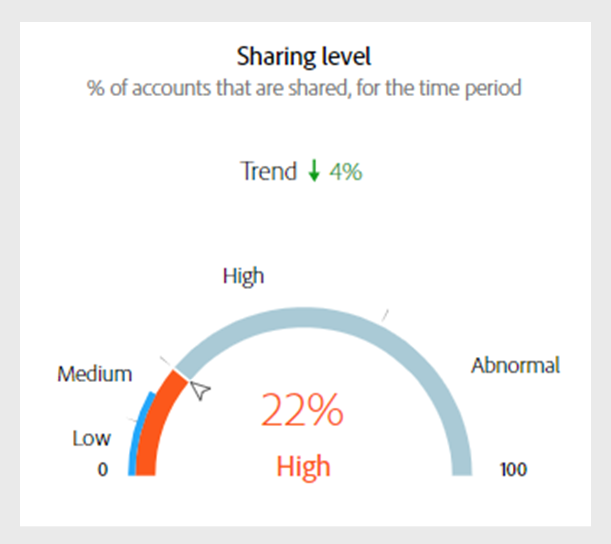
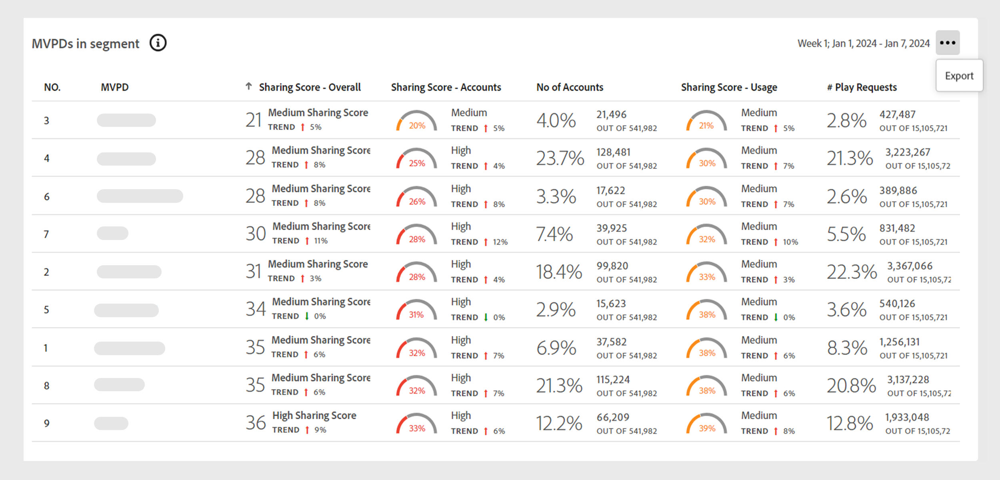
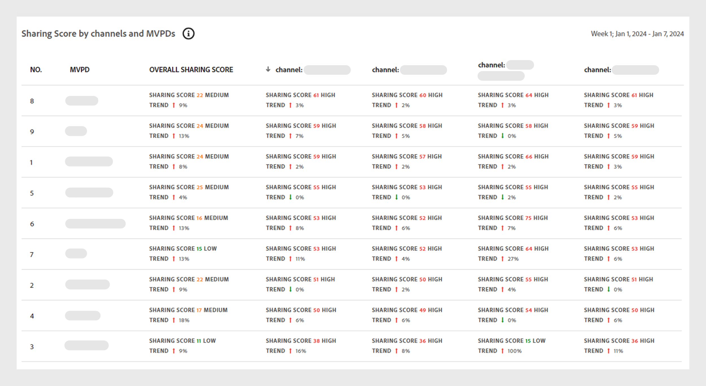
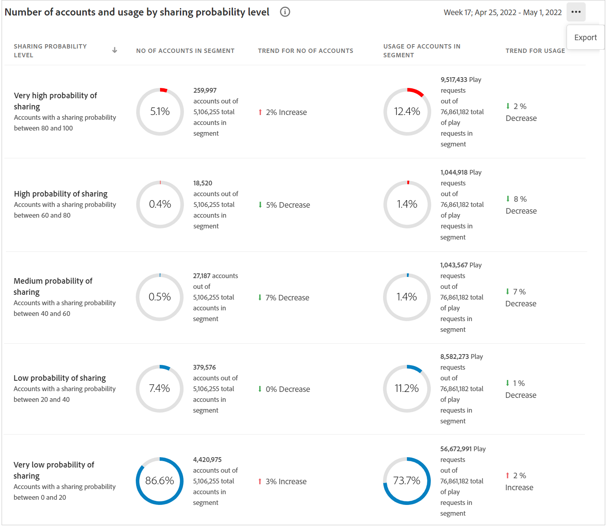

# Datapaneler på kontrollpanelen {#data-panels}

När du har valt ett segment och ett tidsintervall visas olika datapaneler, tabeller och diagram på kontrollpanelen som visar en högnivåvy över delningsaktiviteter inom det valda segmentet.

Tabellen nedan visar tillgängligheten och skillnaderna mellan datapanelerna i olika [versioner](/help/accountiq/versions-aiq.md) av Account IQ:

| Datapaneler | D2C-tjänster | TVE Programmers | TVE MVPD |
|---|---|---|---|
| [Medelvärde för delningspoäng som aggregerats för det aktuella segmentet](#aggregated-sharing) | Tillgänglig och konsekvent | Tillgänglig och konsekvent | Tillgänglig och konsekvent |
| [Videokategorier i segment](#video-categories-segment) | Finns med små variationer | Finns med små variationer | Finns med små variationer |
| [Dela bakgrundsmusik efter kanaler och MVPD](#sharin-score-by-channels-and-mvpds) | Otillgänglig | Tillgänglig | Otillgänglig |
| [Sannolikhet för kontodelning](#accounts-sharing-probability) | Tillgänglig och konsekvent | Tillgänglig och konsekvent | Tillgänglig och konsekvent |
| [Antal konton och användning genom att dela sannolikhet](#number-of-accounts-usage-sharing-probability) | Tillgänglig och konsekvent | Tillgänglig och konsekvent | Tillgänglig och konsekvent |

## Genomsnittlig delningspoäng som aggregerats för det aktuella segmentet {#aggregated-sharing}

Panelen för medeldelningspoäng ger en översta avläsning med en sammanfattning av hur stor del av materialet som har delats i termer av konton och direktuppspelningsvolym.

Mätvärdena hjälper er att förstå omfattningen (från låg, medel, hög till onormal) av delning av autentiseringsuppgifter för era prenumeranter, mätt i konton och förbrukning.

*Medelvärde för delningspoängpanelaggregerad för det aktuella segmentet*

>[!NOTE]
>
> Den blå indikatorn i det **genomsnittliga delningspoängen som aggregerats för det aktuella segmentet** har olika syften för D2C-tjänster jämfört med TV Everywhere. För D2C-tjänster representerar den **tjänstens genomsnittsindex** enligt föregående bild. Om du loggar in som programmerare eller MVPD ändras etiketten till **Branschmedelindex**.

Följande mått är komponenter i panelen Medeldelningspoäng.

### Delningsnivå {#sharing-level}

Den delade nivåprofilen visar procentandelen av alla delade prenumerantkonton inom det definierade segmentet under det valda tidsintervallet.

Procentandelen beräknas utifrån ett genomsnitt av den sannolikhet för delning som beräknats för varje konto i segmentet. Den här beräkningen innehåller konton som har direktuppspelats minst en gång under det valda tidsintervallet.

Trend-indikatorn visar den procentuella förändringen i måttets värde från föregående tidsintervall.

{width="350" align="left"}

*Delningsnivå*

### Användning från delade konton {#usage-from-shared-accounts}

Mätaren visar hur många procent av de delade kontonas användning som finns bland alla abonnentkonton för det definierade segmentet och tidsperioden. Intervallen, som heter Låg, Medium, Hög och Onormal, baseras på branschens medelvärden.

Trend-indikatorn, som visar en ökning eller minskning av användningen från delade konton jämfört med föregående tidsintervall.

{width="350" align="left"}

*Användning från delade konton*

### Total delning {#overall-sharing-score}

Den övergripande poängdelningen är en kombination av poängdelningar, inklusive&quot;Delningsnivå&quot; och&quot;Användning från delade konton&quot;.

Det ger en poäng som återspeglar den övergripande effekten av delning. Dess syfte liknar syftet med en kreditpoäng, som sammanfattar delningsnivån med ett enda tal. Men i det här fallet innebär en högre poäng en högre delningsnivå.

{width="350" align="left"}

*Samlat delningsresultat*

## Videokategorier i segment {#video-categories-segment}

Du kan välja kolumnrubrikerna för att sortera data i alla versioner av Account IQ.

+++D2C-tjänster: Segmentregioner

När du loggar in som en D2C-tjänst ger **Regioner i segmenttabellen** en jämförande bild av de olika aggregerade delningsresultaten för [videokategorierna](/help/accountiq/product-concepts.md#video-category-def) i det aktuella segmentet.

*Dela bakgrundsmusik efter regioner i segment*

>[!NOTE]
>
> De [videokategorier](product-concepts.md#video-category-def) som visas i den föregående bilden, till exempel **Områden** i segmentet, är bara ett exempel. När du loggar in på Account IQ visas företagets specifika videokategori på den här panelen.

Välj **Exportera** om du vill hämta data i en CSV-fil. Lär dig [hur du exporterar datapanelrapporter](/help/accountiq/export-reports.md).

+++

+++Programmerare: MVPD i segment

När du loggar in som programmerare ger **MVPD i segmenttabellen** en jämförande vy över de olika aggregerade delningspoängen för MVPD i det aktuella segmentet.

Välj **Exportera** om du vill hämta data i en CSV-fil. Lär dig [hur du exporterar datapanelrapporter](/help/accountiq/export-reports.md).

+++

+++MVPDs: Programmerare i segment

När du loggar in som ett MVPD-program ger **Programmerare i segmenttabellen** en jämförande bild av de olika aggregerade delningsresultaten för Programmerarna i det aktuella segmentet.

Markera kolumnrubrikerna för att sortera data.

*Dela bakgrundsmusik efter programmerare i segment*

Välj **Exportera** om du vill hämta data i en CSV-fil. Lär dig [hur du exporterar datapanelrapporter](/help/accountiq/export-reports.md).

+++

## Dela poäng via kanaler och videoprogrammeringsfönster  {#sharin-score-by-channels-and-mvpds}

När du loggar in som programmerare ger den här tabellen en jämförande bild av delningspoängen för de valda kanalerna för programmeringsversionerna i det aktuella segmentet.

Markera kolumnrubrikerna för att sortera data.

*Dela bakgrundsmusik via kanaler och MVPD*

## Sannolikhet för kontodelning {#accounts-sharing-probability}

Diagrammet delas upp i olika sannolikhetsintervall, från mycket låga (0-20 %) till mycket höga (80-100 %). Läs mer om intervallen för [Sannolikhet för kontodelning](#accounts-sharing-probability).

>[!NOTE]
>
>I stapeldiagrammet används en logaritmisk skala.

*Antal och procentandelar av prenumerantkonton i olika delningssannolikhetsintervall*

## Antal konton och användning genom att dela sannolikhetsnivå {#number-of-accounts-usage-sharing-probability}

Den här panelen ger en tabellvy över konton som är uppdelade i intervall med troliga quinles för delning, från mycket låg (0-20 %) till mycket hög (80-100 %), med varje quintiles associerade användning från delade konton. Läs mer om intervallen för [Sannolikhet för kontodelning](#accounts-sharing-probability).

*Antal konton, trender och användningar inom olika sannolikhetsintervall*

Välj **Exportera** om du vill hämta data i en CSV-fil. Lär dig [hur du exporterar datapanelrapporter](/help/accountiq/export-reports.md).
