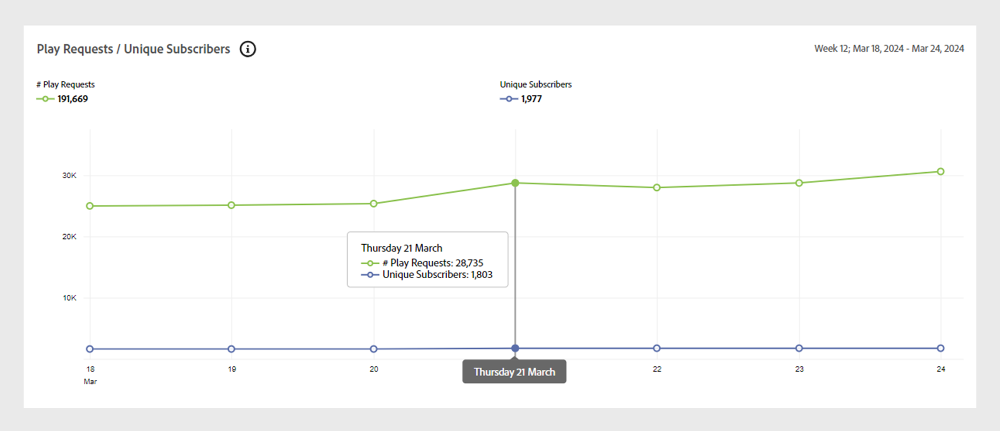
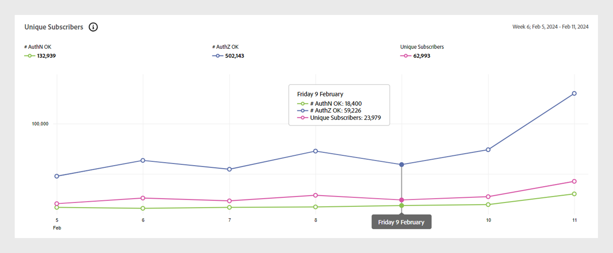

# [!UICONTROL General usage] rapporter {#general-usage-reports}

[!UICONTROL Account IQ] rapporter är grundläggande analysverktyg som gör att du kan gå in i data för att isolera [kohorter](/help/accountiq/product-concepts.md#segmet-def), identifiera avvikelser och bygga upp en förståelse för dina kontoegenskaper.

[!UICONTROL General usage] rapportsidan innehåller verktyg för att ta bort undergruppsmått baserat på antalet kontoenheter som används, IP-adresser som identifieras och deras respektive postnummer.

Alla rapporter baseras på det aktuella segment som valts i [Segment och tidsintervall](/help/accountiq/segments-timeinterval.md) -panelen. Du kan finjustera markeringen och ytterligare begränsa den genom att ange tröskelvärden (antal enheter, antal IP-adresser och antal postkoder) i dialogrutan [Översikt över ögonblicksbild - konton över tröskelvärden](#snapshot-overview) -panelen.

## Spela upp förfrågningar och unika prenumeranter {#playreq-uniquesubs}

I linjediagrammen här visas hur värdena ändras över tid, t.ex. uppspelningsbegäranden och unika prenumeranter i ett valt tidsintervall för det definierade segmentet.

+++ D2C-tjänster: uppspelningsförfrågningar/unika prenumeranter

*Spela upp förfrågningar/unika prenumeranter för D2C-tjänster*

+++

+++Programmerare: Spela upp begäranden/unika prenumeranter

*Spela upp begäranden/unika prenumeranter för programmerare*

+++

+++MVPD: Unika prenumeranter

*Unika prenumeranter för distributörer av videoprogrammeringstjänster*

+++

 

X-axeln representerar tiden baserat på det aktuella intervallet och y-axeln representerar grundläggande aktivitetsmått för prenumeranten under den perioden. Med linjediagrammen kan du visualisera och jämföra aktiviteten för prenumeranterna i det aktuella segmentet. Beroende på vilken version av konto-IQ det är:

* **AuthN OK**: Antal lyckade autentisering. Läs mer om [AuthN OK](/help/accountiq/product-concepts.md#authn-ok-def).

* **AuthZ OK**: Antal lyckade auktoriseringar. Läs mer om [AuthZ OK](/help/accountiq/product-concepts.md#authz-ok-def).

* **Spela upp begäranden**: Antal uppspelningsbegäranden. Läs mer om [Spela upp begäranden](/help/accountiq/product-concepts.md#play-requests-def).

* **Unika prenumeranter**: Antal slutförda unika prenumeranter. Läs mer om [Unika prenumeranter](/help/accountiq/product-concepts.md#unique-subscriber-def).

>[!NOTE]
>
>Vilka mätvärden som är tillgängliga varierar beroende på vilken version av konto-IQ som används.

## Översikt över ögonblicksbilder - konton över tröskelvärden {#snapshot-overview}

Finjustera analyser och rapporter med hjälp av det här extra filtret för att ange olika användningströsklar. När du har valt ett segment kan du även använda följande filter för att analysera prenumerantbeteendet ytterligare:

* Tröskelvärde för antal enheter

* Antal IP-tröskelvärden

* Antal postkoder, tröskel

När du uppdaterar tröskelvärden i [Kontona segment baserat på valda tröskelvärden](#account-segments-basedon-segments) visas effekten i:

* [Enheter per vecka (eller månad) per konto](#devices-week-account)

* [Platser per vecka (eller månad) per konto](#locations-week-account)

* [IP-adresser per vecka (eller månad) per konto](#ip-week-account)

* [Historisk vy över kontosegment](#account-segment-historical-view)

>[!NOTE]
>
>Varje tröskelvärde sätts till standardvärdet 4. På sidan General Usage (Allmän användning) visas en analys för abonnenter som använder mer än fyra enheter, som använder innehåll från mer än fyra olika IP-adresser. *och* fler än fyra olika postnummer.

### Kontonegment baserat på valda tröskelvärden {#account-segments-basedon-segments}

The **Kontona segment baserat på valda tröskelvärden** I finns alternativ för att ange tröskelvärden (mellan 1 och 10) för antal enheter, antal IP-adresser och antal postkoder.

I diagrammet visas följande:

* Absolut antal abonnentkonton.

* Procentandel av det totala antalet abonnentkonton i segmentet som använder antalet enheter, från antalet IP-adresser, i antalet postkoder som anges av tröskelvärdena.

## Enheter per vecka (eller månad) per konto {#devices-week-account}

I det här stapeldiagrammet visas hur abonnenterna använder sina enheter för att komma åt innehåll.

X-axeln visar Antal konton och y-axeln visar Antal enheter. Baserat på det tröskelvärde som du anger för antal enheter per konto anger det absoluta antalet prenumerantkonton som förbrukar innehåll från ett visst antal enheter under en veckas tid.

När du hovrar över ett fält (specifikt för antalet enheter) visas en etikett som ger information om antalet prenumerantkonton (och procentandelen av det totala antalet prenumerantkonton i segmentet) som direktuppspelar kanalinnehåll med dessa många enheter under en vecka.

I diagrammet markeras även följande:

* En röd linje som markerar tröskelvärdet som du anger.

* En grön linje som anger medelvärdet för antalet olika enheter som används av ett prenumerantkonto per vecka (eller månad).

Nöden ger en alternativ vy över de enheter som används av konton i det aktuella segmentet över det angivna tröskelvärdet.

## Platser per vecka (eller månad) per konto {#locations-week-account}

Liknar måttet för [Enheter per vecka (eller månad) per konto](#devices-week-account)kan du med hjälp av placeringsvärdena per vecka (eller månad) per konto analysera hur abonnentkontot används från olika platser. X-axeln visar Antal konton och y-axeln visar Antal platser.

När du har angett ett tröskelvärde för antalet platser kan du använda diagrammet för att identifiera följande:

* Antal (och procentandel) prenumeranter som konsumerar innehåll från (ett visst) x antal platser under en vecka.

* Procentandel av det totala antalet prenumerantkonton som visar innehåll från fler platser än tröskelvärdet.

* Jämför veckomedelvärdet (antal olika platser för ett konto) med tröskelvärdet.

## Ips per vecka (eller månad) per konto {#ip-week-account}

Liknar måttet för **Antal platser per vecka per konto**, **Antal IP-adresser per vecka per konto** Med hjälp av mätvärden kan du utvärdera mängden förändring vid källan för direktuppspelning för det aktuella segmentet.

X-axeln visar Antal konton och y-axeln visar Antal IP.

När du har definierat ett segment och angett ett tröskelvärde för antalet IP-adresser kan du använda diagrammet för att identifiera följande:

* Antal (och procentandel) prenumeranter som konsumerar innehåll från ett visst antal IP-adresser per vecka.

* Procentandel av det totala antalet prenumerantkonton som visar innehåll från fler IP-adresser än tröskelvärdet.

* Jämför veckomedelvärdet (antal olika IP-adresser för ett konto) med tröskelvärdet.

## Konton, segmenthistorikvy {#account-segment-historical-view}

I diagrammet med historikvyfältet kan du jämföra användningsstatistik över olika tidsintervall. Dessutom ritas de olika användningsmåtten tillsammans, som [Enheter per vecka (eller månad) per konto](#devices-week-account), [Platser per vecka (eller månad) per konto](#locations-week-account)och [IP-adresser per vecka (eller månad) per konto](#ip-week-account).

* X-axeln ritar upp tidsintervallet och y-axeln visar antalet abonnentkonton, enheter, platser och IP-adresser.

* De orangefärgade strecken betecknar segment i olika tidsintervall.

* Linjediagrammet ritar upp ändringarna i [Enheter per vecka (eller månad) per konto](#devices-week-account), [Platser per vecka (eller månad) per konto](#locations-week-account)och [IP-adresser per vecka (eller månad) per konto](#ip-week-account) värden över tidsintervallet baserat på tröskelvärdet.

* De blå staplarna anger det totala antalet aktiva prenumeranter i branschen under ett tidsintervall.

* Du kan markera specifika teckenförklaringar och de hjälper dig att skala diagrammet.

