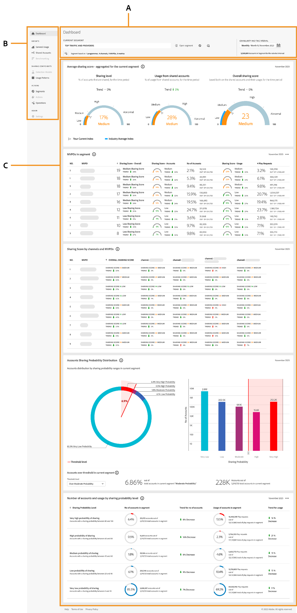

# Introduktion till kontrollpanelen {#introduction-dashboard}

Kontrollpanelen sammanfattar och sammanställer data i en samling diagram och rapporter som utformats för att ge en översikt på hög nivå över omfattningen och effekten av kontodelning. Den tillhandahåller en enda sida med huvudrapporter och mätvärden från [!UICONTROL Account IQ].

>[!NOTE]
>
>De flesta datapanelerna på kontrollpanelerna D2C, Programmerare och MVPD är identiska. Vissa datapaneler kan dock skilja sig åt för olika versioner.

+++D2C-tjänster: Kontrollpanel

{align="left"}

*Kontrollpanel för D2C-tjänster*

**A.** Panelen Segment och tidsintervall **B.** Sidnavigering **C.** Datapaneler

+++

+++Program: Kontrollpanel

{align="left"}

*Kontrollpanel för programmerare*

**A.** Panelen Segment och tidsintervall **B.** Sidnavigering **C.** Datapaneler

+++

+++MVPDs: Dashboard

Kontrollpanelen för programmerings- och videoprogrammeringsprogram skiljer sig något från programmeringarnas.

![instrumentpanel för [!UICONTROL Account IQ] för MVPD](assets/dashboard-mvpd.png){align="left"}

*Kontrollpanel för MVPD:er*

**A.** Panelen Segment och tidsintervall **B.** Sidnavigering **C.** Datapaneler

+++

Kontrollpanelen för D2C-tjänster, programmerare och programmerare innehåller följande:

* **Segment och tidsintervallpanel**: På den här panelen kan du välja segment och tidsintervall för att generera kontodelningsrapporter och ge en sammanfattning av det valda segmentet. Visa [segment och tidsintervall](/help/accountiq/segments-timeinterval.md) om du vill ha mer information.

* **Sidnavigering**: Med de här flikarna kan du navigera och utforska olika avsnitt och sidor i Account IQ.

* **Datapaneler**: Panelerna visar rapporter om kontodelning via tabeller och diagram, och du kan exportera dem som rapporter direkt till den lokala enheten. Visa [datapanelernas](/help/accountiq/data-panels.md)- och [exportdatapanelernas rapporter](/help/accountiq/export-reports.md) om du vill ha mer information.
