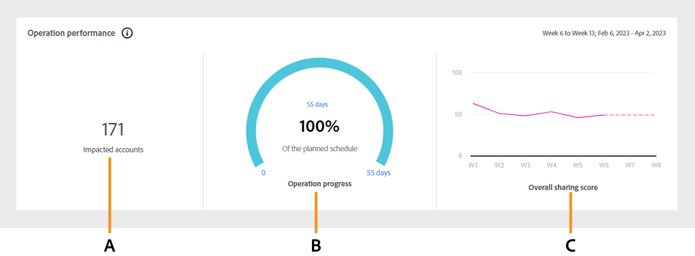

# Operationer {#operations-tab-next-steps}

När du har analyserat prenumerantens användningsmönster och identifierat instanser av lösenordsdelning för ett valt segment med hjälp av [!DNL Account IQ] kan ni vidta riktade åtgärder via fokuserade procedurer som kallas operationer i [!DNL Account IQ].

**Operationer** kan ni effektivt spåra och hantera delning av autentiseringsuppgifter med en grupp konton för att minska lösenordsdelning och förbättra upplevelsen för värdefulla prenumeranter.

Du kan använda åtgärder på en definierad [segment](/help/accountiq/product-concepts.md#segment-def) för att hantera lösenordsdelning inom ett specifikt [tidsintervall](/help/accountiq/product-concepts.md#time-interval-def) och schemalägga åtgärden att köras vid ett framtida datum. Dessa åtgärder omfattar begränsningar för att minimera lösenordsdelning eller begränsningar för icke-delade konton.

När du använder åtgärder kan du inte bara ange åtgärder och deras omfattning, utan även mäta deras resultat.

Genom att utvärdera resultaten kan ni förfina er strategi för att optimera effekterna, oavsett om det är genom att konvertera låntagare, minska utbytet av autentiseringsuppgifter eller minska bortfallet.

Du kan utföra olika funktioner med åtgärder:

* [Visa åtgärdsrapporter](#operation-reports)
* [Skapa en ny åtgärd](#create-new-operation)
* [Stoppa åtgärd](#stop-operation)

## Visa åtgärdsrapporter {#operation-reports}

Du kan granska effekterna av en åtgärd med hjälp av åtgärdsrapporter. Om du vill visa åtgärdsrapporten väljer du **Operationer** flik under **Åtgärder** i den vänstra panelen av konto-IQ-programmet. En lista över åtgärder som är tillgängliga i systemet visas. Du kan komma åt nyckelinformation om varje åtgärd i tabellformat. Detaljerna är följande:

* Åtgärdens namn
* Aktuell status (som Schemalagd, Körs, Avslutad, Fel eller Stoppad)
* Procent slutförda förlopp
* Målgrupp eller segment som åtgärden ska tillämpas på
* Typ av åtgärd som har valts för åtgärden
* Startdatum för åtgärden
* Slutdatum för åtgärden
* Datum när åtgärden skapades
* Senaste ändringsdatum för åtgärden

*Lista och information om befintliga åtgärder i konto-IQ*

Markera önskat **Åtgärdsnamn** i listan över åtgärder. Följande rapporter visas:

### Åtgärdsprestanda {#operation-performance}

Operationsprestandan ger en översta avläsning som sammanfattar antalet konton som påverkas, operationsförloppet och det övergripande delningsresultatet för konton i segmentet under operationens [utvärderingsperiod](/help/accountiq/product-concepts.md#evaluation-period-def).

*Rapport över operationsprestanda*

**S.** Påverkade konton **B.** Åtgärdsförlopp **C.** Total delning

#### Påverkade konton {#impacted-accounts}

Det här numret visar antalet abonnentkonton som påverkas av åtgärden som utförts under åtgärdens utvärderingsperiod.

#### Åtgärdsförlopp {#operation-progress}

Den här mätaren visar antalet dagar och procentandelen av åtgärden som slutfördes utanför det planerade schemat.

#### Total delning {#overall-sharing-score}

Det här linjediagrammet representerar [totalpoäng för delning](/help/accountiq/data-panels.md#overall-sharing-score), som omfattar delningsnivå och användning från delade konton varje vecka under åtgärdens utvärderingsperiod.

### Åtgärdseffekt: konton i segment {#impact-accounts}

Den här rapporten visas som ett skiktat stapeldiagram som illustrerar effekten av en åtgärd över tid.

*Åtgärdens påverkan på konton i segmentdiagram*

X-axeln representerar åtgärdens [utvärderingsperiod](/help/accountiq/product-concepts.md#evaluation-period-def)medan y-axeln anger status för konton i operationens segment. Varje stapel i diagrammet är uppdelad i tre färger:

* Rosa representerar antalet konton som uppfyller segmentets villkor som används i den här åtgärden.

* Blue representerar antalet aktiva konton som ursprungligen fanns i segmentet men som inte uppfyllde segmentets villkor under varje vecka eller månad i operationens [utvärderingsperiod](/help/accountiq/product-concepts.md#evaluation-period-def).

* Grå representerar konton som var inaktiva under utvärderingsperioden.

>[!NOTE]
>
>Den första rosa stapeln representerar antalet konton som uppfyller villkoren för operationssegmentet i början av utvärderingsperioden.

Med tiden visar diagrammet förändringar i kontots beteende i förhållande till de ursprungliga villkoren (t.ex. har en delningssannolikhet på mer än 90 och fler än 5 enheter har blivit inaktiva).

### Åtgärdseffekt: mått för delade konton {#impact-shared-accounts}

Måtten för delade konton ger en översikt över delningsnivå och uppspelningsbegäranden från prenumerantkonton i operationens segment under operationens [utvärderingsperiod](/help/accountiq/product-concepts.md#evaluation-period-def).

#### Delningsnivå {#share-level}

Det här linjediagrammet representerar [delningsnivå](/help/accountiq/data-panels.md#sharing-level) varje vecka under åtgärdens utvärderingsperiod.

{width="550" align="left"}

*Raddiagram för delningsnivå*

#### Antal uppspelningsbegäranden {#play-requests}

Det här linjediagrammet representerar [spelförfrågningar](/help/accountiq/general-usage-reports.md#playreq-uniquesubs) varje vecka under åtgärdens utvärderingsperiod.

{width="550" align="left"}

*Antal linjediagram för uppspelningsförfrågningar*

### Åtgärdseffekt: allmänna användningsmått {#impact-general-usage}

De allmänna användningsmåtten ger en översikt över det genomsnittliga antalet enheter, IP-adresser och platser i åtgärdens segment under åtgärdens [utvärderingsperiod](/help/accountiq/product-concepts.md#evaluation-period-def).

#### Antal enheter {#devices}

Det här linjediagrammet representerar medelvärdet [antal enheter](/help/accountiq/general-usage-reports.md#devices-week-account) varje vecka under åtgärdens utvärderingsperiod.

{width="550" align="left"}

*Antal enheter, linjediagram*

#### Antal IP-adresser och platser {#IPs-locations}

Det här linjediagrammet representerar medelvärdet [antal IP-adresser](/help/accountiq/general-usage-reports.md#ip-week-account) och [platser](/help/accountiq/general-usage-reports.md#locations-week-account) varje vecka under åtgärdens utvärderingsperiod.

{width="550" align="left"}

*Antal IP-adresser och platslinjediagram*

Stäng rapporten och gå tillbaka till huvudsidan **Operationer** sida, markera **Operationer** flik under **Åtgärder** till vänster.

## Skapa ny åtgärd {#create-new-operation}

När du går till **Operationer** flik under **Åtgärder** i den vänstra panelen väljer **Skapa ny åtgärd** högst upp på **Operationer** sida.

Följ instruktionerna i följande avsnitt för att skapa en ny åtgärd:

* [Operationsinformation](#operation-details)
* [Segment](#segment)
* [Åtgärd](#action)
* [Schema](#schedule)

### Operationsinformation {#operation-details}

I det här avsnittet skriver du namnet på åtgärden i **Åtgärdsnamn**.

>[!TIP]
>
>Beskriv syftet med åtgärden eller åtgärdens art i **åtgärdsnamn** för snabb identifiering. Alternativet att **Lägg till beskrivning och taggar** kommer att finnas i framtida versioner.

*Lägg till åtgärdsnamn*

### Segment {#segment}

Klicka på **Markera segment** och välj ett segment som du vill använda den här åtgärden på. Läs [markera ett segment](/help/accountiq/segments-timeinterval.md#segment-selection).

När du har markerat ett segment ska du använda  om du vill visa en detaljerad segmentsammanfattning. Läs mer om [segmentsammanfattning](segments-timeinterval.md#segment-summary).

*Välj segment och tidsintervall*

>[!NOTE]
>
>The [videokategorier](product-concepts.md#video-category-def) som visas i föregående bild, till exempel **MVPD**, **Programmerare** och **Kanaler** representerar etiketterna som används i TV Everywhere-versionen av konto-IQ. Om du är inloggad som en D2C-tjänst visar etiketterna företagets specifika videokategorier.

Använd vid behov  om du vill redigera det markerade segmentet eller   om du vill skapa ett nytt segment. Mer information finns i instruktionerna för [skapa ett nytt segment](work-with-segments.md#create-new-segment) eller [redigera ett segment](work-with-segments.md#edit-segment).

>[!IMPORTANT]
>
>**Segmenttyp** namngiven **[!UICONTROL Fixed number of accounts]** är markerat som standard. Alternativet som ska väljas **[!UICONTROL Variable number of accounts]** kommer att finnas i kommande versioner.

Välj **Kornighet och tidsintervall** övervaka operationen under en viss period. Läs mer om [hur du väljer granularitet och tidsintervall](/help/accountiq/segments-timeinterval.md#granularity-timeinterval).

### Åtgärd {#action}

I det här avsnittet väljer du en **Åtgärd** som du vill utföra på det markerade segmentet i listrutan.

*Välj typ av åtgärd*

Det finns två alternativ:

* Välj **CM-princip** för det system för övervakning av samtidig användning som är integrerat med konto-IQ.

* Välj **Extern åtgärd** för att skapa och bearbeta arbetsflöden utanför konto-IQ och som inte är integrerade med konto-IQ-systemet.

>[!NOTE]
>
>Externa åtgärder kanske inte alltid har att göra med lösenordsdelning, men de kan ändå påverka det, till exempel lanseringen av en ny årstid.

### Schema {#schedule}

I det här avsnittet väljer du **Startdatum** och **Slutdatum** från datumväljaren för att ange aktiveringen för åtgärden.

>[!IMPORTANT]
>
>För närvarande är standardaktiveringen **Startdatum** och **Slutdatum** är inställda på **På-datum**. Alternativet som ska väljas **När ett villkor är uppfyllt** och **Manuellt** kommer att finnas i kommande versioner.

>[!NOTE]
>
>Se till att både startdatum och slutdatum är i linje med granulariteten som valts för utvärdering i **Steg 4**.

* Om du har valt granularitet aggregerat efter veckor, väljer du start- och slutdatum i veckor (till exempel Vecka 10).
* Om du har valt granularitet aggregerad per månad väljer du start- och slutdatum i månader.

*Välj Startdatum och Slutdatum i datumväljaren*

**S.** Startdatumväljare **B.** Slutdatumväljare

>[!NOTE]
>
>The **Startdatum** måste vara senare än både utvärderingsperioden och aktuellt datum, medan **Slutdatum** måste vara senare än startdatumet och det aktuella datumet för att schemalägga och köra åtgärder i den framtida perioden.

Välj **Spara åtgärd** högst upp på **Operationer** sida för att bearbeta en ny åtgärd.

## Stoppa åtgärd {#stop-operation}

Du kan bara stoppa de åtgärder som finns i **Körs** status. Så här avbryter du en befintlig åtgärd:

1. Navigera till **Operationer** flik under **Åtgärder** i den vänstra navigeringen för konto-IQ-programmet.
1. Välj **Alternativ** menyn för den åtgärd som du vill stoppa.

   

   *Välj Alternativ-menyn för att avbryta åtgärden*

1. Välj **Stoppa**.

