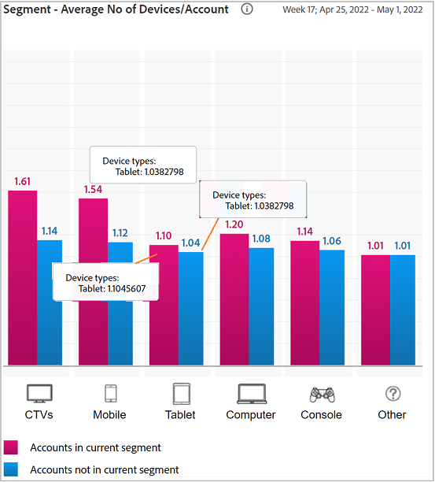

# Rapporter om delade konton {#shared-accounts-reports}

Rapporterna om delade konton innehåller en annan grupp diagram som återspeglar delningsbeteende och -förbrukning för det aktuella segmentet. Till exempel: **[!UICONTROL Over Moderate Probability]** och **[!UICONTROL Over Low Probability]** för aktuellt segment.

## Sannolikhet för kontodelning {#accounts-sharing-probability}

I det här dons- och streckdiagrammet visas procentsatserna (och absoluta tal) för de prenumerantkonton som faller inom specifika intervall för delningssannolikhet. Intervallen definieras som:

* Mycket hög (80-100 %)
* Hög (60-80 %)
* Måttligt (40-60 %)
* Låg (20-40 %)
* Mycket låg (0 %-20 %)

Den röda linjen markerar det tröskelvärde som är markerat i [Konton över tröskelvärdet i aktuellt segment](#threshold-selector) och det ljusröda området innehåller summan av alla konton över det tröskelvärdet.

I stapeldiagrammet visas antalet konton som faller inom varje intervall på y-axeln för varje intervall (ritas på x-axeln).

Här markeras det aktuella tröskelvärdet och det ljusröda området innehåller summan av alla konton som ligger över det tröskelvärdet.

>[!NOTE]
>
> Y-axeln i stapeldiagrammet är logaritmisk.

### Konton över tröskelvärdet i aktuellt segment{#threshold-selector}

På den här panelen kan du välja ett tröskelvärde för diagrammen för munstycket och stolpdiagrammen ovan. De fyra alternativen är:

* Konton **över mycket låg** delning **sannolikhet**

* Konton **över lågt** delning **sannolikhet**

* Konton **övermåttlig** delning **sannolikhet**

* Konton **över högt** delning **sannolikhet**

När du har valt tröskelvärdet visas procentandelen (och antalet) konton av alla prenumerantkonton i det valda segmentet.

## Antal uppspelningsbegäranden av totalt {#play-request-out-total}

I dondiagrammet visas procentandelen (och antalet) av uppspelningsbegäranden som görs av prenumeranter i segmentet, vilket gör att du kan jämföra uppspelningsbegäranden som görs av prenumeranter som inte finns i det definierade segmentet.

När du flyttar markören över donatdiagrammet visas även procenttal och siffror för prenumeranter från olika sannolikhetsintervall.

<!---->

## Genomsnittligt antal enheter per konto{#avg-devices-account}

I stapeldiagrammet visas det genomsnittliga antalet enheter av varje typ som för närvarande används av prenumeranter i det aktuella segmentet och av enheter som inte finns i det aktuella segmentet.

## Segmentpostkoder per period per konto {#zip-codes-period-account}

I det här diagrammet visas hur många abonnenter i det aktuella segmentet som konsumerar innehåll från olika platser (mätt med postnummer) för det angivna tidsintervallet.

>[!NOTE]
>
>Du kan zooma in de fält som representerar mer än en uppsättning postnummer, som representeras av en **+** (plus) genom att dubbelklicka på dem.

## Segmentgeografisk spännvidd per period per konto {#geo-span-period-account}

I det här stapeldiagrammet visas antalet abonnentkonton som förbrukar innehåll från platser som faller inom olika geografiska områden i engelska mil. Intervallet baseras på det maximala avståndet mellan de platser från vilka en prenumerant har direktuppspelat under tidsintervallet.

>[!NOTE]
>
> Du kan zooma in de fält som representerar mer än en uppsättning geografiska avstånd, som representeras av en **+** (plus) (t.ex. 1000+) genom att dubbelklicka på dem.

>[!MORELIKETHIS]
>
>* Lär dig hur du exporterar rapporter för de 1 000 populäraste prenumeranterna i det valda segmentet med hjälp av filter i Delade kontorapporter med [Exportera de 1 000 populäraste kontona](/help/accountiq/export-acc-information.md) alternativ.
