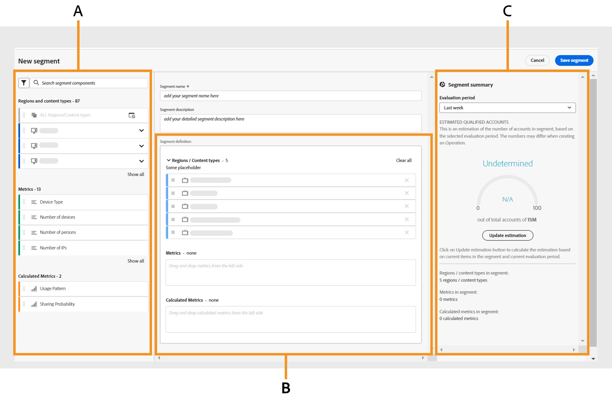
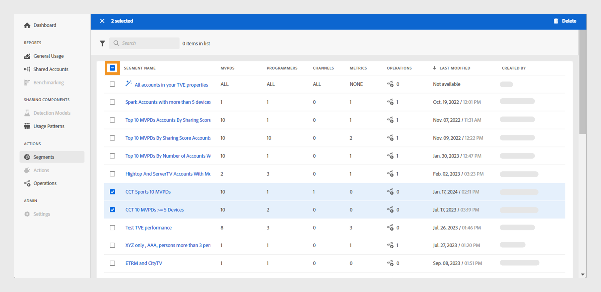

# Arbeta med segment {#work-with-segments}

[Segment](product-concepts.md#segmet-def) är en samling prenumerantkonton som gör att du kan analysera delning av autentiseringsuppgifter under användardefinierade villkor. Du kan använda segment för att undersöka olika uppsättningar prenumerationskonton och generera motsvarande datarapporter i tabeller och diagram. Det finns två typer av segment i konto-IQ:

1. **Standardsegment**: **Alla konton i dina egenskaper** är ett körklart segment i systemet som innehåller alla aktiva prenumerantkonton utan särskilda villkor.

   >[!NOTE]
   >
   >Användning av standardsegmentet kan förhindra visning av vissa tabeller som [Videokategorier i segment](data-panels.md#video-categories-segment), [Dela poäng via kanaler och videoprogrammeringsfönster](data-panels.md#sharin-score-by-channels-and-mvpds)och [Distribution av användningsmönster för videokategorier](usage-patterns.md#usage-pattern-dis-video-categories). Dessa tabeller kan endast innehålla och visa data för upp till 20 rader åt gången. De återstående tabellerna, diagrammen och rapporterna är desamma för standardsegment och anpassade segment.

1. **Egna segment**: Dessa är skräddarsydda segment som gör att du kan gruppera prenumerantkonton från specifika kategorier, som D2C-innehållstyper, programmerare, kanaler och distributörer av videoprogrammeringstjänster för analys av delning av autentiseringsuppgifter under användardefinierade villkor. Läs mer om hur [skapa ett anpassat segment](#create-new-segment).

   >[!IMPORTANT]
   >
   >Alla procedurer som beskrivs i den här handboken är baserade på anpassade segment. Begreppen är dock desamma för standardsegment och anpassade segment.

När du går till **Åtgärder** och väljer **[!UICONTROL Segments]** i den vänstra panelen visas en lista med segment som är tillgängliga i systemet. På sidan Segment kan du snabbt utvärdera nyckeldetaljer för varje segment i ett tabellformat. Informationen omfattar segmentnamnet, antalet [videokategorier](product-concepts.md#video-category-def), mätvärden, [operationer](product-concepts.md#operation-def) med det aktuella segmentet, senaste ändringsdatum och -tid samt namnet på segmentskaparen.

Du kan utföra följande funktioner med segment:

* [Skapa ett nytt segment](#create-new-segment)
* [Hantera segment](#manage-segments)

## Skapa ett nytt segment {#create-new-segment}

Processen att skapa ett nytt segment liknar den för D2C-tjänster och TV Everywhere. Videokategorierna är olika för respektive version av konto-IQ.

+++D2C-tjänster

Om du vill skapa ett segment och analysera prenumerantens delningsbeteende väljer du **[!UICONTROL Create new segment]** uppe till höger.

*Välj Skapa nytt segment*

>[!NOTE]
>
>Videokategorierna som visas i föregående bild, till exempel **Regioner** och **Innehållstyper** är bara exempel. När du loggar in på konto-IQ visas företagets specifika videokategorier med dessa etiketter.

Den öppnar en **Nytt segment** sida, som innehåller följande element:

*Ny segmentsida*

**S.** Segmentkomponenter **B.** Segmentdefinition **C.** Segmentsammanfattning

* **Segmentkomponenter**: En inventering av [videokategorier](product-concepts.md##video-category-def) och beräknade värden som används för att definiera ett segment.

  >[!NOTE]
  >
  >Använd **[!UICONTROL Show all]** om du vill expandera listan med segmentkomponenter. Om du snabbt vill hitta en komponent söker du efter dess namn i **söksegmentskomponenter** i stället för att bläddra igenom hela listan.

* **Segmentdefinition**: En arbetsyta där du kan dra och släppa olika segmentkomponenter för att skapa ett segment.

* **Segmentsammanfattning**: En sammanfattning som uppskattar de kvalificerade kontona baserat på komponenterna i segmentdefinitionen och ger en kort översikt över segmentet under utvärderingsperioden.

Så här skapar du ett segment:

1. Skriv segmentnamnet i **Segmentnamn** som visas i listan över segment och under segmentmarkeringen.
1. Skriv en detaljerad beskrivning av ditt segment i **Segmentbeskrivning**.
1. Dra till exempel **Regioner och innehållstyper** från segmentkomponenterna i den vänstra panelen och släpp dem i **Områden/innehållstyper** i **Segmentdefinition**.

   >[!NOTE]
   >
   >Du kan skapa ett segment baserat på antingen regioner eller innehållstyper. Visa de associerade innehållstyperna för ett område i en listruta.

   Om du börjar med att lägga till en **innehållstyp** i **Områden/innehållstyper** kan du bara lägga till innehållstyper som efterföljande komponenter.

   Om du börjar med att lägga till en **Län** i **Områden/innehållstyper** visas en beslutsdialogruta.

   {width="550" align="left"}

   *Lägga till en segmentkomponent som ett område eller dess dialogruta för innehållstyper*

   Bestäm om du vill jämföra specifika regioner eller ett segment baserat på innehållstyperna som är kopplade till en region.

   Välj **[!UICONTROL As a region]** för att lägga till regioner i **Områden/innehållstyper** -avsnitt.

   Välj **[!UICONTROL As its content types]** om du vill lägga till innehållstyper för ett område.

1. Dra **Mått** från segmentkomponenterna i den vänstra panelen och släpp dem i **Mått** i **Segmentdefinition**.

   

   *Välj en operator och tilldela ett värde för det tillagda måttet*

   När du har lagt till mätvärden i segmentdefinitionen väljer du en operator från **[!UICONTROL Select an operator]** listrutemeny och tilldela ett värde med **[!UICONTROL Select an option]**.

   Justera värden för vissa mätvärden genom att använda uppåtpilen för att öka och nedåtpilen för att minska.

1. Dra **Beräknade mått** från segmentkomponenterna i den vänstra panelen och släpp dem i **Beräknade mått** i **Segmentdefinition**.

   

   *Välj en operator och tilldela ett värde för det tillagda beräknade måttet*

   När du har lagt till beräknade värden i segmentdefinitionen, **[!UICONTROL Select an operator]** i listrutan och tilldela ett värde med **[!UICONTROL Select an option]**.

   >[!NOTE]
   >
   >Alla mätvärden och beräknade mätvärden som du hamnar under segmentdefinitionen åtföljs av lämpliga operatorer för att tilldela värden till respektive mätvärden och beräknade värden.

1. Granska segmentinformationen i **Segmentsammanfattning** för att bestämma vilka ändringar du vill implementera i hela segmentet.
1. Välj **[!UICONTROL Last week]** eller **[!UICONTROL Last month]** från **Utvärderingsperiod** i listrutan för att uppskatta summeringsvärden för föregående vecka eller månad.
1. Välj **[!UICONTROL Update estimation]** för att beräkna antalet uppskattade kvalificerade konton i det aktuella segmentet baserat på den valda utvärderingsperioden.
1. Välj **[!UICONTROL Save segment]**.

Segmentet som du har skapat finns nu i segmentlistan.

+++

+++TV Everywhere

Om du vill skapa ett segment och analysera prenumerantens delningsbeteende väljer du **[!UICONTROL Create new segment]** uppe till höger.

*Välj Skapa nytt segment*

Den öppnar en **Nytt segment** sida, som innehåller följande element:

*Ny segmentsida*

**S.** Segmentkomponenter **B.** Segmentdefinition **C.** Segmentsammanfattning

* **Segmentkomponenter**: En inventering av programmerare och kanaler, programmeringsdokument, mätvärden och beräknade värden som används för att definiera ett segment.

  >[!NOTE]
  >
  >Använd **[!UICONTROL Show all]** om du vill expandera listan med segmentkomponenter. Om du snabbt vill hitta en komponent söker du efter dess namn i **söksegmentskomponenter** i stället för att bläddra igenom hela listan.

* **Segmentdefinition**: En arbetsyta där du kan dra och släppa olika segmentkomponenter för att skapa ett segment.

* **Segmentsammanfattning**: En sammanfattning som uppskattar de kvalificerade kontona baserat på komponenterna i segmentdefinitionen och ger en kort översikt över segmentet under utvärderingsperioden.

Så här skapar du ett segment:

1. Skriv segmentnamnet i **Segmentnamn** som visas i listan över segment och under segmentmarkeringen.
1. Skriv en detaljerad beskrivning av ditt segment i **Segmentbeskrivning**.
1. Dra **Programmerare och kanaler** från segmentkomponenterna i den vänstra panelen och släpp dem i **Programmerare/kanaler** i **Segmentdefinition**.

   >[!NOTE]
   >
   >Du kan skapa ett segment baserat på antingen programmerare eller kanaler. Visa de associerade kanalerna med en programmerare i en listruta.

   Om du börjar med att lägga till en **Kanal** i **Programmerare/kanaler** kan du bara lägga till kanaler som efterföljande komponenter.

   Om du börjar med att lägga till en **Programmer** i **Programmerare/kanaler** visas en beslutsdialogruta.

   {width="550" align="left"}

   *Lägg till segmentkomponent som programmerare eller dess kanaldialogruta*

   Bestäm om du vill jämföra specifika programmerare eller ett segment baserat på de kanaler som är kopplade till en programmerare.

   Välj **[!UICONTROL As a programmer]** för att lägga till programmerare i **Programmerare/kanaler** -avsnitt.

   Välj **[!UICONTROL As its channels]** för att lägga till alla kanaler i en programmerare.

1. Dra **MVPD** från segmentkomponenterna i den vänstra panelen och släpp dem i **MVPD** i **Segmentdefinition**.

   >[!NOTE]
   >
   >När du loggar in som programmerare får du ett MVPD-dokument med namnet **oändlighet** visas som ett fristående alternativ i **MVPD** -avsnitt. Du kan inte kombinera det med andra MVPD-program.

1. Dra **Mått** från segmentkomponenterna i den vänstra panelen och släpp dem i **Mått** i **Segmentdefinition**.

   

   *Välj en operator och tilldela ett värde för det tillagda måttet*

   När du har lagt till mätvärden i segmentdefinitionen väljer du en operator från **[!UICONTROL Select an operator]** listrutemeny och tilldela ett värde med **[!UICONTROL Select an option]**.

   Justera värden för vissa mätvärden genom att använda uppåtpilen för att öka och nedåtpilen för att minska.

1. Dra **Beräknade mått** från segmentkomponenterna i den vänstra panelen och släpp dem i **Beräknade mått** i **Segmentdefinition**.

   

   *Välj en operator och tilldela ett värde för det tillagda beräknade måttet*

   När du har lagt till beräknade värden i segmentdefinitionen, **[!UICONTROL Select an operator]** i listrutan och tilldela ett värde med **[!UICONTROL Select an option]**.

   >[!NOTE]
   >
   >Alla mätvärden och beräknade mätvärden som du hamnar under segmentdefinitionen åtföljs av lämpliga operatorer för att tilldela värden till respektive mätvärden och beräknade värden.

1. Granska segmentinformationen i **Segmentsammanfattning** för att bestämma vilka ändringar du vill implementera i hela segmentet.
1. Välj **[!UICONTROL Last week]** eller **[!UICONTROL Last month]** från **Utvärderingsperiod** i listrutan för att uppskatta summeringsvärden för föregående vecka eller månad.
1. Välj **[!UICONTROL Update estimation]** för att beräkna antalet uppskattade kvalificerade konton i det aktuella segmentet baserat på den valda utvärderingsperioden.
1. Välj **[!UICONTROL Save segment]**.

Segmentet som du har skapat finns nu i segmentlistan.
+++

## Hantera segment {#manage-segments}

Du kan markera ett segment i segmentlistan och sedan utföra följande åtgärder:

* [Redigera ett segment](#edit-segment)
* [Duplicera ett segment](#duplicate-segment)
* [Ta bort ett segment](#delete-segment)

*Markera ett segment som du vill redigera, duplicera eller ta bort*

**S.** [Standardsegment](#work-with-segments) **B.** [Videokategorier](product-concepts.md#video-category-def)

>[!NOTE]
>
>De videokategorier som visas i det här avsnittet, till exempel **MVPD**, **Programmerare** och **Kanaler** representerar etiketterna som används i TV Everywhere-versionen av konto-IQ. Om du är inloggad som en D2C-tjänst visar etiketterna företagets specifika videokategorier.

Du kan inte redigera, duplicera eller ta bort standardsegmentet med namnet **Alla konton i dina egenskaper**.

### Redigera ett segment {#edit-segment}

1. Navigera till **[!UICONTROL Segments]** flik under **Åtgärder** i den vänstra panelen om du vill visa en lista med segment.
1. Markera det segment som du vill redigera.
1. Välj **[!UICONTROL Edit]**.
1. Ändra segmentinformation, t.ex. segmentnamnet, beskrivningen eller komponenterna i **Segmentdefinition**.

   >[!TIP]
   >
   >Använd **[!UICONTROL Clear all]** om du vill ta bort alla segmentkomponenter i varje avsnitt under segmentdefinitionen samtidigt. Du kan också markera kryssknappen om du vill ta bort enskilda objekt.

   

   *Markera Rensa alla om du vill ta bort alla segmentkomponenter samtidigt*

1. Välj antingen **[!UICONTROL Update segment]** för att uppdatera det befintliga segmentet eller **[!UICONTROL Save as new segment]** för att skapa ett nytt segment med ändringarna.

   >[!NOTE]
   >
   >Det är inte tillåtet att uppdatera segment som är under pågående åtgärder. Det enda alternativet för segment med pågående åtgärder är att spara ändringar som ett nytt segment.

### Duplicera ett segment {#duplicate-segment}

1. Navigera till **[!UICONTROL Segments]** flik under **Åtgärder** i den vänstra panelen om du vill visa en lista med segment.
1. Markera det segment som du vill duplicera.
1. Välj **[!UICONTROL Duplicate]**.

En kopia av det valda segmentet genereras och placeras i slutet av segmentlistan. Du kan redigera de nödvändiga detaljerna i det duplicerade segmentet och sedan antingen uppdatera det duplicerade segmentet eller spara det som ett nytt segment.

### Ta bort ett segment {#delete-segment}

1. Navigera till **[!UICONTROL Segments]** flik under **Åtgärder** i den vänstra panelen om du vill visa en lista med segment.
1. Markera det segment som du vill ta bort.

   Markera flera segment om du vill ta bort dem i en enda åtgärd. Du kan också markera en kryssruta till vänster om **Segmentnamn** om du vill ta bort alla segment samtidigt.

   >[!NOTE]
   >
   > Du kan bara ta bort mer än ett segment eller alla segment om inget av segmenten används av åtgärderna. Dessutom tas standardsegmentet med namnet bort **Alla konton i dina egenskaper** är inte tillåtet. Den förblir omarkerad när du försöker ta bort alla segment samtidigt.

   

   *Markera flera segment om du vill ta bort mer än ett segment*

1. Välj **[!UICONTROL Delete]**.
1. Bekräfta till **[!UICONTROL Delete]** i dialogrutan för att ta bort segmentet permanent.

   >[!NOTE]
   >
   >Segmentet tas bort permanent från systemet och du kan inte ångra den här åtgärden.
