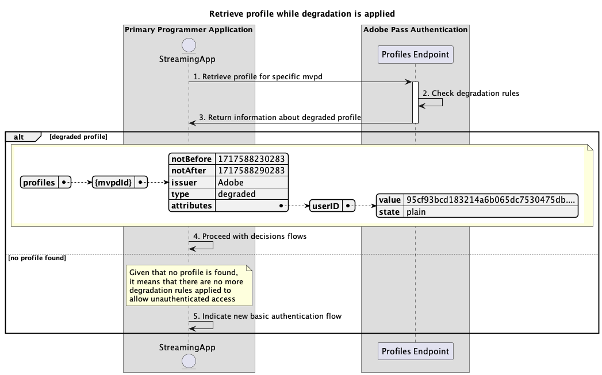

# Försämrade åtkomstflöden {#degraded-access-flows}

>[!IMPORTANT]
>
> Innehållet på den här sidan tillhandahålls endast i informationssyfte. Användning av denna API kräver en aktuell licens från Adobe. Ingen obehörig användning är tillåten.

>[!IMPORTANT]
>
> REST API V2-implementeringen begränsas av dokumentationen för [begränsningsmekanismen](/help/authentication/integration-guide-programmers/throttling-mechanism.md).

>[!MORELIKETHIS]
>
> Gå även till [REST API V2 FAQ](/help/authentication/integration-guide-programmers/rest-apis/rest-api-v2/rest-api-v2-faqs.md#authentication-phase-faqs-general).

Genom att dekryptera kan du tillfälligt kringgå specifika slutpunkter för autentisering och behörighet från MVPD. Oftast initierar programmeraren den här åtgärden, men oavsett vem som utlöser en nedbrytningshändelse beror åtgärden på tidigare arrangemang som gjorts med de berörda programmeringsversionerna.

Mer information om degraderingsfunktionen finns i dokumentationen för [Försämring](../../../../features-premium/degraded-access/degradation-feature.md).

Med de försämrade åtkomstflödena kan du fråga efter följande scenarier:

* [Utför autentisering när nedgradering används](#perform-authentication-while-degradation-is-applied)
* [Hämta auktoriseringsbeslut när nedgradering används](#retrieve-authorization-decisions-while-degradation-is-applied)
* [Hämta beslut om förauktorisering när nedgradering används](#retrieve-preauthorization-decisions-while-degradation-is-applied)
* [Hämta profil när nedgradering används](#retrieve-profile-while-degradation-is-applied)

## Utför autentisering när nedgradering används {#perform-authentication-while-degradation-is-applied}

### Förutsättningar {#prerequisites-perform-authentication-while-degradation-is-applied}

Innan du utför autentiseringsflödet när nedgraderingen tillämpas ska du kontrollera att följande krav är uppfyllda:

* Strömningsprogrammet måste initiera en autentiseringssession när det behöver logga in med MVPD.

>[!IMPORTANT]
> 
> Antaganden
> 
>  
> 
> * Strömningsprogrammet har ingen giltig profil för just den MVPD som sparats i Adobe Pass backend.
> * Det finns en AuthNAll-nedbrytningsregel som används för integreringen mellan angiven `serviceProvider` och `mvpd`.

### Arbetsflöde {#workflow-perform-authentication-while-degradation-is-applied}

Följ de angivna stegen för att implementera autentiseringsflödet när nedbrytning används, vilket visas i följande diagram.

*Utför autentisering när degradering används*

1. **Skapa autentiseringssession:** Direktuppspelningsprogrammet samlar in alla data som behövs för att initiera en autentiseringssession genom att anropa sessionens slutpunkt.

   >[!IMPORTANT]
   >
   > Mer information om hur du gör det finns i API-dokumentationen för [Skapa autentiseringssession](../../apis/sessions-apis/rest-api-v2-sessions-apis-create-authentication-session.md):
   > 
   > * Alla _obligatoriska_-parametrar, som `serviceProvider`, `mvpd`, `domainName` och `redirectUrl`
   > * Alla _obligatoriska_ rubriker, som `Authorization` och `AP-Device-Identifier`
   > * Alla _valfria_ parametrar och rubriker

1. **Kontrollera nedbrytningsregler:** Adobe Pass-servern verifierar om det finns en AuthNAll-nedbrytningsregel som tillämpas på integreringen mellan angiven `serviceProvider` och `mvpd`.

1. **Ange nästa åtgärd:** Sessionernas slutpunktssvar innehåller de data som behövs för att vägleda direktuppspelningsprogrammet när det gäller nästa åtgärd:
   * Attributet `actionName` är inställt på&quot;auktorisera&quot;.
   * Attributet `actionType` är inställt på&quot;direct&quot;.

   >[!IMPORTANT]
   >
   > Mer information om vilken information som finns i ett sessionssvar finns i API-dokumentationen för [Skapa autentiseringssession](../../apis/sessions-apis/rest-api-v2-sessions-apis-create-authentication-session.md).
   > 
   >  
   > 
   > Sessionernas slutpunkt validerar data i begäran för att säkerställa att de grundläggande villkoren uppfylls:
   >
   > * Parametrarna och rubrikerna _required_ måste vara giltiga.
   > * Integrationen mellan angiven `serviceProvider` och `mvpd` måste vara aktiv.
   >
   >  
   > 
   > Om den grundläggande valideringen misslyckas genereras ett felsvar som ger ytterligare information som följer dokumentationen för [Förbättrade felkoder](../../../../features-standard/error-reporting/enhanced-error-codes.md).
   >
   >  
   > 
   > Sessionernas slutpunkt använder data från begäran för att kontrollera om villkoren för begränsad åtkomst är uppfyllda:
   >
   > * Integrationen mellan angiven `serviceProvider` och `mvpd` måste ha en AuthNAll-nedbrytningsregel.
   >
   >  
   > 
   > Om verifieringen av begränsad åtkomst misslyckas används standardvärdet för det grundläggande autentiseringsflödet.

1. **Fortsätt med beslutsflöden:** Direktuppspelningsprogrammet kan fortsätta med efterföljande beslutsflöden.

## Hämta auktoriseringsbeslut när nedgradering används {#retrieve-authorization-decisions-while-degradation-is-applied}

### Förutsättningar {#prerequisites-retrieve-authorization-decisions-while-degradation-is-applied}

Innan du hämtar auktoriseringsbeslut när nedgradering används, ska du kontrollera att följande krav är uppfyllda:

* Strömningsprogrammet måste hämta ett auktoriseringsbeslut innan en användarvald resurs spelas upp.

>[!IMPORTANT]
>
> Antaganden
> 
>  
> 
> * Strömningsprogrammet har ingen giltig profil för just den MVPD.
> * Det finns en AuthZAll- eller AuthNAll-nedbrytningsregel som tillämpas på integreringen mellan angiven `serviceProvider` och `mvpd`.

### Arbetsflöde {#workflow-retrieve-authorization-decisions-while-degradation-is-applied}

Följ de angivna stegen för att implementera auktoriseringsflödet när nedbrytning används, vilket visas i följande diagram.

*Hämta auktoriseringsbeslut när nedgradering används*

1. **Hämta auktoriseringsbeslut:** Direktuppspelningsprogrammet samlar in alla nödvändiga data för att erhålla ett auktoriseringsbeslut för en specifik resurs genom att anropa auktoriseringsslutpunkten för beslut.

   >[!IMPORTANT]
   > 
   > Mer information om följande finns i [Hämta auktoriseringsbeslut med hjälp av specifik API-dokumentation för mvpd](../../apis/decisions-apis/rest-api-v2-decisions-apis-retrieve-authorization-decisions-using-specific-mvpd.md):
   >
   > * Alla _obligatoriska_-parametrar, som `serviceProvider`, `mvpd` och `resources`
   > * Alla _obligatoriska_ rubriker, som `Authorization` och `AP-Device-Identifier`
   > * Alla _valfria_ parametrar och rubriker

1. **Kontrollera nedbrytningsregler:** Adobe Pass-servern verifierar om det finns en AuthZAll- eller AuthNAll-nedbrytningsregel som används för integreringen mellan angiven `serviceProvider` och `mvpd`.

1. **Returbeslut `Permit` med medietoken:** Slutpunktssvaret för beslutsauktorisering innehåller ett `Permit`-beslut och en medietoken.

   >[!IMPORTANT]
   >
   > Mer information om vilken information som ges i ett beslutssvar finns i [Hämta auktoriseringsbeslut med hjälp av specifik mvpd](../../apis/decisions-apis/rest-api-v2-decisions-apis-retrieve-authorization-decisions-using-specific-mvpd.md) API-dokumentation.
   >
   >  
   > 
   > Slutpunkten för beslutsauktorisering validerar data för begäran för att säkerställa att de grundläggande villkoren uppfylls:
   >
   > * Parametrarna och rubrikerna _required_ måste vara giltiga.
   > * Integrationen mellan angiven `serviceProvider` och `mvpd` måste vara aktiv.
   >
   >  
   > 
   > Om den grundläggande valideringen misslyckas genereras ett felsvar som ger ytterligare information som följer dokumentationen för [Förbättrade felkoder](../../../../features-standard/error-reporting/enhanced-error-codes.md).
   >
   >  
   >
   > Slutpunkten för beslutsauktorisering använder data för begäran för att kontrollera om villkoren för begränsad åtkomst är uppfyllda:
   >
   > * Integrationen mellan angiven `serviceProvider` och `mvpd` måste ha en AuthZAll- eller AuthNAll-nedbrytningsregel tillämpad.
   >
   >  
   > 
   > Om verifieringen av begränsad åtkomst misslyckas kommer svaret att återgå till det grundläggande auktoriseringsflödet.

1. **Starta dataström med medietoken:** Direktuppspelningsprogrammet använder medietoken för att spela upp innehållet.

## Hämta beslut om förauktorisering när nedgradering används {#retrieve-preauthorization-decisions-while-degradation-is-applied}

### Förutsättningar {#prerequisites-retrieve-preauthorization-decisions-while-degradation-is-applied}

Innan du hämtar beslut om förauktorisering när nedgradering används, måste du kontrollera att följande krav är uppfyllda:

* Strömningsprogrammet vill hämta beslut om förauktorisering för att visa en lista över resurser tillsammans med deras associerade status.

>[!IMPORTANT]
>
> Antaganden
>
>  
> 
> * Strömningsprogrammet har ingen giltig profil för just den MVPD.
> * Det finns en AuthZAll- eller AuthNAll-nedbrytningsregel som tillämpas på integreringen mellan angiven `serviceProvider` och `mvpd`.

### Arbetsflöde {#workflow-retrieve-preauthorization-decisions-while-degradation-is-applied}

Följ de angivna stegen för att implementera förauktoriseringsflödet när nedbrytning används, vilket visas i följande diagram.

*Hämta beslut om förauktorisering när nedgradering används*

1. **Hämta förauktoriseringsbeslut:** Direktuppspelningsprogrammet samlar in alla nödvändiga data för att erhålla förauktoriseringsbeslut för en lista med resurser genom att anropa slutpunkten för förauktorisering av beslut.

   >[!IMPORTANT]
   >
   > Se [Hämta beslut om förhandsauktorisering med hjälp av specifik mvpd](../../apis/decisions-apis/rest-api-v2-decisions-apis-retrieve-preauthorization-decisions-using-specific-mvpd.md) API-dokumentation för mer information om:
   >
   > * Alla _obligatoriska_-parametrar, som `serviceProvider`, `mvpd` och `resources`
   > * Alla _obligatoriska_ rubriker, som `Authorization` och `AP-Device-Identifier`
   > * Alla _valfria_ parametrar och rubriker

1. **Kontrollera nedbrytningsregler:** Adobe Pass-servern verifierar om det finns en AuthZAll- eller AuthNAll-nedbrytningsregel som används för integreringen mellan angiven `serviceProvider` och `mvpd`.

1. **Returnera förauktoriseringsbeslut:** Slutpunktssvaret för förauktorisering av beslut innehåller ett `Permit`-beslut för varje resurs.

   >[!IMPORTANT]
   >
   > Mer information om vilken information som ges i ett beslutssvar finns i [Hämta förhandsauktoriseringsbeslut med hjälp av specifik mvpd](../../apis/decisions-apis/rest-api-v2-decisions-apis-retrieve-preauthorization-decisions-using-specific-mvpd.md) API-dokumentation.
   >
   >  
   >
   > Slutpunkten för förauktorisering av beslut validerar data för begäran för att säkerställa att de grundläggande villkoren uppfylls:
   >
   > * Parametrarna och rubrikerna _required_ måste vara giltiga.
   > * Integrationen mellan angiven `serviceProvider` och `mvpd` måste vara aktiv.
   >
   >  
   > 
   > Om den grundläggande valideringen misslyckas genereras ett felsvar som ger ytterligare information som följer dokumentationen för [Förbättrade felkoder](../../../../features-standard/error-reporting/enhanced-error-codes.md).
   >
   >  
   >
   > Slutpunkten för förauktorisering av beslut använder data för begäran för att kontrollera om villkoren för begränsad åtkomst är uppfyllda:
   >
   > * Integrationen mellan angiven `serviceProvider` och `mvpd` måste ha en AuthZAll- eller AuthNAll-nedbrytningsregel tillämpad.
   >
   >  
   > 
   > Om verifieringen av begränsad åtkomst misslyckas kommer svaret att återgå till det grundläggande förauktoriseringsflödet.

1. **Hantera förauktoriseringsbeslut:** Direktuppspelningsprogrammet bearbetar svaret och kan använda det för att visa lämplig status för varje resurs i användargränssnittet.

## Hämta profil när nedgradering används {#retrieve-profile-while-degradation-is-applied}

>[!IMPORTANT]
>
> Slutpunktsfrågan för profiler är valfri när nedgradering används.
>
>  
> 
> Sessionernas slutpunktssvar instruerar programmet att fortsätta med beslutsflöden när nedgradering används. Mer information finns i avsnittet [Utför autentisering när nedgradering används](#perform-authentication-while-degradation-is-applied).

### Förutsättningar {#prerequisites-retrieve-profile-while-degradation-is-applied}

Innan du hämtar profilen för en viss MVPD när nedgradering används, måste du kontrollera att följande krav är uppfyllda:

* Strömningsprogrammet, som har en markerad eller cachelagrad `mvpd`-identifierare, vill hämta profilen för en specifik MVPD.

>[!IMPORTANT]
>
> Antaganden
>
>  
> 
> * Strömningsprogrammet har ingen giltig profil för just den MVPD.
> * Det finns en AuthNAll-nedbrytningsregel som används för integreringen mellan angiven `serviceProvider` och `mvpd`.

### Arbetsflöde {#workflow-retrieve-profile-while-degradation-is-applied}

Följ de angivna stegen för att implementera flödet för hämtning av profiler för en viss MVPD när nedgradering används, vilket visas i följande diagram.

*Hämta profil när nedgradering används*

1. **Hämta profil för specifik mvpd:** Direktuppspelningsprogrammet samlar in alla nödvändiga data för att hämta profilinformation för den specifika MVPD-filen genom att skicka en begäran till profilslutpunkten.

   >[!IMPORTANT]
   >
   > Mer information om följande finns i [Hämta profil för specifik mvpd](../../apis/profiles-apis/rest-api-v2-profiles-apis-retrieve-profile-for-specific-mvpd.md) API-dokumentation:
   >
   > * Alla _obligatoriska_-parametrar, som `serviceProvider` och `mvpd`
   > * Alla _obligatoriska_ rubriker, som `Authorization` och `AP-Device-Identifier`
   > * Alla _valfria_ parametrar och rubriker

1. **Kontrollera nedbrytningsregler:** Adobe Pass-servern verifierar om det finns en AuthNAll-nedbrytningsregel som tillämpas på integreringen mellan angiven `serviceProvider` och `mvpd`.

1. **Returnera information om den försämrade profilen:** Profilens slutpunktssvar innehåller information om den försämrade profilen, inklusive attributet `type` inställt på &quot;degraderad&quot;.

   >[!IMPORTANT]
   >
   > Mer information om vilken information som ges i ett profilsvar finns i [Hämta profil för specifik dokumentation för mvpd](../../apis/profiles-apis/rest-api-v2-profiles-apis-retrieve-profile-for-specific-mvpd.md) API.
   >
   >  
   >
   > Profilens slutpunkt validerar data i begäran för att säkerställa att de grundläggande villkoren uppfylls:
   >
   > * Parametrarna och rubrikerna _required_ måste vara giltiga.
   > * Integrationen mellan angiven `serviceProvider` och `mvpd` måste vara aktiv.
   >
   >  
   > 
   > Om den grundläggande valideringen misslyckas genereras ett felsvar som ger ytterligare information som följer dokumentationen för [Förbättrade felkoder](../../../../features-standard/error-reporting/enhanced-error-codes.md).
   >
   >  
   > 
   > Profilslutpunkten använder data från begäran för att kontrollera om villkoren för begränsad åtkomst är uppfyllda:
   >
   > * Integrationen mellan angiven `serviceProvider` och `mvpd` måste ha en AuthNAll-nedbrytningsregel.
   >
   >  
   > 
   > Om verifieringen av begränsad åtkomst misslyckas, används standardvärdet för svaret för det grundläggande hämtningsflödet för profilen.

1. **Fortsätt med beslutsflöden:** Om slutpunktssvaret för profiler innehåller en profil använder direktuppspelningsprogrammet den nedgraderade profilinformationen för att fortsätta med efterföljande beslutsflöden.

1. **Ange nytt grundläggande autentiseringsflöde:** Om slutpunktssvaret för profiler inte innehåller någon profil anger direktuppspelningsprogrammet att användaren ska initiera ett nytt grundläggande autentiseringsflöde.

>[!NOTE]
>
> Stegen för hämtning av profiler för en viss autentiseringskod är desamma som ovan, förutom att slutpunkten som används är den som beskrivs i [Hämta profil för specifik kod](../../apis/profiles-apis/rest-api-v2-profiles-apis-retrieve-profile-for-specific-code.md) -dokumentation.
