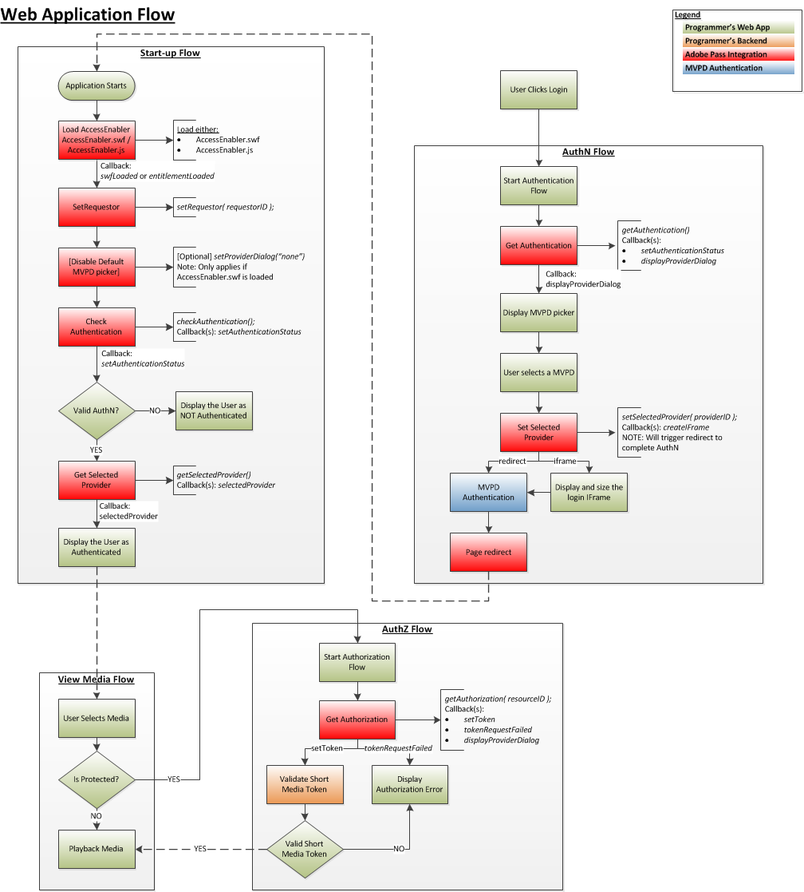

# JavaScript SDK Cookbook {#javascript-sdk-cookbook}

>[!NOTE]
>
>Innehållet på den här sidan tillhandahålls endast i informationssyfte. Användning av denna API kräver en aktuell licens från Adobe. Ingen obehörig användning är tillåten.

## Introduktion {#intro}

I det här dokumentet beskrivs de tillståndsarbetsflöden som en programmers program implementerar för en JavaScript-integrering med Adobe Pass Authentication-tjänsten. Länkar till JavaScript API Reference ingår i hela dokumentet.

Observera också att avsnittet [Relaterad information](#related) innehåller en
länka till en uppsättning JavaScript-kodexempel.

## Tillståndsflöden {#entitlement}

1. [Förutsättningar](#prereq)
2. [Startflöde](#startup)
3. [Autentiseringsflöde](#authn)
4. [Auktoriseringsflöde](#authz)
5. [Visa medieflöde](#logout)

</br>




## Förutsättningar {#prereq}

**Beroenden:**

- Adobe Pass Authentication Library (AccessEnabler) samarbetar med kontohanteraren för Adobe Pass-autentisering för att ordna detta.
- Giltigt begärande-ID för Adobe Pass-autentisering. Kontakta din kontohanterare för Adobe Pass-autentisering för att ordna detta.

Skapa callback-funktioner:

- `entitlementLoaded`
</br>

**Utlösare:** AccessEnabler har lästs in och initieringen har slutförts.

- `displayProviderDialog(mvpds)`

  **Utlös:** `getAuthentication(),` endast om användaren inte har valt en leverantör (ett MVPD) och inte har autentiserats ännu
Parametern mvpds är en array med providers som är tillgängliga för användaren.

- `setAuthenticationStatus(status, errorcode)`

  **Utlösare:**
   - `checkAuthentication()`varje gång.
   - `getAuthentication()` endast om användaren redan är autentiserad och har valt en leverantör.

  Status som returneras är lyckad eller misslyckad. Felkoden beskriver typen av fel.

- `createIFrame(width, height)`

  **Utlösare:** `setSelectedProvider(providerID)`, endast om den valda providern är konfigurerad att visas i en IFrame.

  >[!NOTE]
  >
  >En provider är konfigurerad att återge sin autentiseringsskärm som antingen en omdirigering eller i en iFrame, och programmeraren måste ta hänsyn till båda.

- `sendTrackingData(event, data)`

  **Utlösare:** `checkAuthentication(), getAuthentication(),checkAuthorization(), getAuthorization(), setSelectedProvider()`.  Parametern `event` anger vilken berättigandehändelse som inträffade. Parametern `data` är en lista med värden som relaterar till händelsen.
- `setToken(token, resource)`
  **Utlösare:** `checkAuthorization()` och `getAuthorization()` efter en auktorisering för att visa en resurs.   Parametern `token` är den kortlivade medietoken. Parametern `resource` är det innehåll som användaren har behörighet att visa.

- `tokenRequestFailed(resource, code, description)`
  **Utlösare:**`checkAuthorization()` och`getAuthorization()` efter en misslyckad auktorisering.\
  Parametern `resource` är det innehåll som användaren försökte visa. Parametern `code` är felkoden som anger vilken typ av fel som uppstod. Parametern `description` beskriver felet som är associerat med felkoden.

- `selectedProvider(mvpd)`

  **Utlösare:** [`getSelectedProvider()`](#$getSelProv Parametern `mvpd` ger information om providern som valts av
användaren.

- `setMetadataStatus(metadata, key, arguments)`

  **Utlösare:** `getMetadata().`\
  Parametern `metadata` innehåller de specifika data som du har begärt. Nyckelparametern är nyckeln som används i `getMetadata()`-begäran och parametern `arguments` är samma ordlista som skickades till `getMetadata()`.


## 2. Startflöde

**I. Läs in AccessEnabler JavaScript:**

**För mellanlagringsprofil**

```JSON
<script type="text/javascript"         
src="https://entitlement.auth-staging.adobe.com/entitlement/v4/AccessEnabler.js">
</script>"
```

eller...

**För produktionsprofil**

```JSON
<script type="text/javascript"         
src="https://entitlement.auth.adobe.com/entitlement/v4/AccessEnabler.js">
</script>"
```

**Utlösare:** När initieringen är klar, Adobe Pass
autentiseringen anropar din `entitlementLoaded()` callback-funktion. Det här är ingångspunkten för programmets kommunikation med AccessEnabler.


**II.** Ring `setRequestor()` för att upprätta
Programmerarens identitet; ange Programmerarens `requestorID` och
(valfritt) en array med Adobe Pass Authentication-slutpunkter.

**Utlösare:** Ingen, men `displayProviderDialog()` kan anropas vid behov.


**III.** Anropa `checkAuthentication()` för att kontrollera om det finns en befintlig autentisering utan att initiera det fullständiga [autentiseringsflödet].  Om det här anropet lyckas kan du fortsätta direkt till `authorization flow`.  Om inte går du vidare till `authentication flow`.

**Beroende:** Ett lyckat anrop till `setRequestor()` (det här beroendet gäller även för alla efterföljande anrop).

**Utlösare:** `setAuthenticationStatus()` återanrop

</br>

## 3. Autentiseringsflöde </span>


**Beroende:** Ett lyckat anrop till `setRequestor()` (det här beroendet gäller även för alla efterföljande anrop).


Anropa `getAuthentication()` för att få autentiseringsstatusen OR för att utlösa providerautentiseringsflödet.

**Utlösare:**

- `displayProviderDialog()`om användaren ännu inte har autentiserats
- `setAuthenticationStatus()` om autentisering redan har utförts

Autentiseringsflödet har slutförts när AccessEnabler anropar `setAuthenticationStatus()` med `isAuthenticated == 1`.

## 4. Auktoriseringsflöde {#authz}

**Beroenden:**

- Ett lyckat anrop till `setRequestor()` (det här beroendet gäller även för alla efterföljande anrop).
- Giltiga resurs-ID:n som avtalats med MVPD:n. Observera att resurs-ID:n ska vara samma som de som används på andra enheter eller plattformar och ska vara samma för alla programmeringsgränssnitten.

Anropa `getAuthorization()` och skicka ResourceID för det begärda mediet. Ett lyckat anrop returnerar en kort medietoken, som bekräftar att användaren har behörighet att visa det begärda mediet.

- Om anropet skickas: Användaren har en giltig AuthN-token och användaren har behörighet att titta på det begärda mediet.
- Om anropet misslyckas: Undersök undantaget som utlöses för att avgöra dess typ (AuthN, AuthZ eller något annat):
- Om anropet var ett AuthN-fel startar du om AuthN-flödet.
- Om anropet var ett AuthZ-fel har användaren inte behörighet att titta på det begärda mediet och någon typ av felmeddelande ska visas för användaren.
- Om det finns något annat fel (anslutningsfel, nätverksfel osv.) visar sedan ett felmeddelande för användaren.

Använd medietokentverifieraren för att validera den shortMediaToken som returnerades från ett lyckat `getAuthorization()`-anrop.


**Beroende:** Verifieraren för kort medietoken (ingår i
AccessEnabler-bibliotek)

- Om valideringen godkänns: Visa/spela upp det begärda mediet för användaren.
- Om den misslyckas: AuthZ-token var ogiltig, ska mediebegäran avvisas och ett felmeddelande ska visas för användaren.

## 5. Visa medieflöde {#logout}

- Användaren väljer de media som ska visas.
   - Är media skyddade?
      - Din app kontrollerar om mediet är skyddat:
         - Om mediet är skyddat startar din app autentiseringsflödet (AuthZ) ovan.
         - Om mediet inte är skyddat fortsätter du med Visa media-flödet.
         - Uppspelningsmedia

## Konfigurera besökar-ID {#visitorID}

Det är mycket viktigt att konfigurera ett [Experience Cloud-besökar-ID](https://experienceleague.adobe.com/docs/id-service/using/home.html) från analysens synvinkel. När ett EC-besökarID-värde har angetts skickar SDK den här informationen tillsammans med varje nätverksanrop och Adobe Pass Authentication-tjänsten samlar in den här informationen. På så sätt kan du korrelera analysdata från tjänsten Adobe Pass Authentication med andra analysrapporter som du kan ha från andra program eller webbplatser. Information om hur du konfigurerar EC visitorID finns [här](https://experienceleague.adobe.com/docs/id-service/using/home.html?lang=en).


>[!NOTE]
>
>Observera att detta funktionalitetsstöd är tillgängligt från och med JS SDK version 3.1.0.

<!--
### Related Information (#related)

* [JavaScript SDK Overview](/help/authentication/javascript-sdk-overview.md)
* [JavaScript SDK API Reference](/help/authentication/javascript-sdk-api-reference.md)
* **JavaScript SDK Code Samples**
-->
