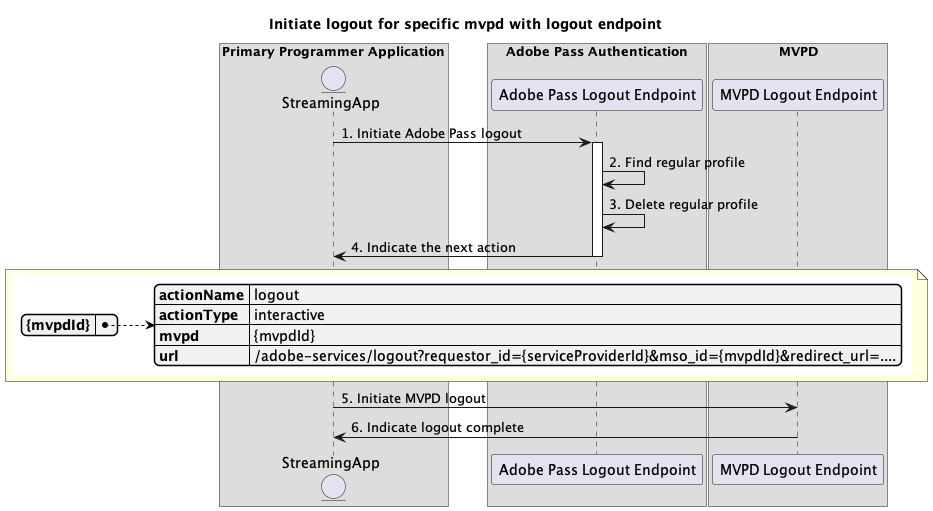

# Grundläggande utloggningsflöde som har utförts i det primära programmet {#basic-logout-flow-performed-within-primary-application}

>[!IMPORTANT]
>
> Innehållet på den här sidan tillhandahålls endast i informationssyfte. Användning av denna API kräver en aktuell licens från Adobe. Ingen obehörig användning är tillåten.

>[!IMPORTANT]
>
> REST API V2-implementeringen begränsas av dokumentationen för [begränsningsmekanismen](/help/authentication/throttling-mechanism.md).

**Utloggningsflödet** inom behörigheten Adobe Pass-autentisering gör att direktuppspelningsprogrammet kan utföra två huvudsteg:

* Ta bort de vanliga profiler som sparas på Adobe Pass-serverdel.
* Använd en användaragent (webbläsare) för att navigera till MVPD-slutpunkten för utloggning, vilket utlöser en rensning på MVPD-serverdelen.

Med grundläggande utloggningsflöde kan du fråga efter följande scenarier:

* [Initiera utloggning för specifik mvpd med utloggningsslutpunkt](#initiate-logout-for-specific-mvpd-with-logout-endpoint)
* [Initiera utloggning för specifik mvpd utan utloggningsslutpunkt](#initiate-logout-for-specific-mvpd-without-logout-endpoint)

## Initiera utloggning för specifik mvpd med utloggningsslutpunkt {#initiate-logout-for-specific-mvpd-with-logout-endpoint}

### Förutsättningar {#prerequisites-initiate-logout-for-specific-mvpd-with-logout-endpoint}

Innan du startar utloggningen för ett specifikt MVPD med en utloggningsslutpunkt måste du kontrollera att följande krav är uppfyllda:

* Strömningsprogrammet måste ha en giltig vanlig profil som har skapats för MVPD med något av de grundläggande autentiseringsflödena:
   * [Utför autentisering i det primära programmet](./rest-api-v2-basic-authentication-primary-application-flow.md)
   * [Utför autentisering i det sekundära programmet med förvald mvpd](./rest-api-v2-basic-authentication-secondary-application-flow.md)
   * [Utför autentisering i det sekundära programmet utan förvald mvpd](./rest-api-v2-basic-authentication-secondary-application-flow.md)
* Strömningsprogrammet måste initiera utloggningsflödet när det behöver logga ut från MVPD.

>[!IMPORTANT]
>
> Antaganden
>
>  
> 
> * MVPD stöder utloggningsflödet och har en utloggningsslutpunkt.

### Arbetsflöde {#workflow-initiate-logout-for-specific-mvpd-with-logout-endpoint}

Följ de angivna stegen för att implementera det grundläggande utloggningsflödet för ett specifikt MVPD med en utloggningsslutpunkt som utförs i ett primärt program enligt bilden nedan.

*Initiera utloggning för specifik mvpd med utloggningsslutpunkt*

1. **Initiera Adobe Pass-utloggning:** Direktuppspelningsprogrammet samlar in alla data som behövs för att initiera utloggningsflödet genom att anropa Adobe Pass utloggningsslutpunkt.

   >[!IMPORTANT]
   >
   > Mer information om hur du använder API-dokumentationen för mvpd](../../apis/logout-apis/rest-api-v2-logout-apis-initiate-logout-for-specific-mvpd.md) finns i [Initiera utloggning:
   >
   > * Alla _obligatoriska_-parametrar, som `serviceProvider`, `mvpd` och `redirectUrl`
   > * Alla _obligatoriska_ rubriker, som `Authorization`, `AP-Device-Identifier`
   > * Alla _valfria_ parametrar och rubriker

1. **Hitta en vanlig profil:** Adobe Pass-servern identifierar en giltig profil baserat på mottagna parametrar och rubriker.

1. **Ta bort vanlig profil:** Adobe Pass-servern tar bort den identifierade vanliga profilen från Adobe Pass serverdel.

1. **Ange nästa åtgärd:** Slutpunktssvaret för Adobe Pass-utloggningen innehåller de data som krävs för att vägleda direktuppspelningsprogrammet angående nästa åtgärd:
   * Attributet `url` finns eftersom MVPD stöder utloggningsflödet.
   * Attributet `actionName` är inställt på &quot;log out&quot;.
   * Attributet `actionType` är inställt på &quot;interactive&quot;.

   >[!IMPORTANT]
   >
   > Mer information om vilken information som ges i ett utloggningssvar finns i [Initiera utloggning för specifik mvpd](../../apis/logout-apis/rest-api-v2-logout-apis-initiate-logout-for-specific-mvpd.md) API-dokumentation.
   > 
   >  
   > 
   > Adobe Pass utloggningsslutpunkt validerar data i begäran för att säkerställa att de grundläggande villkoren uppfylls:
   >
   > * Parametrarna och rubrikerna _required_ måste vara giltiga.
   > * Integrationen mellan angiven `serviceProvider` och `mvpd` måste vara aktiv.
   >
   >  
   > 
   > Om valideringen misslyckas genereras ett felsvar som ger ytterligare information som följer dokumentationen för [Förbättrade felkoder](../../../enhanced-error-codes.md).

1. **Initiera MVPD-utloggning:** Strömningsprogrammet läser `url` och använder en användaragent för att initiera utloggningsflödet med MVPD. Flödet kan innehålla flera omdirigeringar till MVPD-system. Resultatet är dock att MVPD utför sin interna rensning och skickar den slutliga utloggningsbekräftelsen tillbaka till Adobe Pass backend.

1. **Ange att utloggningen är slutförd:** Strömningsprogrammet kan vänta på att användaragenten ska nå den angivna `redirectUrl` och kan använda den som en signal för att visa ett specifikt meddelande i användargränssnittet.

## Initiera utloggning för specifik mvpd utan utloggningsslutpunkt {#initiate-logout-for-specific-mvpd-without-logout-endpoint}

### Förutsättningar {#prerequisites-initiate-logout-for-specific-mvpd-without-logout-endpoint}

Innan du startar utloggningen för ett specifikt MVPD utan en utloggningsslutpunkt måste du kontrollera att följande krav är uppfyllda:

* Strömningsprogrammet måste ha en giltig vanlig profil som har skapats för MVPD med något av de grundläggande autentiseringsflödena:
   * [Utför autentisering i det primära programmet](./rest-api-v2-basic-authentication-primary-application-flow.md)
   * [Utför autentisering i det sekundära programmet med förvald mvpd](./rest-api-v2-basic-authentication-secondary-application-flow.md)
   * [Utför autentisering i det sekundära programmet utan förvald mvpd](./rest-api-v2-basic-authentication-secondary-application-flow.md)
* Strömningsprogrammet måste initiera utloggningsflödet när det behöver logga ut från MVPD.

>[!IMPORTANT]
>
> Antaganden
>
>  
> 
> * MVPD stöder inte utloggningsflödet och har ingen utloggningsslutpunkt.

### Arbetsflöde {#workflow-initiate-logout-for-specific-mvpd-without-logout-endpoint}

Följ de angivna stegen för att implementera det grundläggande utloggningsflödet för ett specifikt MVPD utan en utloggningsslutpunkt som utförs i ett primärt program enligt bilden nedan.

*Initiera utloggning för specifik mvpd utan utloggningsslutpunkt*

1. **Initiera Adobe Pass-utloggning:** Direktuppspelningsprogrammet samlar in alla data som behövs för att initiera utloggningsflödet genom att anropa Adobe Pass utloggningsslutpunkt.

   >[!IMPORTANT]
   >
   > Mer information om hur du använder API-dokumentationen för mvpd](../../apis/logout-apis/rest-api-v2-logout-apis-initiate-logout-for-specific-mvpd.md) finns i [Initiera utloggning:
   >
   > * Alla _obligatoriska_-parametrar, som `serviceProvider`, `mvpd` och `redirectUrl`
   > * Alla _obligatoriska_ rubriker, som `Authorization`, `AP-Device-Identifier`
   > * Alla _valfria_ parametrar och rubriker

1. **Hitta en vanlig profil:** Adobe Pass-servern identifierar en giltig profil baserat på mottagna parametrar och rubriker.

1. **Ta bort vanlig profil:** Adobe Pass-servern tar bort den identifierade vanliga profilen.

1. **Ange nästa åtgärd:** Slutpunktssvaret för Adobe Pass-utloggningen innehåller de data som krävs för att vägleda direktuppspelningsprogrammet angående nästa åtgärd:
   * Attributet `url` saknas eftersom MVPD inte stöder utloggningsflödet.
   * Attributet `actionName` är inställt på&quot;complete&quot;.
   * Attributet `actionType` är inställt på none.

   >[!IMPORTANT]
   >
   > Mer information om vilken information som ges i ett utloggningssvar finns i [Initiera utloggning för specifik mvpd](../../apis/logout-apis/rest-api-v2-logout-apis-initiate-logout-for-specific-mvpd.md) API-dokumentation.
   > 
   >  
   > 
   > Adobe Pass utloggningsslutpunkt validerar data i begäran för att säkerställa att de grundläggande villkoren uppfylls:
   >
   > * Parametrarna och rubrikerna _required_ måste vara giltiga.
   > * Integrationen mellan angiven `serviceProvider` och `mvpd` måste vara aktiv.
   >
   >  
   > 
   > Om valideringen misslyckas genereras ett felsvar som ger ytterligare information som följer dokumentationen för [Förbättrade felkoder](../../../enhanced-error-codes.md).

1. **Ange att utloggningen är slutförd:** Direktuppspelningsprogrammet bearbetar svaret och kan använda det för att visa ett specifikt meddelande i användargränssnittet.
