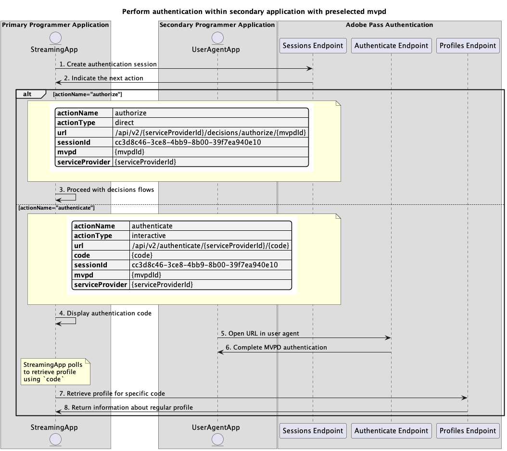
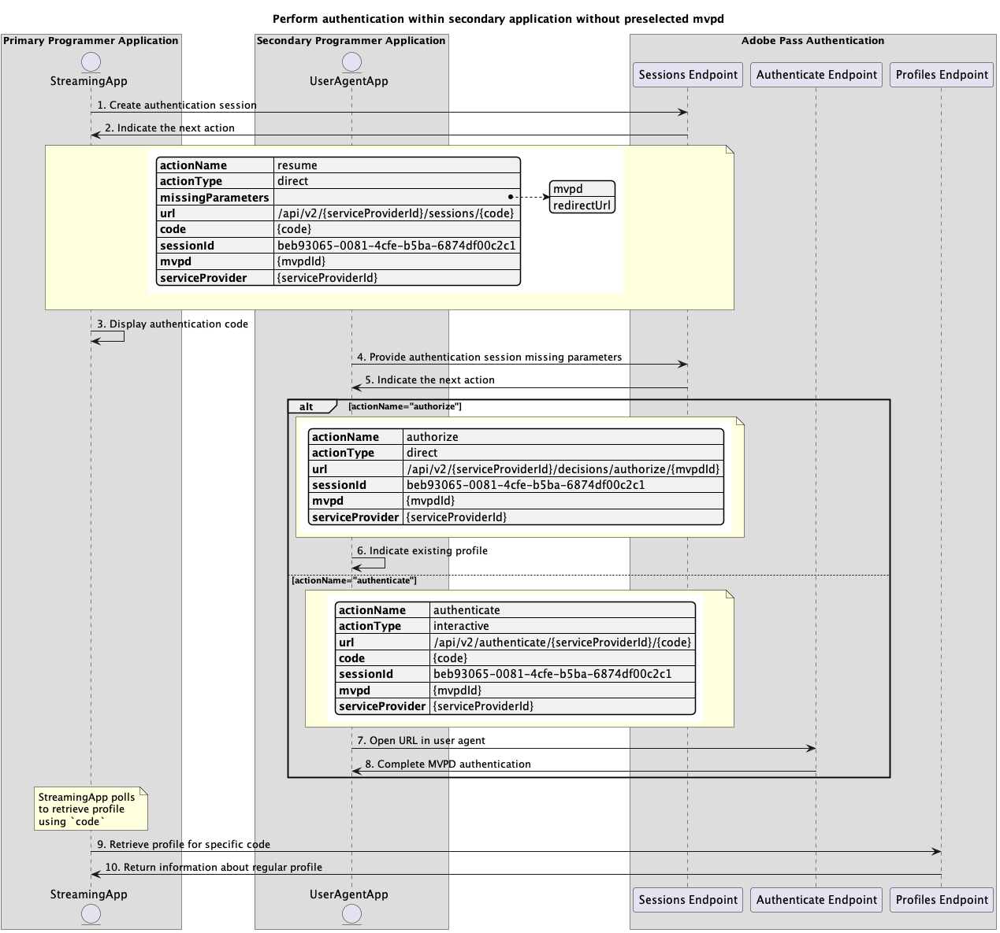

# Grundläggande autentiseringsflöde som utförs i sekundärt program {#basic-authentication-flow-performed-within-secondary-application}

**Autentiseringsflödet** i Adobe Pass-autentiseringsberättigandet gör att direktuppspelningsprogrammet kan verifiera att en användare har ett giltigt MVPD-konto. Denna process kräver att användaren har ett aktivt MVPD-konto och anger giltiga inloggningsuppgifter på MVPD-inloggningssidan.

Autentiseringsflöde krävs i följande fall:

* När användaren öppnar ett program för första gången.
* När användarens tidigare autentisering har upphört att gälla.
* När användaren loggar ut från MVPD-kontot.
* När användaren vill autentisera med ett annat MVPD.

I alla dessa fall får programmet som anropar någon av profilslutpunkterna ett tomt svar eller en eller flera profiler, men för olika programmeringsvideofilmsprogram.

**Autentiseringsflödet** kräver att en användaragent (webbläsare) slutför en serie samtal från programmet till Adobe Pass-servern, sedan till inloggningssidan för MVPD och slutligen tillbaka till programmet. Detta flöde kan omfatta flera omdirigeringar till MVPD-system och hantering av cookies eller sessioner som lagras för varje domän, vilket kan vara en utmaning att uppnå och skydda utan användaragent.

Autentiseringsscenarierna är följande:

* [Utför autentisering i det primära programmet](../basic-flows/rest-api-v2-basic-authentication-primary-application-flow.md)
* [Utför autentisering i det sekundära programmet med förvald mvpd](../basic-flows/rest-api-v2-basic-authentication-secondary-application-flow.md)
* [Utför autentisering i det sekundära programmet utan förvald mvpd](../basic-flows/rest-api-v2-basic-authentication-secondary-application-flow.md)

## Utför autentisering i det sekundära programmet med förvald mvpd {#perform-authentication-within-secondary-application-with-preselected-mvpd}

### Förutsättningar {#prerequisites-perform-authentication-within-secondary-application-with-preselected-mvpd}

Innan du startar autentiseringsflödet i ett primärt program och avslutar det via användarinteraktion i ett sekundärt program måste du se till att följande krav uppfylls:

* Strömningsprogrammet måste välja ett MVPD.
* Strömningsprogrammet måste initiera en autentiseringssession för att kunna logga in med det valda MVPD-programmet.
* Det sekundära programmet måste autentisera med det valda MVPD-programmet i en användaragent.

>[!IMPORTANT]
>
> Antaganden
>
>  
> 
> * Strömningsprogrammet stöder användarinteraktion för att välja ett MVPD.
> * Det sekundära programmet (vanligtvis på en sekundär enhet) stöder användarinteraktion för att autentisera med det valda MVPD-programmet i en användaragent.

### Arbetsflöde {#workflow-perform-authentication-within-secondary-application-with-preselected-mvpd}

Följ de angivna stegen för att implementera det grundläggande autentiseringsflödet som utförs i ett sekundärt program med ett förvalt MVPD enligt bilden nedan.

*Utför autentisering i det sekundära programmet med förvald mvpd*

1. **Skapa autentiseringssession:** Direktuppspelningsprogrammet samlar in alla data som behövs för att initiera en autentiseringssession genom att anropa sessionens slutpunkt.

   Mer information om hur du gör det finns i API-dokumentationen för [Skapa autentiseringssession](../../apis/sessions-apis/rest-api-v2-sessions-apis-create-authentication-session.md):
   * Alla _obligatoriska_-parametrar, som `serviceProvider`, `mvpd`, `domainName` och `redirectUrl`
   * Alla _obligatoriska_ rubriker, som `Authorization`, `AP-Device-Identifier`
   * Alla _valfria_ parametrar och rubriker

   >[!IMPORTANT]
   > 
   > Direktuppspelningsprogrammet måste tillhandahålla alla nödvändiga parametrar i ett enda anrop när autentiseringssessionen skapas.

1. **Ange nästa åtgärd:** Sessionernas slutpunktssvar innehåller de data som behövs för att vägleda direktuppspelningsprogrammet när det gäller nästa åtgärd.

   Mer information om vilken information som finns i ett sessionssvar finns i API-dokumentationen för [Skapa autentiseringssession](../../apis/sessions-apis/rest-api-v2-sessions-apis-create-authentication-session.md).

   >[!IMPORTANT]
   >
   > Sessionernas slutpunkt validerar data i begäran för att säkerställa att de grundläggande villkoren uppfylls:
   >
   > * Parametrarna och rubrikerna _required_ måste vara giltiga.
   > * Integrationen mellan angiven `serviceProvider` och `mvpd` måste vara aktiv.
   >
   >  
   > 
   > Om valideringen misslyckas genereras ett felsvar som ger ytterligare information som följer dokumentationen för [Förbättrade felkoder](../../../enhanced-error-codes.md).

1. **Fortsätt med beslutsflöden:** Sessionernas slutpunktssvar innehåller följande data:
   * Attributet `actionName` är inställt på&quot;auktorisera&quot;.
   * Attributet `actionType` är inställt på&quot;direct&quot;.

   Om Adobe Pass serverdel identifierar en giltig profil behöver direktuppspelningsprogrammet inte autentisera igen med det valda MVPD-programmet, eftersom det redan finns en profil som kan användas för efterföljande beslutsflöden.

1. **Visa autentiseringskod:** Sessionernas slutpunktssvar innehåller följande data:
   * `code` som kan användas för att återuppta autentiseringssessionen i ett sekundärt program.
   * Attributet `actionName` är inställt på &quot;authenticate&quot;.
   * Attributet `actionType` är inställt på &quot;interactive&quot;.

   Om Adobe Pass serverdel inte identifierar en giltig profil, visar direktuppspelningsprogrammet `code` som kan användas för att återuppta autentiseringssessionen i ett sekundärt program.

1. **Öppna URL i användaragent:** Det sekundära programmet öppnar en användaragent för inläsning av den självberäknade `url`, vilket gör en begäran till slutpunkten för autentisering. Det här flödet kan innehålla flera omdirigeringar, vilket i slutänden leder användaren till MVPD-inloggningssidan och anger giltiga inloggningsuppgifter.

1. **Fullständig MVPD-autentisering:** Om autentiseringsflödet lyckas sparar användaragentinteraktionen en vanlig profil i Adobe Pass-serverdelen och når den angivna `redirectUrl`.

1. **Hämta profil för specifik kod:** Direktuppspelningsprogrammet samlar in alla nödvändiga data för att hämta profilinformation genom att skicka en begäran till profilslutpunkten.

   Mer information om följande finns i [Hämta profil för specifik API-dokumentation för koden](../../apis/profiles-apis/rest-api-v2-profiles-apis-retrieve-profiles-for-specific-code.md):
   * Alla _obligatoriska_-parametrar, som `serviceProvider` och `code`
   * Alla _obligatoriska_ rubriker, som `Authorization`, `AP-Device-Identifier`
   * Alla _valfria_ parametrar och rubriker

   >[!NOTE]
   >
   > Förslag: Direktuppspelningsprogrammet kan implementera en avsökningsmekanism med `code` för att kontrollera om den reguljära profilen genererades och sparades.

1. **Returinformation om vanlig profil:** Profilernas slutpunktssvar innehåller information om den vanliga profil som är associerad med de mottagna parametrarna och rubrikerna.

   Mer information om vilken information som ges i ett profilsvar finns i [Hämta profil för specifik kod](../../apis/profiles-apis/rest-api-v2-profiles-apis-retrieve-profiles-for-specific-code.md) API-dokumentation.

   >[!IMPORTANT]
   >
   > Profilens slutpunkt validerar data i begäran för att säkerställa att de grundläggande villkoren uppfylls:
   >
   > * Parametrarna och rubrikerna _required_ måste vara giltiga.
   >
   >  
   > 
   > Om valideringen misslyckas genereras ett felsvar som ger ytterligare information som följer dokumentationen för [Förbättrade felkoder](../../../enhanced-error-codes.md).

## Utför autentisering i det sekundära programmet utan förvald mvpd {#perform-authentication-within-secondary-application-without-preselected-mvpd}

### Förutsättningar {#prerequisites-perform-authentication-within-secondary-application-without-preselected-mvpd}

Innan du startar autentiseringsflödet i ett primärt program och avslutar det via användarinteraktion i ett sekundärt program måste du se till att följande krav uppfylls:

* Direktuppspelningsprogrammet måste initiera en autentiseringssession när det behöver logga in.
* Det sekundära programmet måste välja en MVPD.
* Det sekundära programmet måste autentisera med det valda MVPD-programmet i en användaragent.

>[!IMPORTANT]
>
> Antaganden
>
>  
> 
> * Det sekundära programmet (vanligtvis på en sekundär enhet) stöder användarinteraktion för att välja ett MVPD.
> * Det sekundära programmet (vanligtvis på en sekundär enhet) stöder användarinteraktion för att autentisera med det valda MVPD-programmet i en användaragent.

### Arbetsflöde {#workflow-perform-authentication-within-secondary-application-without-preselected-mvpd}

Följ de angivna stegen för att implementera det grundläggande autentiseringsflödet som utförs i ett sekundärt program utan ett förvalt MVPD enligt bilden nedan.

*Utför autentisering i det sekundära programmet utan förvald mvpd*

1. **Skapa autentiseringssession:** Strömningsprogrammet samlar in en del av de data som krävs för att initiera en autentiseringssession genom att anropa sessionens slutpunkt.

   Mer information om hur du gör det finns i API-dokumentationen för [Skapa autentiseringssession](../../apis/sessions-apis/rest-api-v2-sessions-apis-create-authentication-session.md):
   * Alla _obligatoriska_-parametrar, som `serviceProvider`
   * Alla _obligatoriska_ rubriker, som `Authorization`, `AP-Device-Identifier`
   * Alla _valfria_ parametrar och rubriker

   >[!IMPORTANT]
   >
   > Direktuppspelningsprogrammet kan inte tillhandahålla alla nödvändiga parametrar i ett enda anrop när autentiseringssessionen skapas.

1. **Ange nästa åtgärd:** Sessionernas slutpunktssvar innehåller de data som behövs för att vägleda direktuppspelningsprogrammet när det gäller nästa åtgärd:
   * `code` som kan användas för att återuppta autentiseringssessionen i ett sekundärt program.
   * Attributet `actionName` är inställt på &quot;resume&quot;.
   * Attributet `actionType` är inställt på&quot;direct&quot;.

   Mer information om vilken information som finns i ett sessionssvar finns i API-dokumentationen för [Skapa autentiseringssession](../../apis/sessions-apis/rest-api-v2-sessions-apis-create-authentication-session.md).

   >[!IMPORTANT]
   >
   > Sessionernas slutpunkt validerar data i begäran för att säkerställa att de grundläggande villkoren uppfylls:
   >
   > * Parametrarna och rubrikerna _required_ måste vara giltiga.
   >
   >  
   > 
   > Om valideringen misslyckas genereras ett felsvar som ger ytterligare information som följer dokumentationen för [Förbättrade felkoder](../../../enhanced-error-codes.md).

1. **Visa autentiseringskod:** Strömningsprogrammet visar `code` som kan användas för att återuppta autentiseringssessionen i ett sekundärt program.

1. **Ange att parametrar saknas i autentiseringssessionen:** Det sekundära programmet samlar in alla data som saknas för att återuppta autentiseringssessionen och anropar sessionens slutpunkt.

   Mer information om hur du gör det finns i [Återuppta autentiseringssession](../../apis/sessions-apis/rest-api-v2-sessions-apis-resume-authentication-session.md) API-dokumentationen:
   * Alla _obligatoriska_-parametrar, som `serviceProvider`, `mvpd`, `domainName` och `redirectUrl`
   * Alla _obligatoriska_ rubriker, som `Authorization`, `AP-Device-Identifier`
   * Alla _valfria_ parametrar och rubriker

1. **Ange nästa åtgärd:** Sessionernas slutpunktssvar innehåller de data som behövs för att vägleda direktuppspelningsprogrammet när det gäller nästa åtgärd.

   Mer information om vilken information som ges i ett sessionssvar finns i [Återuppta autentiseringssession](../../apis/sessions-apis/rest-api-v2-sessions-apis-resume-authentication-session.md) API-dokumentationen.

   >[!IMPORTANT]
   >
   > Sessionernas slutpunkt validerar data i begäran för att säkerställa att de grundläggande villkoren uppfylls:
   >
   > * Parametrarna och rubrikerna _required_ måste vara giltiga.
   > * Integrationen mellan angiven `serviceProvider` och `mvpd` måste vara aktiv.
   >
   >  
   > 
   > Om valideringen misslyckas genereras ett felsvar som ger ytterligare information som följer dokumentationen för [Förbättrade felkoder](../../../enhanced-error-codes.md).

1. **Ange befintlig profil:** Sessionernas slutpunktssvar innehåller följande data:
   * Attributet `actionName` är inställt på&quot;auktorisera&quot;.
   * Attributet `actionType` är inställt på&quot;direct&quot;.

   Om Adobe Pass serverdel identifierar en giltig profil behöver direktuppspelningsprogrammet inte autentisera igen med det valda MVPD-programmet, eftersom det redan finns en profil som kan användas för efterföljande beslutsflöden.

1. **Öppna URL i användaragent:** Sessionernas slutpunktssvar innehåller följande data:
   * `url` som kan användas för att initiera den interaktiva autentiseringen på MVPD-inloggningssidan.
   * Attributet `actionName` är inställt på &quot;authenticate&quot;.
   * Attributet `actionType` är inställt på &quot;interactive&quot;.

   Om Adobe Pass serverdel inte identifierar en giltig profil, öppnar det sekundära programmet en användaragent för att läsa in `url`, vilket gör en begäran till slutpunkten för autentisering. Det här flödet kan innehålla flera omdirigeringar, vilket i slutänden leder användaren till MVPD-inloggningssidan och anger giltiga inloggningsuppgifter.

1. **Fullständig MVPD-autentisering:** Om autentiseringsflödet lyckas sparar användaragentinteraktionen en vanlig profil i Adobe Pass-serverdelen och når den angivna `redirectUrl`.

1. **Hämta profil för specifik kod:** Direktuppspelningsprogrammet samlar in alla nödvändiga data för att hämta profilinformation genom att skicka en begäran till profilslutpunkten.

   Mer information om följande finns i [Hämta profil för specifik API-dokumentation för koden](../../apis/profiles-apis/rest-api-v2-profiles-apis-retrieve-profiles-for-specific-code.md):
   * Alla _obligatoriska_-parametrar, som `serviceProvider` och `code`
   * Alla _obligatoriska_ rubriker, som `Authorization`, `AP-Device-Identifier`
   * Alla _valfria_ parametrar och rubriker

   >[!NOTE]
   >
   > Förslag: Direktuppspelningsprogrammet kan implementera en avsökningsmekanism med `code` för att kontrollera om den reguljära profilen genererades och sparades.

1. **Returinformation om vanlig profil:** Profilernas slutpunktssvar innehåller information om den vanliga profil som är associerad med de mottagna parametrarna och rubrikerna.

   Mer information om vilken information som ges i ett profilsvar finns i [Hämta profil för specifik kod](../../apis/profiles-apis/rest-api-v2-profiles-apis-retrieve-profiles-for-specific-code.md) API-dokumentation.

   >[!IMPORTANT]
   >
   > Profilens slutpunkt validerar data i begäran för att säkerställa att de grundläggande villkoren uppfylls:
   >
   > * Parametrarna och rubrikerna _required_ måste vara giltiga.
   >
   >  
   > 
   > Om valideringen misslyckas genereras ett felsvar som ger ytterligare information som följer dokumentationen för [Förbättrade felkoder](../../../enhanced-error-codes.md).
