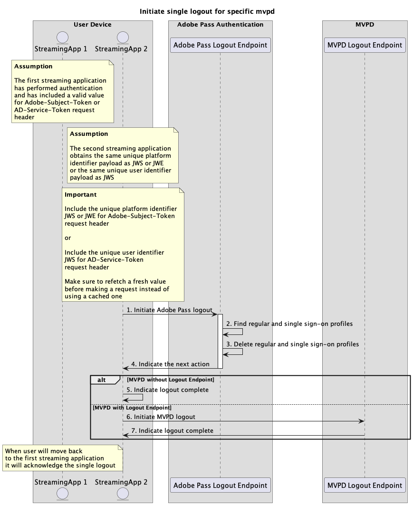

# Enkelt utloggningsflöde {#single-logout-flow}

>[!IMPORTANT]
>
> Innehållet på den här sidan tillhandahålls endast i informationssyfte. Användning av denna API kräver en aktuell licens från Adobe. Ingen obehörig användning är tillåten.

>[!IMPORTANT]
>
> REST API V2-implementeringen begränsas av dokumentationen för [begränsningsmekanismen](/help/authentication/throttling-mechanism.md).

## Initiera enkel utloggning för specifik mvpd {#initiate-single-logout-for-specific-mvpd}

### Förutsättningar {#prerequisites-initiate-single-logout-for-specific-mvpd}

Innan du startar en enda utloggning för ett specifikt MVPD måste du kontrollera att följande krav är uppfyllda:

* Det andra direktuppspelningsprogrammet måste ha en giltig enkel inloggningsprofil som har skapats för MVPD med ett av autentiseringsflödena för enkel inloggning:
   * [Utför autentisering genom enkel inloggning med plattformsidentitet](./rest-api-v2-single-sign-on-platform-identity-flows.md)
   * [Utför autentisering med enkel inloggning med tjänsttoken](./rest-api-v2-single-sign-on-service-token-flows.md)
* Det andra direktuppspelningsprogrammet måste initiera ett enda utloggningsflöde när det behöver logga ut från MVPD.

>[!IMPORTANT]
> 
> Antaganden
>
>  
> 
> * Det första och andra direktuppspelningsprogrammet får samma unika plattformsidentifierarnyttolast som `JWS` eller `JWE` eller samma unika användaridentifierarnyttolast som `JWS`.

### Arbetsflöde {#workflow-initiate-single-logout-for-specific-mvpd}

Utför de angivna stegen för att implementera ett enda utloggningsflöde för ett specifikt MVPD enligt bilden nedan.

*Initiera enkel utloggning för specifik mvpd*

1. **Initiera Adobe Pass-utloggning:** Direktuppspelningsprogrammet samlar in alla data som behövs för att initiera utloggningsflödet genom att anropa Adobe Pass utloggningsslutpunkt.

   >[!IMPORTANT]
   >
   > Mer information om hur du använder API-dokumentationen för mvpd](../../apis/logout-apis/rest-api-v2-logout-apis-initiate-logout-for-specific-mvpd.md) finns i [Initiera utloggning:
   >
   > * Alla _obligatoriska_-parametrar, som `serviceProvider`, `mvpd` och `redirectUrl`
   > * Alla _obligatoriska_ rubriker, som `Authorization`, `AP-Device-Identifier`
   > * Alla _valfria_ parametrar och rubriker
   >
   >  
   >
   > Strömningsprogrammet måste se till att det innehåller ett giltigt värde för den unika plattforms-ID:t eller den unika användaridentifieraren innan en begäran görs.
   >
   >  
   > 
   > Mer information om rubriken `Adobe-Subject-Token` finns i [Adobe-Subject-Token](../../appendix/headers/rest-api-v2-appendix-headers-adobe-subject-token.md) -dokumentationen.
   > 
   >  
   > 
   > Mer information om rubriken `AD-Service-Token` finns i dokumentationen för [AD-Service-Token](../../appendix/headers/rest-api-v2-appendix-headers-ad-service-token.md).

1. **Hitta vanliga profiler och profiler för enkel inloggning:** Adobe Pass-servern identifierar giltiga profiler för både vanlig och enkel inloggning baserat på mottagna parametrar och rubriker.

1. **Ta bort vanliga profiler och profiler för enkel inloggning:** Adobe Pass-servern tar bort identifierade vanliga profiler och profiler för enkel inloggning från Adobe Pass serverdel.

1. **Ange nästa åtgärd:** Slutpunktssvaret för Adobe Pass-utloggningen innehåller de data som krävs för att vägleda direktuppspelningsprogrammet angående nästa åtgärd.

   >[!IMPORTANT]
   >
   > Mer information om vilken information som ges i ett utloggningssvar finns i [Initiera utloggning för specifik mvpd](../../apis/logout-apis/rest-api-v2-logout-apis-initiate-logout-for-specific-mvpd.md) API-dokumentation.
   > 
   >  
   > 
   > Adobe Pass utloggningsslutpunkt validerar data i begäran för att säkerställa att de grundläggande villkoren uppfylls:
   >
   > * Parametrarna och rubrikerna _required_ måste vara giltiga.
   > * Integrationen mellan angiven `serviceProvider` och `mvpd` måste vara aktiv.
   >
   >  
   > 
   > Om valideringen misslyckas genereras ett felsvar som ger ytterligare information som följer dokumentationen för [Förbättrade felkoder](../../../enhanced-error-codes.md).

1. **Ange att utloggningen är slutförd:** Om MVPD inte stöder utloggningsflödet bearbetar direktuppspelningsprogrammet svaret och kan använda det för att visa ett specifikt meddelande i användargränssnittet.

1. **Initiera MVPD-utloggning:** Om MVPD saknar stöd för utloggningsflödet bearbetar direktuppspelningsprogrammet svaret och använder en användaragent för att initiera utloggningsflödet med MVPD. Flödet kan innehålla flera omdirigeringar till MVPD-system. Resultatet är dock att MVPD utför sin interna rensning och skickar den slutliga utloggningsbekräftelsen tillbaka till Adobe Pass backend.

1. **Ange att utloggningen är slutförd:** Strömningsprogrammet kan vänta på att användaragenten ska nå den angivna `redirectUrl` och kan använda den som en signal för att visa ett specifikt meddelande i användargränssnittet.

>[!NOTE]
>
> Stegen för det enskilda utloggningsflödet är desamma som ovan, om det initieras från det första direktuppspelningsprogrammet.
