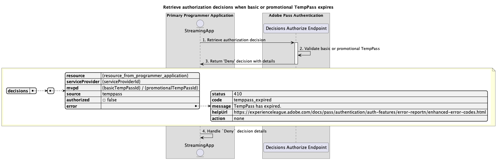

# Tillfälliga åtkomstflöden {#temporary-access-flows}

>[!IMPORTANT]
>
> Innehållet på den här sidan tillhandahålls endast i informationssyfte. Användning av denna API kräver en aktuell licens från Adobe. Ingen obehörig användning är tillåten.

>[!IMPORTANT]
>
> REST API V2-implementeringen begränsas av dokumentationen för [begränsningsmekanismen](/help/authentication/throttling-mechanism.md).

Med TempPass kan programmerare ge temporär åtkomst till sitt skyddade innehåll utan att be användarna autentisera med ett giltigt MVPD-konto.

Mer information om TempPass-funktionen finns i [TempPass](../../../temp-pass.md) -dokumentationen.

Med tillfälliga åtkomstflöden kan du fråga efter följande scenarier:

* [Hämta auktoriseringsbeslut med grundläggande TempPass](#retrieve-authorization-decisions-using-basic-temppass)
* [Hämta auktoriseringsbeslut med hjälp av kampanjtempPass](#retrieve-authorization-decisions-using-promotional-temppass)
* [Använd maximalt antal resurser med hjälp av erbjudandet TempPass](#consume-maximum-number-of-resources-using-promotional-temppass)
* [Hämta auktoriseringsbeslut när grundläggande eller kampanjtillagda TempPass upphör att gälla](#retrieve-authorization-decisions-when-basic-or-promotional-temppass-expires)
* [Hämta profil för grundläggande TempPass](#retrieve-profile-for-basic-temppass)
* [Hämta profil för kampanj TempPass](#retrieve-profile-for-promotional-temppass)

## Hämta auktoriseringsbeslut med grundläggande TempPass {#retrieve-authorization-decisions-using-basic-temppass}

### Förutsättningar {#prerequisites-retrieve-authorization-decisions-using-basic-temppass}

Innan du hämtar auktoriseringsbeslut med hjälp av grundläggande TempPass måste du kontrollera att följande krav är uppfyllda:

* Strömningsprogrammet vill ge temporär åtkomst till uppspelningsinnehåll utan att be användaren autentisera.
* Strömningsprogrammet måste hämta ett auktoriseringsbeslut innan en användarvald resurs spelas upp.

>[!IMPORTANT]
>
> Antaganden
> 
>  
> 
> * En giltig konfigurationsinställning för grundläggande TempPass måste tillämpas på integreringen mellan angiven `serviceProvider` och `mvpd`.
> * TTL (Time-To-Live) som konfigurerats för det grundläggande TempPass har inte gått ut.

### Arbetsflöde {#workflow-retrieve-authorization-decisions-using-basic-temppass}

Följ de angivna stegen för att implementera auktoriseringsflödet med hjälp av grundläggande TempPass som i följande diagram.

*Hämta auktoriseringsbeslut med grundläggande TempPass*

1. **Hämta auktoriseringsbeslut:** Direktuppspelningsprogrammet samlar in alla nödvändiga data för att erhålla ett auktoriseringsbeslut för en specifik resurs genom att anropa auktoriseringsslutpunkten för beslut.

   >[!IMPORTANT]
   >
   > Mer information om följande finns i [Hämta auktoriseringsbeslut med hjälp av specifik API-dokumentation för mvpd](../../apis/decisions-apis/rest-api-v2-decisions-apis-retrieve-authorization-decisions-using-specific-mvpd.md):
   > 
   > * Alla _obligatoriska_-parametrar, som `serviceProvider`, `mvpd` och `resources`
   > * Alla _obligatoriska_ rubriker, som `Authorization` och `AP-Device-Identifier`
   > * Alla _valfria_ parametrar och rubriker

1. **Verifiera grundläggande TempPass:** Adobe Pass-servern verifierar om en giltig konfigurationskonfiguration av grundläggande TempPass har tillämpats på integreringen mellan angiven `serviceProvider` och `mvpd`.

1. **Returbeslut `Permit` med medietoken:** Slutpunktssvaret för beslutsauktorisering innehåller ett `Permit`-beslut och en medietoken.

   >[!IMPORTANT]
   >
   > Mer information om vilken information som ges i ett beslutssvar finns i [Hämta auktoriseringsbeslut med hjälp av specifik mvpd](../../apis/decisions-apis/rest-api-v2-decisions-apis-retrieve-authorization-decisions-using-specific-mvpd.md) API-dokumentation.
   >
   >  
   > 
   > Slutpunkten för beslutsauktorisering validerar data för begäran för att säkerställa att de grundläggande villkoren uppfylls:
   >
   > * Parametrarna och rubrikerna _required_ måste vara giltiga.
   > * Integrationen mellan angiven `serviceProvider` och `mvpd` måste vara aktiv.
   >
   >  
   > 
   > Om den grundläggande valideringen misslyckas genereras ett felsvar som ger ytterligare information som följer dokumentationen för [Förbättrade felkoder](../../../enhanced-error-codes.md).
   >
   >  
   > 
   > Slutpunkten för godkännande av beslut använder data för begäran för att kontrollera om villkoren för tillfällig åtkomst är uppfyllda:
   >
   > * TTL-värdet (Time-To-Live) som konfigurerats för det grundläggande TempPass-objektet får inte ha gått ut.
   >
   >  
   > 
   > Om den tillfälliga åtkomstvalideringen misslyckas genereras ett felsvar som ger ytterligare information som följer dokumentationen för [Förbättrade felkoder](../../../enhanced-error-codes.md).

1. **Starta dataström med medietoken:** Direktuppspelningsprogrammet använder medietoken för att spela upp innehållet.

## Hämta auktoriseringsbeslut med hjälp av kampanjtempPass {#retrieve-authorization-decisions-using-promotional-temppass}

### Förutsättningar {#prerequisites-retrieve-authorization-decisions-using-promotional-temppass}

Innan du hämtar auktoriseringsbeslut med hjälp av erbjudandeTempPass måste du kontrollera att följande krav är uppfyllda:

* Strömningsprogrammet vill ge temporär åtkomst för att spela upp ett maximalt antal resurser utan att be användaren autentisera.
* Strömningsprogrammet måste innehålla unik information om användarens identitet när ett auktoriseringsbeslut hämtas.
* Strömningsprogrammet måste hämta ett auktoriseringsbeslut innan en användarvald resurs spelas upp.

>[!IMPORTANT]
>
> Antaganden
>
>  
> 
> * Det måste finnas en giltig konfigurationsinställning för tillfälligt kampanjpass tillämpad på integreringen mellan angiven `serviceProvider` och `mvpd`.
> * TTL-värdet (Time-To-Live) som har konfigurerats för kampanjens TempPass har inte gått ut.
> * Det maximala antalet resurser som har konfigurerats för kampanjens TempPass har inte förbrukats.

### Arbetsflöde {#workflow-retrieve-authorization-decisions-using-promotional-temppass}

Följ de angivna stegen för att implementera auktoriseringsflödet med hjälp av en kampanj TempPass enligt bilden nedan.

*Hämta auktoriseringsbeslut med hjälp av tillfälligt kampanjpass*

1. **Hämta auktoriseringsbeslut:** Direktuppspelningsprogrammet samlar in alla nödvändiga data för att erhålla ett auktoriseringsbeslut för en specifik resurs genom att anropa auktoriseringsslutpunkten för beslut.

   >[!IMPORTANT]
   >
   > Mer information om följande finns i [Hämta auktoriseringsbeslut med hjälp av specifik API-dokumentation för mvpd](../../apis/decisions-apis/rest-api-v2-decisions-apis-retrieve-authorization-decisions-using-specific-mvpd.md):
   >
   > * Alla _obligatoriska_-parametrar, som `serviceProvider`, `mvpd` och `resources`
   > * Alla _obligatoriska_ rubriker, som `Authorization` och `AP-Device-Identifier`
   > * Alla _valfria_ parametrar och rubriker
   >
   >  
   >
   > Slutpunkten för beslutsauktorisering kräver att det finns en rubrik för `AP-TempPass-Identity` när du använder kampanjtempPass. Rubriken innehåller unik information om identiteten för den användare som kommer åt innehållet.
   > 
   >  
   > 
   > Mer information om rubriken `AP-TempPass-Identity` finns i dokumentationen för [AP-TempPass-Identity](../../appendix/headers/rest-api-v2-appendix-headers-ap-temppass-identity.md).

1. **Verifiera tillfälligt kampanjpass:** Adobe Pass-servern verifierar om en giltig konfigurationskonfiguration av tillfälligt pass har tillämpats på integreringen mellan angiven `serviceProvider` och `mvpd`.

1. **Returbeslut `Permit` med medietoken:** Slutpunktssvaret för beslutsauktorisering innehåller ett `Permit`-beslut och en medietoken.

   >[!IMPORTANT]
   >
   > Mer information om vilken information som ges i ett beslutssvar finns i [Hämta auktoriseringsbeslut med hjälp av specifik mvpd](../../apis/decisions-apis/rest-api-v2-decisions-apis-retrieve-authorization-decisions-using-specific-mvpd.md) API-dokumentation.
   > 
   >  
   > 
   > Slutpunkten för beslutsauktorisering validerar data för begäran för att säkerställa att de grundläggande villkoren uppfylls:
   >
   > * Parametrarna och rubrikerna _required_ måste vara giltiga.
   > * Integrationen mellan angiven `serviceProvider` och `mvpd` måste vara aktiv.
   >
   >  
   > 
   > Om den grundläggande valideringen misslyckas genereras ett felsvar som ger ytterligare information som följer dokumentationen för [Förbättrade felkoder](../../../enhanced-error-codes.md).
   >
   >  
   > 
   > Slutpunkten för godkännande av beslut använder data för begäran för att kontrollera om villkoren för tillfällig åtkomst är uppfyllda:
   >
   > * TTL-värdet (Time-To-Live) som har konfigurerats för kampanjtempPass får inte upphöra.
   > * Det maximala antalet resurser som har konfigurerats för kampanjens TempPass får inte förbrukas.
   >
   >  
   > 
   > Om den tillfälliga åtkomstvalideringen misslyckas genereras ett felsvar som ger ytterligare information som följer dokumentationen för [Förbättrade felkoder](../../../enhanced-error-codes.md).

1. **Starta dataström med medietoken:** Direktuppspelningsprogrammet använder medietoken för att spela upp innehållet.

## Använd maximalt antal resurser med hjälp av erbjudandet TempPass {#consume-maximum-number-of-resources-using-promotional-temppass}

### Förutsättningar {#prerequisites-consume-maximum-number-of-resources-using-promotional-temppass}

Kontrollera att följande krav är uppfyllda innan du förbrukar maximalt antal resurser med hjälp av erbjudandet TempPass:

* Strömningsprogrammet vill ge temporär åtkomst för att spela upp ett maximalt antal resurser utan att be användaren autentisera.
* Strömningsprogrammet måste innehålla unik information om användarens identitet när ett auktoriseringsbeslut hämtas.
* Strömningsprogrammet måste hämta ett auktoriseringsbeslut innan en användarvald resurs spelas upp.

>[!IMPORTANT]
>
> Antaganden
>
>  
> 
> * Det måste finnas en giltig konfigurationsinställning för tillfälligt kampanjpass tillämpad på integreringen mellan angiven `serviceProvider` och `mvpd`.
> * TTL-värdet (Time-To-Live) som har konfigurerats för kampanjens TempPass har inte gått ut.
> * Det maximala antalet resurser som har konfigurerats för kampanjens TempPass är 1.

### Arbetsflöde {#workflow-consume-maximum-number-of-resources-using-promotional-temppass}

Följ de angivna stegen för att implementera auktoriseringsflödet när du använder ett maximalt antal resurser med hjälp av erbjudandet TempPass enligt bilden nedan.

*Konsumera maximalt antal resurser med hjälp av erbjudandet TempPass*

1. **Hämta profil för TempPass-kampanj:** Direktuppspelningsprogrammet samlar in alla nödvändiga data för att hämta profilinformation för TempPass-kampanjen genom att skicka en begäran till Profiles-slutpunkten.

   >[!IMPORTANT]
   >
   > Mer information om följande finns i [Hämta profil för specifik mvpd](../../apis/profiles-apis/rest-api-v2-profiles-apis-retrieve-profile-for-specific-mvpd.md) API-dokumentation:
   >
   > * Alla _obligatoriska_-parametrar, som `serviceProvider` och `mvpd`
   > * Alla _obligatoriska_ rubriker, som `Authorization` och `AP-Device-Identifier`
   > * Alla _valfria_ parametrar och rubriker
   >
   >  
   > 
   > Slutpunktsfrågan för profiler är valfri och kan användas för att avgöra hur många resurser som fortfarande kan spelas upp med hjälp av kampanjen TempPass.

1. **Verifiera tillfälligt kampanjpass:** Adobe Pass-servern verifierar om en giltig konfigurationskonfiguration av tillfälligt pass har tillämpats på integreringen mellan angiven `serviceProvider` och `mvpd`.

1. **Returnera information om den tillfälliga profilen:** Profilernas slutpunktssvar innehåller information om den tillfälliga profilen, inklusive attributet `type` som är inställt på&quot;tillfällig&quot;.

   >[!IMPORTANT]
   >
   > Mer information om vilken information som ges i ett profilsvar finns i [Hämta profil för specifik dokumentation för mvpd](../../apis/profiles-apis/rest-api-v2-profiles-apis-retrieve-profile-for-specific-mvpd.md) API.
   > 
   >  
   > 
   > Profilens slutpunkt validerar data i begäran för att säkerställa att de grundläggande villkoren uppfylls:
   >
   > * Parametrarna och rubrikerna _required_ måste vara giltiga.
   > * Integrationen mellan angiven `serviceProvider` och `mvpd` måste vara aktiv.
   > 
   >  
   >
   > Om den grundläggande valideringen misslyckas genereras ett felsvar som ger ytterligare information som följer dokumentationen för [Förbättrade felkoder](../../../enhanced-error-codes.md).
   >
   >  
   > 
   > Profilslutpunkten använder data från begäran för att kontrollera om villkoren för temporär åtkomst är uppfyllda:
   >
   > * TTL-värdet (Time-To-Live) som har konfigurerats för kampanjtempPass får inte upphöra.
   > * Det maximala antalet resurser som har konfigurerats för kampanjens TempPass får inte förbrukas.
   >
   >  
   > 
   > Om den tillfälliga åtkomstvalideringen misslyckas genereras ett felsvar som ger ytterligare information som följer dokumentationen för [Förbättrade felkoder](../../../enhanced-error-codes.md).

1. **Fortsätt med beslutsflöden:** Om slutpunktssvaret för profiler innehåller en profil använder direktuppspelningsprogrammet den tillfälliga profilinformationen för att fortsätta med efterföljande beslutsflöden.

1. **Hämta auktoriseringsbeslut:** Direktuppspelningsprogrammet samlar in alla nödvändiga data för att erhålla ett auktoriseringsbeslut för en specifik resurs genom att anropa auktoriseringsslutpunkten för beslut.

   >[!IMPORTANT]
   > 
   > Mer information om följande finns i [Hämta auktoriseringsbeslut med hjälp av specifik API-dokumentation för mvpd](../../apis/decisions-apis/rest-api-v2-decisions-apis-retrieve-authorization-decisions-using-specific-mvpd.md):
   >
   > * Alla _obligatoriska_-parametrar, som `serviceProvider`, `mvpd` och `resources`
   > * Alla _obligatoriska_ rubriker, som `Authorization` och `AP-Device-Identifier`
   > * Alla _valfria_ parametrar och rubriker
   >
   >  
   > 
   > Slutpunkten för beslutsauktorisering kräver att det finns en rubrik för `AP-TempPass-Identity` när du använder kampanjtempPass. Rubriken innehåller unik information om identiteten för den användare som kommer åt innehållet.
   > 
   >  
   > 
   > Mer information om rubriken `AP-TempPass-Identity` finns i dokumentationen för [AP-TempPass-Identity](../../appendix/headers/rest-api-v2-appendix-headers-ap-temppass-identity.md).

1. **Verifiera tillfälligt kampanjpass:** Adobe Pass-servern verifierar om en giltig konfigurationskonfiguration av tillfälligt pass har tillämpats på integreringen mellan angiven `serviceProvider` och `mvpd`.

1. **Returbeslut `Permit` med medietoken:** Slutpunktssvaret för beslutsauktorisering innehåller ett `Permit`-beslut och en medietoken.

   >[!IMPORTANT]
   >
   > Mer information om vilken information som ges i ett beslutssvar finns i [Hämta auktoriseringsbeslut med hjälp av specifik mvpd](../../apis/decisions-apis/rest-api-v2-decisions-apis-retrieve-authorization-decisions-using-specific-mvpd.md) API-dokumentation.
   > 
   >  
   > 
   > Slutpunkten för beslutsauktorisering validerar data för begäran för att säkerställa att de grundläggande villkoren uppfylls:
   >
   > * Parametrarna och rubrikerna _required_ måste vara giltiga.
   > * Integrationen mellan angiven `serviceProvider` och `mvpd` måste vara aktiv.
   >
   >  
   > 
   > Om den grundläggande valideringen misslyckas genereras ett felsvar som ger ytterligare information som följer dokumentationen för [Förbättrade felkoder](../../../enhanced-error-codes.md).
   > 
   >  
   > 
   > Slutpunkten för godkännande av beslut använder data för begäran för att kontrollera om villkoren för tillfällig åtkomst är uppfyllda:
   >
   > * TTL-värdet (Time-To-Live) som har konfigurerats för kampanjtempPass får inte upphöra.
   > * Det maximala antalet resurser som har konfigurerats för kampanjens TempPass får inte förbrukas.
   >
   >  
   > 
   > Om den tillfälliga åtkomstvalideringen misslyckas genereras ett felsvar som ger ytterligare information som följer dokumentationen för [Förbättrade felkoder](../../../enhanced-error-codes.md).

1. **Hämta auktoriseringsbeslut:** Direktuppspelningsprogrammet samlar in alla nödvändiga data för att erhålla ett auktoriseringsbeslut för en specifik resurs genom att anropa auktoriseringsslutpunkten för beslut.

   >[!IMPORTANT]
   >
   > Mer information om följande finns i [Hämta auktoriseringsbeslut med hjälp av specifik API-dokumentation för mvpd](../../apis/decisions-apis/rest-api-v2-decisions-apis-retrieve-authorization-decisions-using-specific-mvpd.md):
   >
   > * Alla _obligatoriska_-parametrar, som `serviceProvider`, `mvpd` och `resources`
   > * Alla _obligatoriska_ rubriker, som `Authorization` och `AP-Device-Identifier`
   > * Alla _valfria_ parametrar och rubriker
   >
   >  
   > 
   > Slutpunkten för beslutsauktorisering kräver att det finns en rubrik för `AP-TempPass-Identity` när du använder kampanjtempPass. Rubriken innehåller unik information om identiteten för den användare som kommer åt innehållet.
   >
   >  
   > 
   > Mer information om rubriken `AP-TempPass-Identity` finns i dokumentationen för [AP-TempPass-Identity](../../appendix/headers/rest-api-v2-appendix-headers-ap-temppass-identity.md).

1. **Verifiera tillfälligt kampanjpass:** Adobe Pass-servern verifierar om en giltig konfigurationskonfiguration av tillfälligt pass har tillämpats på integreringen mellan angiven `serviceProvider` och `mvpd`.

1. **Returbeslut `Deny` med information:** Slutpunktssvaret för beslut auktoriserar innehåller ett `Deny`-beslut och en felnyttolast som följer [Förbättrade felkoder](../../../enhanced-error-codes.md) -dokumentationen.

   >[!IMPORTANT]
   >
   > Mer information om vilken information som ges i ett beslutssvar finns i [Hämta auktoriseringsbeslut med hjälp av specifik mvpd](../../apis/decisions-apis/rest-api-v2-decisions-apis-retrieve-authorization-decisions-using-specific-mvpd.md) API-dokumentation.
   > 
   >  
   > 
   > Slutpunkten för beslutsauktorisering validerar data för begäran för att säkerställa att de grundläggande villkoren uppfylls:
   >
   > * Parametrarna och rubrikerna _required_ måste vara giltiga.
   > * Integrationen mellan angiven `serviceProvider` och `mvpd` måste vara aktiv.
   >
   >  
   > 
   > Om den grundläggande valideringen misslyckas genereras ett felsvar som ger ytterligare information som följer dokumentationen för [Förbättrade felkoder](../../../enhanced-error-codes.md).
   >
   >  
   > 
   > Slutpunkten för godkännande av beslut använder data för begäran för att kontrollera om villkoren för tillfällig åtkomst är uppfyllda:
   >
   > * TTL-värdet (Time-To-Live) som har konfigurerats för kampanjtempPass får inte upphöra.
   > * Det maximala antalet resurser som har konfigurerats för kampanjens TempPass får inte förbrukas.
   >
   >  
   > 
   > Om den tillfälliga åtkomstvalideringen misslyckas genereras ett felsvar som ger ytterligare information som följer dokumentationen för [Förbättrade felkoder](../../../enhanced-error-codes.md).

1. **Hantera `Deny` beslutsinformation:** Direktuppspelningsprogrammet bearbetar felinformationen från svaret och kan använda den för att visa ett specifikt meddelande i användargränssnittet.

   >[!NOTE]
   >
   > Förslag: Direktuppspelningsprogrammet kan informera användarna om att det maximala antalet resurser har överskridits och råda dem att starta ett grundläggande autentiseringsflöde med ett regelbundet MVPD-program för att fortsätta titta.

## Hämta auktoriseringsbeslut när grundläggande eller kampanjtillagda TempPass upphör att gälla {#retrieve-authorization-decisions-when-basic-or-promotional-temppass-expires}

### Förutsättningar {#prerequisites-retrieve-authorization-decisions-when-basic-or-promotional-temppass-expires}

Innan du hämtar auktoriseringsbeslut när grundläggande eller kampanjtillhörighet för TempPass har upphört att gälla måste du kontrollera att följande krav är uppfyllda:

* [Förutsättningar innan auktoriseringsbeslut hämtas med grundläggande TempPass](#prerequisites-retrieve-authorization-decisions-using-basic-temppass).
* [Förutsättningar innan auktoriseringsbeslut hämtas med erbjudandet TempPass](#prerequisites-retrieve-authorization-decisions-using-promotional-temppass).

>[!IMPORTANT]
>
> Antaganden
> 
>  
> 
> * En giltig konfigurationsinställning för grundläggande eller kampanjtillagda TempPass måste tillämpas på integreringen mellan angiven `serviceProvider` och `mvpd`.
> * TTL (Time-To-Live) som konfigurerats för det grundläggande eller kampanjmässiga TempPass har gått ut.

### Arbetsflöde {#workflow-retrieve-authorization-decisions-when-basic-or-promotional-temppass-expires}

Följ de angivna stegen för att implementera auktoriseringsflödet när det grundläggande eller kampanjmässiga TempPass förfaller enligt bilden nedan.

*Hämta auktoriseringsbeslut när grundläggande eller kampanjtillhörighet för TempPass upphör*

1. **Hämta auktoriseringsbeslut:** Direktuppspelningsprogrammet samlar in alla nödvändiga data för att erhålla ett auktoriseringsbeslut för en specifik resurs genom att anropa auktoriseringsslutpunkten för beslut.

   >[!IMPORTANT]
   >
   > Mer information om följande finns i [Hämta auktoriseringsbeslut med hjälp av specifik API-dokumentation för mvpd](../../apis/decisions-apis/rest-api-v2-decisions-apis-retrieve-authorization-decisions-using-specific-mvpd.md):
   > 
   > * Alla _obligatoriska_-parametrar, som `serviceProvider`, `mvpd` och `resources`
   > * Alla _obligatoriska_ rubriker, som `Authorization` och `AP-Device-Identifier`
   > * Alla _valfria_ parametrar och rubriker
   >
   >  
   > 
   > Slutpunkten för beslutsauktorisering kräver att det finns en rubrik för `AP-TempPass-Identity` när du använder kampanjtempPass. Rubriken innehåller unik information om identiteten för den användare som kommer åt innehållet.
   > 
   >  
   > 
   > Mer information om rubriken `AP-TempPass-Identity` finns i dokumentationen för [AP-TempPass-Identity](../../appendix/headers/rest-api-v2-appendix-headers-ap-temppass-identity.md).

1. **Verifiera grundläggande eller kampanjtillagda TempPass:** Adobe Pass-servern verifierar om en giltig konfigurationskonfiguration av grundläggande eller kampanjtillagda TempPass har tillämpats på integreringen mellan angiven `serviceProvider` och `mvpd`.

1. **Returbeslut `Deny` med information:** Slutpunktssvaret för beslut auktoriserar innehåller ett `Deny`-beslut och en felnyttolast som följer [Förbättrade felkoder](../../../enhanced-error-codes.md) -dokumentationen.

   >[!IMPORTANT]
   >
   > Mer information om vilken information som ges i ett beslutssvar finns i [Hämta auktoriseringsbeslut med hjälp av specifik mvpd](../../apis/decisions-apis/rest-api-v2-decisions-apis-retrieve-authorization-decisions-using-specific-mvpd.md) API-dokumentation.
   > 
   >  
   > 
   > Slutpunkten för beslutsauktorisering validerar data för begäran för att säkerställa att de grundläggande villkoren uppfylls:
   >
   > * Parametrarna och rubrikerna _required_ måste vara giltiga.
   > * Integrationen mellan angiven `serviceProvider` och `mvpd` måste vara aktiv.
   >
   >  
   > 
   > Om den grundläggande valideringen misslyckas genereras ett felsvar som ger ytterligare information som följer dokumentationen för [Förbättrade felkoder](../../../enhanced-error-codes.md).
   >
   >  
   > 
   > Slutpunkten för godkännande av beslut använder data för begäran för att kontrollera om villkoren för tillfällig åtkomst är uppfyllda:
   >
   > * TTL-värdet (Time-To-Live) som har konfigurerats för det grundläggande eller kampanjmässiga TempPass får inte ha gått ut.
   > * Det maximala antalet resurser som har konfigurerats för kampanjens TempPass får inte förbrukas.
   >
   >  
   > 
   > Om den tillfälliga åtkomstvalideringen misslyckas genereras ett felsvar som ger ytterligare information som följer dokumentationen för [Förbättrade felkoder](../../../enhanced-error-codes.md).

1. **Hantera `Deny` beslutsinformation:** Direktuppspelningsprogrammet bearbetar felinformationen från svaret och kan använda den för att visa ett specifikt meddelande i användargränssnittet.

   >[!NOTE]
   >
   > Förslag: Direktuppspelningsprogrammet kan informera användare om att den tillfälliga åtkomsten har upphört att gälla och råda dem att starta ett grundläggande autentiseringsflöde med ett regelbundet MVPD-program för att fortsätta titta.

## Hämta profil för grundläggande TempPass {#retrieve-profile-for-basic-temppass}

>[!IMPORTANT]
>
> Slutpunktsfrågan för profiler är valfri för grundläggande TempPass.

### Förutsättningar {#prerequisites-retrieve-profile-for-basic-temppass}

Innan du hämtar profilen för grundläggande TempPass måste följande krav vara uppfyllda:

* Strömningsprogrammet vill hämta den tillfälliga profilen för att säkerställa att den tillfälliga åtkomsten inte har gått ut.

>[!IMPORTANT]
>
> Antaganden
> 
>  
> 
> * En giltig konfigurationsinställning för grundläggande TempPass måste tillämpas på integreringen mellan angiven `serviceProvider` och `mvpd`.
> * TTL-värdet (Time-To-Live) som konfigurerats för det grundläggande TempPass-objektet får inte ha gått ut.

### Arbetsflöde {#workflow-retrieve-profile-information-for-basic-temppass}

Följ de angivna stegen för att implementera flödet för hämtning av profiler för grundläggande TempPass enligt bilden nedan.

*Hämta profil för grundläggande TempPass*

1. **Hämta profil för grundläggande TempPass:** Direktuppspelningsprogrammet samlar in alla data som behövs för att hämta profilinformation för grundläggande TempPass genom att skicka en begäran till profilslutpunkten.

   >[!IMPORTANT]
   >
   > Mer information om följande finns i [Hämta profil för specifik mvpd](../../apis/profiles-apis/rest-api-v2-profiles-apis-retrieve-profile-for-specific-mvpd.md) API-dokumentation:
   > 
   > * Alla _obligatoriska_-parametrar, som `serviceProvider` och `mvpd`
   > * Alla _obligatoriska_ rubriker, som `Authorization` och `AP-Device-Identifier`
   > * Alla _valfria_ parametrar och rubriker

1. **Verifiera grundläggande TempPass:** Adobe Pass-servern verifierar om en giltig konfigurationskonfiguration av grundläggande TempPass har tillämpats på integreringen mellan angiven `serviceProvider` och `mvpd`.

1. **Returnera information om den tillfälliga profilen:** Profilernas slutpunktssvar innehåller information om den tillfälliga profilen, inklusive attributet `type` som är inställt på&quot;tillfällig&quot;.

   >[!IMPORTANT]
   >
   > Mer information om vilken information som ges i ett profilsvar finns i [Hämta profil för specifik dokumentation för mvpd](../../apis/profiles-apis/rest-api-v2-profiles-apis-retrieve-profile-for-specific-mvpd.md) API.
   > 
   >  
   > 
   > Profilens slutpunkt validerar data i begäran för att säkerställa att de grundläggande villkoren uppfylls:
   >
   > * Parametrarna och rubrikerna _required_ måste vara giltiga.
   > * Integrationen mellan angiven `serviceProvider` och `mvpd` måste vara aktiv.
   >
   >  
   > 
   > Om den grundläggande valideringen misslyckas genereras ett felsvar som ger ytterligare information som följer dokumentationen för [Förbättrade felkoder](../../../enhanced-error-codes.md).
   >
   >  
   > 
   > Profilslutpunkten använder data från begäran för att kontrollera om villkoren för temporär åtkomst är uppfyllda:
   >
   > * TTL-värdet (Time-To-Live) som konfigurerats för det grundläggande TempPass-objektet får inte ha gått ut.
   >
   >  
   > 
   > Om den tillfälliga åtkomstvalideringen misslyckas genereras ett felsvar som ger ytterligare information som följer dokumentationen för [Förbättrade felkoder](../../../enhanced-error-codes.md).

1. **Fortsätt med beslutsflöden:** Om slutpunktssvaret för profiler innehåller en profil använder direktuppspelningsprogrammet den tillfälliga profilinformationen för att fortsätta med efterföljande beslutsflöden.

## Hämta profil för kampanj TempPass {#retrieve-profile-for-promotional-temppass}

>[!IMPORTANT]
>
> Profilslutpunktsfrågan är valfri för tillfälligt kampanjisolering.

### Förutsättningar {#prerequisites-retrieve-profile-for-promotional-temppass}

Innan du hämtar profilen för kampanjens TempPass måste du kontrollera att följande krav är uppfyllda:

* Strömningsprogrammet vill hämta den tillfälliga profilen för att säkerställa att den tillfälliga åtkomsten inte har gått ut eller för att avgöra hur många resurser som fortfarande kan spelas upp.

>[!IMPORTANT]
>
> Antaganden
>
>  
> 
> * Det måste finnas en giltig konfigurationsinställning för tillfälligt kampanjpass tillämpad på integreringen mellan angiven `serviceProvider` och `mvpd`.
> * TTL-värdet (Time-To-Live) som har konfigurerats för kampanjens TempPass har inte gått ut.
> * Det maximala antalet resurser som har konfigurerats för kampanjens TempPass har inte förbrukats.

### Arbetsflöde {#workflow-retrieve-profile-information-for-promotional-temppass}

Följ de angivna stegen för att implementera flödet för hämtning av profiler för erbjudandet TempPass enligt bilden nedan.

*Hämta profil för kampanjTempPass*

1. **Hämta profil för TempPass-kampanj:** Direktuppspelningsprogrammet samlar in alla nödvändiga data för att hämta profilinformation för TempPass-kampanjen genom att skicka en begäran till Profiles-slutpunkten.

   >[!IMPORTANT]
   >
   > Mer information om följande finns i [Hämta profil för specifik mvpd](../../apis/profiles-apis/rest-api-v2-profiles-apis-retrieve-profile-for-specific-mvpd.md) API-dokumentation:
   > 
   > * Alla _obligatoriska_-parametrar, som `serviceProvider` och `mvpd`
   > * Alla _obligatoriska_ rubriker, som `Authorization` och `AP-Device-Identifier`
   > * Alla _valfria_ parametrar och rubriker

1. **Verifiera tillfälligt kampanjpass:** Adobe Pass-servern verifierar om en giltig konfigurationskonfiguration av tillfälligt pass har tillämpats på integreringen mellan angiven `serviceProvider` och `mvpd`.

1. **Returnera information om den tillfälliga profilen:** Profilernas slutpunktssvar innehåller information om den tillfälliga profilen, inklusive attributet `type` som är inställt på&quot;tillfällig&quot;.

   >[!IMPORTANT]
   >
   > Mer information om vilken information som ges i ett profilsvar finns i [Hämta profil för specifik dokumentation för mvpd](../../apis/profiles-apis/rest-api-v2-profiles-apis-retrieve-profile-for-specific-mvpd.md) API.
   > 
   >  
   > 
   > Profilens slutpunkt validerar data i begäran för att säkerställa att de grundläggande villkoren uppfylls:
   >
   > * Parametrarna och rubrikerna _required_ måste vara giltiga.
   > * Integrationen mellan angiven `serviceProvider` och `mvpd` måste vara aktiv.
   >
   >  
   > 
   > Om den grundläggande valideringen misslyckas genereras ett felsvar som ger ytterligare information som följer dokumentationen för [Förbättrade felkoder](../../../enhanced-error-codes.md).
   >
   >  
   > 
   > Profilslutpunkten använder data från begäran för att kontrollera om villkoren för temporär åtkomst är uppfyllda:
   >
   > * TTL-värdet (Time-To-Live) som har konfigurerats för kampanjtempPass får inte upphöra.
   > * Det maximala antalet resurser som har konfigurerats för kampanjens TempPass får inte förbrukas.
   >
   >  
   > 
   > Om den tillfälliga åtkomstvalideringen misslyckas genereras ett felsvar som ger ytterligare information som följer dokumentationen för [Förbättrade felkoder](../../../enhanced-error-codes.md).

1. **Fortsätt med beslutsflöden:** Om slutpunktssvaret för profiler innehåller en profil använder direktuppspelningsprogrammet den tillfälliga profilinformationen för att fortsätta med efterföljande beslutsflöden.
