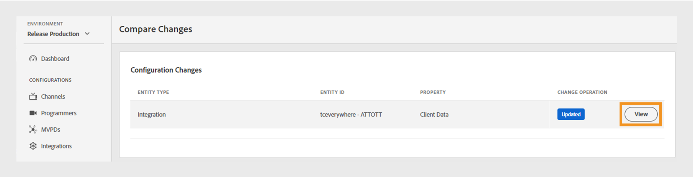

# Ändringslogg {#changes-log}

>[!NOTE]
>
>Innehållet på den här sidan tillhandahålls endast i informationssyfte. Användningen av denna API kräver en aktuell licens från Adobe. Ingen obehörig användning är tillåten.

The **Ändringslogg** på TVE Dashboard kan du visa de konfigurationsändringar som skickas till Adobe Pass Authentication-miljön via TVE Dashboard. Du kan också jämföra två olika konfigurationsändringar.

The **Ändringslogg** I den vänstra panelen visas en lista med alla konfigurationsändringar som gjorts via ett specifikt konto på TVE Dashboard. Den här listan över ändringar innehåller följande information:

* **Ändra beskrivning**: En kort beskrivning av omfattningen av konfigurationsändringen.
* **Skickat av**: Ett e-post-ID för den användare som ansvarar för ändringen.
* **Push-datum**: Datum för konfigurationsändringen.
* **Push-status**: Anger om push-åtgärden lyckades, väntade eller misslyckades.

## Jämför ändringar {#compare-changes}

Så här jämför du ändringar:

1. Välj två konfigurationsändringar i listan som du vill jämföra.

   

   *Jämför konfigurationsändringar*

1. Välj **Jämför** i skärmens övre högra hörn.

   The **Konfigurationsändringar** -avsnittet visar enhetstyp, enhets-ID, egenskap och status för ändringsåtgärden för varje ändring.

1. Håll muspekaren över den konfigurationsändring som du vill visa.
1. Välj **Visa** för att komma åt de ändrade värdena.

   

   *Visa konfigurationsändringar*

Följande är ett exempel på en ändring som har gjorts i den valda konfigurationen. Du kan visa skillnaden mellan de gamla och nya värdena i ändringen.

*Gammalt och nytt värde*

