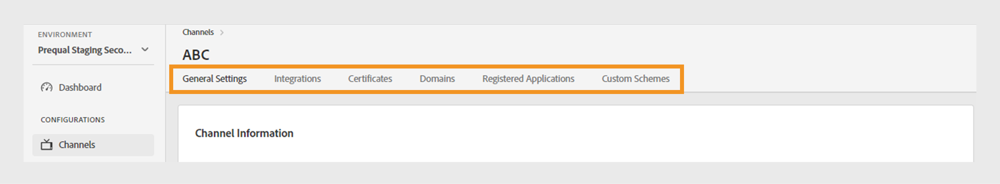

# Kanaler {#channels}

>[!NOTE]
>
>Innehållet på den här sidan tillhandahålls endast i informationssyfte. Användningen av denna API kräver en aktuell licens från Adobe. Ingen obehörig användning är tillåten.

The **Kanaler** på TVE Dashboard kan du visa och hantera inställningar för de kanaler som är kopplade till en viss programmerare. Du kan också [lägg till en ny kanal](#add-new-channel) efter dina behov.

The **Kanaler** på den vänstra panelen visas en lista med länkade kanaler med följande information:

* **Visningsnamn**: Namnet på den kanal som används för kommersiella ändamål.
* **Kanal-ID**: En unik identifierare som också kallas begärande-ID.
* **Integreringar**: Antalet anslutningar som upprättats med [MVPD](/help/authentication/glossary.md#mvpd).

*Lista över befintliga kanaler*

Skriv namnet på kanalen i **Sök** om du vill ha mer information om kanalen ovanför listan.

## Hantera kanalkonfigurationer {#manage-channel-conf}

Följ stegen för att hantera olika inställningar för en viss kanal.

1. Välj **Kanaler** i den vänstra panelen.
1. Välj kanalen i listan över tillgängliga kanaler.
1. Välj någon av följande flikar om du vill visa och redigera motsvarande inställningar för den valda kanalen:

   * [Allmänna inställningar](#general-settings)
   * [Integreringar](#integrations)
   * [Certifikat](#certificates)
   * [Domäner](#domains)
   * [Registrerade program](#registered-applications)
   * [Anpassade scheman](#custom-schemes)

   

   *Kanalinställningar*

>[!IMPORTANT]
>
> Visa [Granska och skicka ändringar](/help/authentication/tve-dashboard-review-push-changes.md) om du vill ha mer information om hur du aktiverar konfigurationsändringarna.

### Allmänna inställningar {#general-settings}

På den här fliken visas **Kanalinformation** och **Analyskonfiguration**.

#### Kanalinformation {#channel-information}

I det här avsnittet kan du redigera följande information:

* **Visningsnamn**: Namnet på den kanal som används för kommersiella ändamål.

* **Standardomdirigerings-URL**: Omdirigerings-URL för säkerhetskopiering för autentisering och utloggning.

* **Felrapportering**: Vid markering **Ja** skickar Adobe Pass SDK:er felrapporter till Adobe Pass för analys.

*Redigera kanalinformation*

#### Analyskonfiguration {#analytics-configuration}

I det här avsnittet kan du konfigurera vidarebefordran av Adobe Pass Authentication-händelser till Adobe Analytics.

Aktivera **Analyskonfiguration** kontaktar du din tekniska kontohanterare (TAM) för mer information om hur du konfigurerar Report Suite ID (RSID).

*Aktivera analyskonfigurationer*

Välj **Lägg till ny analyskonfiguration** för att lägga till flera konfigurationer.

En ny konfigurationsändring har skapats och är klar för serveruppdatering. Så här använder du den nya analyskonfigurationen från **Analyskonfiguration** fortsätter du med [granska och skicka ändringar](/help/authentication/tve-dashboard-review-push-changes.md) flöde.

### Integreringar {#integrations}

På den här fliken visas en lista med tillgängliga integreringar mellan den valda kanalen och de virtuella dokumentdokumenten. I listan visas varje integrering tillsammans med dess status, vilket anger om den är aktiverad eller inte. Välj en specifik integrering i den här listan för att få tillgång till detaljerad information i [Integreringar](tve-dashboard-integrations.md) -avsnitt.

*Lista över tillgängliga integreringar*

### Certifikat {#certificates}

På den här fliken visas en lista med [tillgängliga certifikat](#available-certificates) och [ärvda tillgängliga certifikat](#inherited-avail-certificates) används i krypteringsflödena för användarmetadata. Den visar information om varje certifikat som innehåller:

* Status (om aktiverad för **kryptering av användarmetadata** eller inte)
* Serienummer
* Emittentorganisationens namn
* Ämnesorganisationens namn
* Utfärdat den
* Utgångsdatum
* En nedrullningsbar meny för kryptering av användarmetadata (om du väljer **Ja** krypterar certifikatet känslig användarinformation, t.ex. postkodsvärden).

#### Tillgängliga certifikat {#available-certificates}

Dessa certifikat fungerar som privata eller offentliga nycklar och används för kryptering av användarmetadata.
Du kan göra följande ändringar under det tillgängliga certifikatavsnittet:

* [Lägg till nytt certifikat](#add-new-certificate)
* [Ta bort certifikat](#delete-certificate)

##### Lägg till nytt certifikat {#add-new-certificate}

Så här lägger du till ett nytt certifikat:

1. Välj **Lägg till nytt certifikat** högst upp på **Tillgängliga certifikat** -avsnitt.

   

   *Lägg till ett nytt certifikat*

1. Klistra in den offentliga nyckeln för certifikatet i **Nytt certifikat** -dialogrutan.
1. Välj **Lägg till certifikat**.

   En ny konfigurationsändring har skapats och är klar för serveruppdatering. Så här använder du det nya certifikatet som finns i **Tillgängliga certifikat** fortsätter du med [granska och skicka ändringar](/help/authentication/tve-dashboard-review-push-changes.md) flöde.

1. Leta reda på det nya certifikatet i listan med **Tillgängliga certifikat**.

   >[!IMPORTANT]
   >
   > Kontrollera att dina system är uppdaterade och klara att använda det nya certifikatet.

1. Välj **Ja** från **Används för att kryptera användarmetadata** för att aktivera ett nytt certifikat.

##### Ta bort certifikat {#delete-certificate}

Så här tar du bort ett certifikat.

1. Hovra över det certifikat som du vill ta bort från listan med **Tillgängliga certifikat**.
1. Välj **Ta bort**.

   

   *Ta bort det markerade certifikatet*

1. Välj **Ta bort** från **Ta bort aktivt certifikat** -dialogrutan.

En ny konfigurationsändring har skapats och är klar för serveruppdatering. Certifikatet tas bort från **Tillgängliga certifikat** endast efter [granska och skicka ändringar](/help/authentication/tve-dashboard-review-push-changes.md).

#### Ärvda tillgängliga certifikat {#inherited-avail-certificates}

Medieföretag definierar dessa certifikat på sin egen nivå. Alla kanaler som är associerade med samma medieföretag kan använda dessa certifikat.

*Ärvda tillgängliga certifikat*

### Domäner {#domains}

På den här fliken visas en lista över tillgängliga domäner som respektive kanal kommunicerar med Adobe Pass-autentisering genom.

Du kan göra följande ändringar i domäner:

* [Lägg till en ny domän](#add-domains)
* [Ta bort domän](#delete-domain)

>[!TIP]
>
> Undvik att lägga till en ny underdomän om det finns en mer allmän domän i listan.

#### Lägg till ny domän {#add-domains}

Följ de här stegen för att lägga till en domän.

1. Välj **Lägg till ny domän** längst upp till höger i **Tillgängliga domäner** -avsnitt.

   

   *Lägg till en ny domän*

1. Skriv namnet på din domän i **Ny domän** -dialogrutan.

1. Välj **Lägg till domän** om du vill lägga till en ny domän för den valda kanalen.

En ny konfigurationsändring har skapats och är klar för serveruppdatering. Så här använder du den nya domänen som anges i **Tillgängliga domäner** fortsätter du med [granska och skicka ändringar](/help/authentication/tve-dashboard-review-push-changes.md) flöde.

#### Ta bort domän {#delete-domain}

Så här tar du bort en domän.

1. Hovra över domänen som du vill ta bort från listan över **Tillgängliga domäner**.
1. Välj **Ta bort**.

   

   *Ta bort den valda domänen*

1. Välj **Ta bort** på **Ta bort domän** -dialogrutan.

En ny konfigurationsändring har skapats och är klar för serveruppdatering. Domänen tas bort från **Tillgängliga domäner** endast efter [granska och skicka ändringar](/help/authentication/tve-dashboard-review-push-changes.md).

Den valda domänen är inte längre tillgänglig för användning. Därför förlorar programmet som är kopplat till den här domänen åtkomsten till Adobe Pass autentiseringstjänster.

### Registrerade program {#registered-applications}

På den här fliken finns en lista med programregistreringar. Visa [Dynamisk hantering av klientregistrering](/help/authentication/dynamic-client-registration-management.md) för mer information.

### Anpassade scheman {#custom-schemes}

På den här fliken visas en lista med anpassade scheman. Visa [Registrering av iOS/tvOS](/help/authentication/iostvos-application-registration.md) och [Dynamisk hantering av klientregistrering](/help/authentication/dynamic-client-registration-management.md) för mer information.

## Lägg till ny kanal {#add-new-channel}

Följ de här stegen för att lägga till en ny kanal.

1. Välj **Kanaler** i den vänstra panelen.
1. Välj **Lägg till ny kanal** längst upp till höger i **Kanaler** -avsnitt.

   

   *Lägg till en ny kanal*

1. Välj **Programmer-ID** i listrutan i **Ny kanal** -dialogrutan.

1. Ange en unik identifierare i **Kanal-ID**.
1. Skriv namnet på den kanal som används för kommersiella ändamål i **Visningsnamn**.
1. Välj **Lägg till kanal**.

En ny konfigurationsändring har skapats och är klar för serveruppdatering. Så här använder du den nya kanalen som visas i **Kanaler** fortsätter du med [granska och skicka ändringar](/help/authentication/tve-dashboard-review-push-changes.md) flöde.

