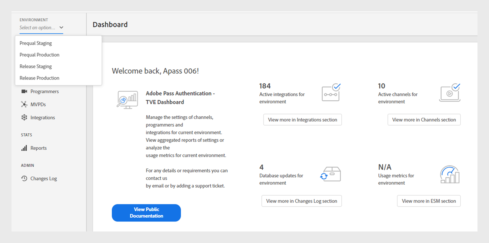

# Miljö {#environments}

>[!NOTE]
>
>Innehållet på den här sidan tillhandahålls endast i informationssyfte. Användningen av denna API kräver en aktuell licens från Adobe. Ingen obehörig användning är tillåten.

På TVE Dashboard finns olika miljöer som är anpassade för att uppfylla specifika syften i Adobe Pass-autentiseringen. Det finns två huvudmiljöer:

* **Föregående**: Miljön för förhandsgodkännande fungerar som en testmiljö för att förbereda och testa nya byggen innan de distribueras till produktionen.

* **Frigör**: I releasemiljön finns färdiga och testade byggen för produktion.

I varje miljö finns det två olika profiler:

* **Mellanlagring**: Mellanlagringsprofilen ansluter till MVPD:s mellanlagringsserver för testning och validering av integreringar innan den publiceras.

* **Produktion**: Produktionsprofilen är kopplad till produktionsprofilen för MVPD för faktiska produktionsaktiviteter.

## Användningsexempel

Miljöerna i TVE Dashboard används i olika fall under programmets livscykel. Med dessa miljöer kan du:

### Föregående mellanlagring

* Validera nya ej släppta funktioner på Adobe Pass Authentication-servern med MVPD:s mellanlagringsslutpunkter.
* Används främst av Adobe Pass Authentication-produktteamet för att lägga till och validera nya MVPD-integreringar.

### Föregående produktion

* Validera nya ej släppta funktioner eller konfigurationer för Adobe Pass Authentication-servern med MVPD:s slutpunkter för produktionen.
* Validera nya programversioner för varje kanal med MVPD:s produktionsslutpunkter.
* Validera alla konfigurationsändringar innan du överför dem till produktion.

### Frigör mellanlagring

* Validera nya programversioner för varje kanal med MVPD:s mellanlagringsslutpunkter.
* Utför prestanda- eller kapacitetstester i den här miljön.

### Frigör produktion

* Representerar den aktiva miljön med den senaste Adobe Pass-versionen som är allmänt tillgänglig för alla slutanvändare.
* Bibehåller stabiliteten i kod och konfiguration och återspeglar omedelbart konfigurationsändringar i slutanvändarens program.

## Växla miljöer {#switch-environments}

Följ stegen för att växla mellan Adobe Pass Authentication TVE Dashboard-miljöer.

1. Logga in med dina programmeringsuppgifter.
1. Välj önskad stagg- eller produktionsmiljö i dialogrutan **Miljö** listrutemeny högst upp i den vänstra panelen.

   

   *Listrutan Adobe Pass Authentication TVE Dashboard-miljö*

>[!NOTE]
>
> Konfigurationerna kan variera i olika miljöer beroende på dina inställningar.

