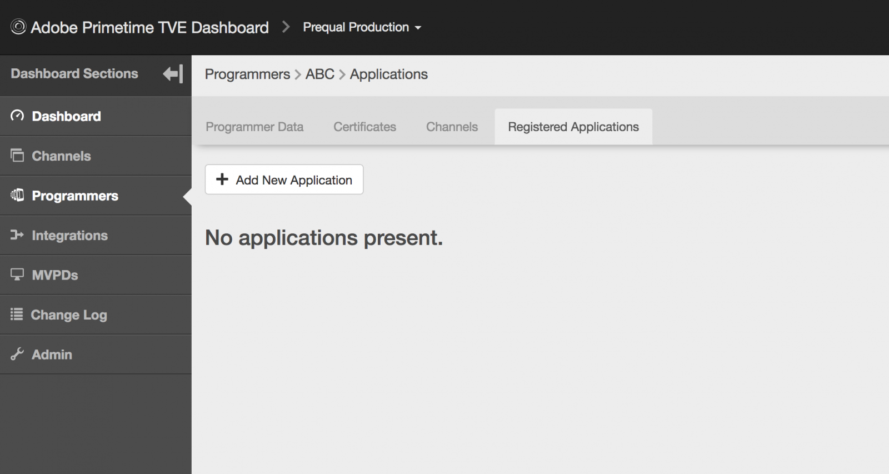

# Användarhandbok för Primetime TVE Dashboard {#tve-db-user-guide}

>[!NOTE]
>
>Innehållet på den här sidan tillhandahålls endast i informationssyfte. Användning av denna API kräver en aktuell licens från Adobe. Ingen obehörig användning är tillåten.

## Introduktion {#tve-db-intro}

[[!DNL Adobe] TVE Dashboard (TVE Dashboard)](https://console.auth.adobe.com/) är en självbetjäningspanel som är avsedd för användare som arbetar för medieföretag (programmerare) som har en affärsrelation med Adobe Pass Authentication-produktgruppen.

Kontakta din kontoansvarige (TAM) för att få åtkomst. För att få åtkomst måste du ha två nya användargrupper konfigurerade i din Adobe Marketing Cloud-organisation:

* TVE Dashboard Read-Write - medlemmarna i den här gruppen har fullständig behörighet för alla redigerbara avsnitt i kontrollpanelen
* Skrivskyddad TVE Dashboard - medlemmarna i den här gruppen har endast visningsrättigheter för hela instrumentpanelen

Innan du börjar gå in på den här användarhandboken rekommenderar vi att du går igenom följande resurser för att få en god förståelse för de flöden och funktioner som Adobe Pass Authentication-produktteamet erbjuder och för att bekanta dig med de termer som används i det här dokumentet:

* [TVE Technical Paper](/help/authentication/technical-paper.md)
* [Programmer Kickstart Guide](/help/authentication/programmer-kickstart-guide.md)
* [Tillståndsflöde](/help/authentication/entitlement-flow.md)
* [Ordlista](/help/authentication/glossary.md)

Om du fortsätter till nästa avsnitt i den här användarhandboken kommer du att upptäcka sätt att administrera olika inställningar för företagets kanaler, programmerare eller integreringar mellan kanaler och distributörer av videoprogram (Multichannel Video Program Distributors).

>[!IMPORTANT]
>TVE Dashboard ger möjlighet att växla mellan en grundläggande och en avancerad Workspace. Du kan göra detta genom att växla ikonen i det övre högra hörnet. Avancerade Workspace riktar sig till användare med omfattande teknisk kunskap och avancerade kunskaper om de funktioner som Adobe Pass Authentication-produktteamet erbjuder.

*Bild 1: Listrutan Grundläggande/avancerad Workspace på Adobe Primetime TV-instrumentpanelen*

## Miljö {#authn-environments}

Beroende på vilka uppgifter en användare kan behöva utföra kan han/hon behöva växla mellan Adobe Pass autentiseringsmiljöer. Mer information om Adobe Pass autentiseringsmiljöer finns i följande dokument: [Om Adobe Pass autentiseringsmiljöer](/help/authentication/understanding-the-adobe-environments.md).

TVE Dashboard innehåller två miljöer som heter Prequal (Prekvalificering) och Release, där var och en har två profiler som heter Staging and Production, enligt nedan:

* [Föregående mellanlagring](https://console-prequal.auth-staging.adobe.com/)
* [Förhandsproduktion](https://console-prequal.auth.adobe.com/)
* [Frigör mellanlagring](https://console.auth-staging.adobe.com/)
* [Frigör produktion](https://console.auth.adobe.com/)

För att växla mellan miljöer kan användaren klicka på den miljö som posten från det nedrullningsbara elementet nedan representerar:

*Figur 2: Listrutan Adobe Pass TVE Dashboard-miljöer*

>[!IMPORTANT]
>
>Observera att när du gör administrativa ändringar i din konfiguration för Adobe Pass-autentisering via TVE Dashboard rekommenderar vi att du följer sekvensen nedan för att säkerställa att den fungerar som den ska.

Så här gör du administrativa ändringar i din konfiguration för Adobe Pass-autentisering via TVE-instrumentpanelen:

* Utför ändringarna i [Frigör mellanlagring och validera dem](http://sp.auth-staging.adobe.com/apitest/api.html).
* Utför ändringarna i [Prequal Production och validera dem](http://sp.auth-staging.adobe.com/apitest/api.html).
* Utför ändringarna i [Frigör produktion och validera dem](http://sp.auth-staging.adobe.com/apitest/api.html).

>[!IMPORTANT]
>
>För att de administrativa ändringarna ska börja gälla måste användarna navigera till avsnittet Granska och push-ändra genom att markera knappen, som visas längst ned till vänster i sidofältet, för att granska ändringar, lägga till en beskrivning för de nyligen skapade ändringarna och bekräfta konfigurationsuppdateringen genom att välja Push Configuration (Push-konfiguration).

*Bild 3: Adobe Primetime TVE Dashboard Review and Push Changes notification*

## Avsnitt {#sections}

Användare som arbetar för medieföretag (programmerare) kan komma åt följande avsnitt i TVE Dashboard från sidofältet:

* **Kanaler** - Innehåller inställningar relaterade till innehållsleverantörer
* **Programmerare** - Innehåller inställningar som är relaterade till den överordnade organisationen som aggregerar en eller flera **kanaler**
* **Integrationer** - Innehåller inställningar som är relaterade till integreringen mellan **Kanaler** och **MVPD-filer**
* **MVPD** - Innehåller inställningar som är relaterade till tillgängliga **MVPD-filer**
* **Rapporter** - Innehåller aggregerade data för tre typer av rapporter: AuthN TTL, AuthZ TTL, SSO
* **Ändringslogg** - Innehåller de senaste ändringarna som används i TVE-instrumentpanelskonfigurationen

*Figur 4: Avsnitten i Adobe Primetime TVE Dashboard*

### Kanaler {#tve-db-channels-section}

I det här avsnittet kan du visa och redigera inställningar för tillgängliga kanaler eller skapa nya. Om du klickar på en av de tillgängliga kanalerna visas en skärm med följande flikar:

* **Kanaldata**
   * **Kanal-ID** - Kanalens unika ID som används i vårt system kallas även för begärande-ID.
   * **Visningsnamn** - Kanalens kommersiella namn.
* **Allmänna inställningar**
   * **Analyskonfiguration** - Konfigurera Adobe Pass-autentiseringshändelser som ska vidarebefordras till Adobe Analytics. Kontakta Adobe om du vill ha mer information om hur Report Suite-ID (RSID) måste konfigureras innan den här funktionen aktiveras.
* **Certifikat**

  Innehåller en lista över certifikat som används i autentiseringsflödet tillsammans med deras utfärdande organisation, utfärdandedatum och utgångsdatum. Dessa certifikat fungerar som privata/offentliga nycklar och används i valideringssyfte.
* **Domäner**

  Innehåller listan över domäner från vilka respektive kanal ska kommunicera med Adobe Pass-autentisering.
* **Integrationer**

  Innehåller en lista över integreringar med tillgängliga programmeringsgränssnitt, tillsammans med statusen för varje integrering som kan vara aktiverad eller inte. Du kan navigera till integreringssidan genom att klicka på en viss post.
* **Registrerade program**

  Innehåller listan över programregistreringar. Mer information finns i dokumentet [Dynamic Client Registration Management](/help/authentication/dcr-api/dynamic-client-registration-overview.md#dynamic-client-registration-management).

* **Anpassade scheman**

  Innehåller en lista med anpassade scheman. Mer information finns i [iOS/tvOS-programregistrering](/help/authentication/iostvos-application-registration.md) och [Dynamisk klientregistreringshantering](/help/authentication/dcr-api/dynamic-client-registration-overview.md#dynamic-client-registration-management)

#### Lägg till/ta bort domäner {#add-delete-domains}

Om du vill börja lägga till en ny domän för den valda kanalen måste du klicka på knappen Lägg till ny domän under listan Domäner. Detta skapar en ny domänpost där du kan ange domännamnet. Om det redan finns en mer allmän domän i domänlistan bör du inte lägga till en ny underdomän.

*Figur: Fliken Domäner i kanaler*

#### Skapa ett registrerat program på kanalnivå {#create-registered-application-channel-level}

Om du vill skapa ett registrerat program på kanalnivå går du till menyn Kanaler och väljer det program som du vill skapa ett program för. När du har navigerat till fliken &quot;Registrerade program&quot; klickar du på knappen &quot;Lägg till nytt program&quot;.

Som du ser i bilden nedan är fälten som du ska fylla i:

* **Programnamn** - namnet på programmet

* **Tilldelad till kanal** - Som visas nedan är det något annorlunda här, jämfört med samma åtgärd som har utförts på programmeringsnivå, att listrutan Tilldelade kanaler inte är aktiverad, så det finns inget alternativ för att binda det registrerade programmet till en annan kanal än den aktuella.

* **Programversion** - som standard är detta inställt på 1.0.0, men vi rekommenderar att du ändrar det med din egen programversion. Om du bestämmer dig för att ändra programversionen bör du tänka på det genom att skapa ett nytt registrerat program för det.

* **Programplattformar** - de plattformar som programmet ska länkas till. Du kan markera alla eller flera värden.

* **Domännamn** - domänerna som programmet ska länkas till. Domänerna i listrutan är ett enhetligt urval av alla domäner från alla kanaler. Du kan välja flera domäner i listan. Innehållet i domänerna är omdirigerings-URL:er [RFC6749](https://tools.ietf.org/html/rfc6749). I klientregistreringsprocessen kan klientprogrammet begära att få använda en omdirigerings-URL för att slutföra autentiseringsflödet. När ett klientprogram begär en viss omdirigerings-URL valideras den mot de domäner som vitlistas i det här registrerade programmet som är kopplat till programsatsen.

När du har fyllt i fälten med lämpliga värden måste du klicka på Klar för att programmet ska sparas i konfigurationen.

Observera att det inte finns **något alternativ för att ändra ett redan skapat program**. Om det upptäcks att något som skapats inte längre uppfyller kraven måste ett nytt registrerat program skapas och användas tillsammans med klientprogrammet vars krav det uppfyller.

##### Ladda ned en programsats {#download-software-statement-channel-level}

Om du klickar på knappen &quot;Ladda ned&quot; på den listpost för vilken en programsats behövs genereras en textfil. Den här filen kommer att innehålla något som liknar exempelutdata nedan.

Filens namn identifieras unikt genom att prefix anges med &quot;software_statement&quot; och den aktuella tidsstämpeln läggs till.

Observera att för samma registrerade program kommer olika programsatser att tas emot varje gång som nedladdningsknappen klickas, men detta medför inte att tidigare programsatser för det här programmet blir ogiltiga. Det beror på att de genereras på plats, per åtgärdsbegäran.

Det finns en **begränsning** gällande hämtningsåtgärden. Om du tillfrågas om en programsats genom att klicka på knappen &quot;Ladda ned&quot; kort efter att du skapat det registrerade programmet och denna ännu inte sparats och konfigurationsjson inte synkroniserats, visas följande felmeddelande längst ned på sidan.

Detta omsluter en HTTP 404 Hittade inte felkod som tagits emot från kärnan eftersom ID:t för det registrerade programmet ännu inte har spridits och kärnan inte känner till det.

Lösningen är att efter att ha skapat det registrerade programmet vänta i högst två minuter på att konfigurationen ska synkroniseras. När detta inträffar kommer felmeddelandet inte längre att tas emot och textfilen med programsatsen kommer att vara tillgänglig för hämtning.

### Programmerare {#tve-db-programmers-section}

I det här avsnittet kan du visa och redigera inställningar för tillgängliga programmerare eller skapa nya. Om du klickar på någon av de tillgängliga programmerarna visas en skärm med följande flikar:

* **Programmerardata**
   * **Programmer-ID** - Programmerarens unika ID som används i vårt system.
   * **Visningsnamn** - Programmerarens kommersiella namn.
   * **Logo Url** - Programmerarens företagslogotyp, URL (Unik Resource Locator).
   * **Förhandsgranskning av logotyp** - Programmerarens kommersiella logotyp förhandsvisas genom att den hämtas från den ovanstående URL:en (Unik Resource Locator).

* **Certifikat**

  Innehåller en lista över certifikat som används i autentiseringsflödet tillsammans med deras utfärdande organisation, utfärdandedatum och utgångsdatum. Dessa certifikat fungerar som privata/offentliga nycklar och används i valideringssyfte.

* **Kanaler**

  Innehåller en lista med kanaler som tillhör den här specifika programmeraren. Du kan navigera till avsnittet Kanaler genom att klicka på en viss post.

* **Registrerade program**

  Innehåller listan över programregistreringar. Mer information finns i [Registreringshantering för dynamisk klient](/help/authentication/dcr-api/dynamic-client-registration-overview.md#dynamic-client-registration-management).

* **Anpassade scheman**

  Innehåller en lista med anpassade scheman. Mer information finns i [iOS/tvOS-programregistrering](/help/authentication/iostvos-application-registration.md).

#### Skapa ett registrerat program på programnivå {#create-registered-application-programmer-level}

Gå till fliken **Programmerare** > **Registrerade program**.

Klicka på **Lägg till nytt program** på fliken Registrerade program. Fyll i obligatoriska fält i det nya fönstret.

Som du ser i bilden nedan är fälten som du ska fylla i:

* **Programnamn** - namnet på programmet

* **Tilldelad till kanal** - namnet på kanalen, tsom det här programmet är länkat till. Standardinställningen i den nedrullningsbara masken är **Alla kanaler.** Med gränssnittet kan du välja en eller alla kanaler.

* **Programversion** - som standard är detta inställt på 1.0.0, men vi rekommenderar att du ändrar det med din egen programversion. Om du bestämmer dig för att ändra programversionen bör du tänka på det genom att skapa ett nytt registrerat program för det.

* **Programplattformar** - de plattformar som programmet ska länkas till. Du kan markera alla eller flera värden.

* **Domännamn** - domänerna som programmet ska länkas till. Domänerna i listrutan är ett enhetligt urval av alla domäner från alla kanaler. Du kan välja flera domäner i listan. Innehållet i domänerna är omdirigerings-URL:er [RFC6749](https://tools.ietf.org/html/rfc6749). I klientregistreringsprocessen kan klientprogrammet begära att få använda en omdirigerings-URL för att slutföra autentiseringsflödet. När ett klientprogram begär en viss omdirigerings-URL valideras den mot de domäner som vitlistas i det här registrerade programmet som är kopplat till programsatsen.

När du har fyllt i fälten med lämpliga värden måste du klicka på Klar för att programmet ska sparas i konfigurationen.

Observera att det inte finns **något alternativ för att ändra ett redan skapat program**. Om det upptäcks att något som skapats inte längre uppfyller kraven måste ett nytt registrerat program skapas och användas tillsammans med klientprogrammet vars krav det uppfyller.

##### Ladda ned en programsats {#download-software-statement-programmer-level}

Om du klickar på knappen &quot;Ladda ned&quot; på den listpost för vilken en programsats behövs genereras en textfil. Den här filen kommer att innehålla något som liknar exempelutdata nedan.

Filens namn identifieras unikt genom att prefix anges med &quot;software_statement&quot; och den aktuella tidsstämpeln läggs till.

Observera att för samma registrerade program kommer olika programsatser att tas emot varje gång som nedladdningsknappen klickas, men detta medför inte att tidigare programsatser för det här programmet blir ogiltiga. Det beror på att de genereras på plats, per åtgärdsbegäran.

Det finns en **begränsning** gällande hämtningsåtgärden. Om du tillfrågas om en programsats genom att klicka på knappen &quot;Ladda ned&quot; kort efter att du skapat det registrerade programmet och den här programsatsen ännu inte sparats och konfigurationsjson inte synkroniserats, visas följande felmeddelande längst ned på sidan.

Detta omsluter en HTTP 404 Hittade inte felkod som tagits emot från kärnan eftersom ID:t för det registrerade programmet ännu inte har spridits och kärnan inte känner till det.

Lösningen är att efter att ha skapat det registrerade programmet vänta i högst två minuter på att konfigurationen ska synkroniseras. När detta inträffar kommer felmeddelandet inte längre att tas emot och textfilen med programsatsen kommer att vara tillgänglig för hämtning.

### Integreringar {#tve-db-integrations-sec}

I det här avsnittet kan du visa och redigera inställningar för integrering mellan kanaler och tillgängliga programmeringsvideofiler (MVPD) eller skapa en ny. Om du klickar på någon av de tillgängliga integreringarna returneras en sida när du använder Workspace Basic (Grundläggande) eller en skärm med följande flikar när du använder Workspace Advanced (Avancerad):

* **Integreringsdata**
   * **Integrations-ID** - Resultatet av att lägga till de unika ID:n för MVPD till kanalens unika ID, avgränsat med tecknet &quot;_&quot;.
   * **Kanalvisningsnamn** - Kanalens kommersiella namn.
   * **Kanal-ID** - Kanalens unika ID som används i vårt system kallas även för begärande-ID.
   * **MVPD-visningsnamn** - MVPD:s kommersiella namn.
   * **MVPD-ID** - MVPD:s unika ID som används i vårt system.
* **Allmänna inställningar**
   * **Nycklar för användarmetadata** - Konfigurera metadatanycklar som är tillgängliga för den specifika integreringen.
   * **Plattformsspecifika inställningar** - Konfigurera olika inställningar för en specifik plattform (till exempel TTL, SSO och IFrames).

* **Autentiseringsinställningar**
   * Innehåller inställningar som är relaterade till autentiseringsfunktionen för Adobe Pass-autentisering.
* **Behörighetsinställningar**
   * Innehåller inställningar som är relaterade till auktoriseringsfunktionen för Adobe Pass-autentisering.
* **Utloggningsinställningar**
   * Innehåller inställningar som är relaterade till inloggningsfunktionen för Adobe Pass-autentisering.

#### Skapa integrering {#create-integration}

Följ stegen nedan för att skapa en ny integrering:

* klicka på knappen&quot;Lägg till ny integrering&quot;
* söka efter och välja en kanal
* söka efter och välja ett dokument för dokumentskydd
* vänta på att TVE Dashboard ska beräkna integrerings-ID och visa tillgängliga MVPD-slutpunkter
* välj autentiserings-, auktoriserings- och utloggningsslutpunkter eller använd standardvärden
* klicka på knappen &quot;Skapa integrering&quot;
* beroende på inställningarna för MVPD kan ett popup-fönster visas och du kan begära ytterligare egenskaper, som bör ha angetts av MVPD i förväg, annars kommer en omdirigering till den nyligen skapade integrationssidan att utföras

*Figur 5. Fönstret Ny integrering i Adobe Primetime TVE Dashboard*

#### Uppdatera integrering {#update-integration}

Om du vill uppdatera en befintlig integrering klickar du på tabellposten för den specifika integreringen i avsnittet Integrationer eller i avsnittet Kanaler, som innehåller fliken Integrationer.

När du använder läget Grundläggande Workspace kan du i det här avsnittet se och redigera de mest uppdaterade inställningarna, som TTL-värden för autentisering och auktoriseringstoken (time-to-live) samt iFrame-inställningar. Tänk på att TTL-inställningar kan saknas för integreringar med MVPD-program som stöder dynamisk definierad Token Persistence TTL (se post 1.19 från [MVPD-integreringskrav](/help/authentication/mvpd-integr-features.md)).

I det här avsnittet kan du visa och redigera mindre vanliga inställningar i det avancerade Workspace-läget.

I både det grundläggande läget och det avancerade läget för Workspace kan du ändra dessa inställningar på plattformsnivå (t.ex. välja ett anpassat värde för TTL-token för auktorisering på Android, som är standard på alla andra plattformar).

>[!IMPORTANT]
>Det är viktigt att förstå inställningsarvskedjan: MVPD -> MVPD Endpoint -> Integration -> Platform, där Platform har det mest specifika värdet och MVPD är det mest generiska standardvärdet.

*Figur 6. Adobe Primetime TVE Dashboard-egenskapens arvskedjekomponent*

#### Plattformsspecifika inställningar {#platform-sp-settings}

Det här underavsnittet kan användas för att åsidosätta inställningarna för specifika plattformar. De tillgängliga plattformarna är:

* **Alla plattformar** - Ange värden som ska tillämpas på alla plattformar oavsett programmeringsimplementeringar om inga andra värden har angetts för en viss plattform.
* **Android** - Ange värden som ska tillämpas på programmeringsimplementeringarna via Adobe Pass Authentication Android SDK.
* **Klientlöst REST API** - Ange värden som ska tillämpas på programmeringsimplementeringarna över Adobe Pass Authentication REST API.
* **Fire TV** - Ange värden som ska tillämpas på programmeringsimplementeringarna via Adobe Pass Authentication FireTV SDK.
* **Flash-SDK** - Den här plattformen är föråldrad. **har tagits bort**
* **JavaScript SDK** - Ange värden som ska tillämpas på programmeringsimplementeringarna via Adobe Pass Authentication JavaScript SDK.
* **Roku** - Ange värden som ska tillämpas på programmeringsimplementeringarna via Adobe Pass Authentication REST API och som skickar &quot;Roku&quot; som enhetstyp. Detta har företräde framför de värden som anges för den klientlösa REST API-plattformen för Roku-enheter.
* **Inbyggt Xbox SDK** - Den här plattformen är föråldrad. **har tagits bort**
* **Xbox 360 REST API** - Ange värden som ska tillämpas på programmeringsimplementeringarna via Adobe Pass Authentication REST API och som skickar &quot;xbox&quot; som enhetstyp. Detta har företräde framför de värden som angetts för den klientlösa REST API-plattformen för Xbox 360-enheter.
* **Xbox One REST API** - Ange värden som ska tillämpas på programmeringsimplementeringarna via Adobe Pass Authentication REST API och som skickar &quot;xboxOne&quot; som enhetstyp. Detta har företräde framför de värden som angetts för den klientlösa REST API-plattformen för XboxOne-enheter.
* **iOS** - Ange värden som ska tillämpas på programmeringsimplementeringarna via Adobe Pass Authentication iOS SDK.
* **tvOS** - Ange värden som ska tillämpas på programmeringsimplementeringarna via Adobe Pass Authentication TVOS SDK.

*Figur 7. De plattformsspecifika inställningarna för Adobe Primetime TVE Dashboard*

#### Aktivera enkel plattformsinloggning {#enable-platform-sso}

Följ stegen nedan för att aktivera/inaktivera enkel inloggning för en specifik integrering och plattform:

* kontrollera att du använder avancerat Workspace-läge
* navigera till önskad integrering
* navigera till fliken **Allmänna inställningar**
* välj den plattform där du vill aktivera eller inaktivera enkel inloggning
* växla flaggan **Aktivera enkel inloggning** till det önskade värdet (Ja/Nej)

  >[!IMPORTANT]
  >Det är viktigt att komma ihåg att flaggan **Aktivera enkel inloggning** endast är tillgänglig för iOS, tvOS, Roku och FireTV och endast för integrering med MVPD-program som stöder enkel inloggning för dessa plattformar.

* växla flaggan **Tillämpa plattformsbehörighet** till det önskade värdet (Ja/Nej)

  >[!IMPORTANT]
  >Observera att flaggan **Tillämpa plattformsbehörighet** kontrollerar om användarens beslut att tillåta eller neka plattformsåtkomst till hans/hennes TV-leverantörsprenumeration kommer att verkställas eller inte. Med tanke på scenariot när flaggan **Aktivera enkel inloggning** är inställd på Ja, **Använd plattformsbehörighet** är inställd på Ja och användaren väljer att neka plattformsåtkomst till sin TV-leverantörsprenumeration, kommer respektive program (kanal) inte att kunna använda den Adobe Pass-autentiseringstoken som erhålls av ett annat program (kanal).

#### Aktivera hembaserad autentisering {#enable-hba}

Följ stegen nedan för att aktivera/inaktivera Home-Base Authentication för **OAuth2**-baserade MVPD-filer:

* kontrollera att du använder avancerat Workspace-läge
* navigera till önskad integrering
* navigera till fliken **Autentiseringsinställningar**
* navigera till underfliken **AuthN Dynamiska regler**
* växla flaggan **Attempt HBA** till det önskade värdet (Ja/Nej)

>[!IMPORTANT]
>Tänk på att HBA AuthN TTL-värdet aldrig ska åsidosättas, annars kan auktoriseringsflödet misslyckas oväntat.

Gå till **tve-support@adobe.com** för information om hur du aktiverar Home-Base Authentication för SAML-baserade MVPD-filer.

### MVPD {#tve-db-mvpds-sec}

I det här avsnittet tillåts visningsinställningar för tillgängliga MVPD-filer. Om du klickar på någon av de tillgängliga PDF-filerna visas en skärm med följande flikar:

* **MVPD-data**
   * **MVPD-ID** - MVPD:s unika ID som används i vårt system.
   * **Visningsnamn** - MVPD:s kommersiella namn som kan användas i användarens väljare.
   * **Logo Url** - MVPD:s kommersiella logotyp, URL (Unik Resource Locator).
   * **Logo Preview** - MVPD:s kommersiella logotypförhandsvisning genom att ladda ned den från ovanstående URL (Unik Resource Locator).
* **Allmänna inställningar**
   * **Metadatanycklar för användare**
      * Metadatanycklar som är tillgängliga för det specifika MVPD-programmet.
   * **Egenskaper för klientdata**
      * **Auth/Aggregator** - Om värdet är Ja behövs en ny autentiseringstoken för varje ny kanal som användaren försöker få åtkomst till.
      * **Passiv AuthN är aktiverad** - Om flaggan Auth/Aggregator är inställd på Ja och om Passiv AuthN är inställd på Ja, sker autentiseringsprocessen med en annan kanal i bakgrunden utan att en fullständig omdirigering av webbläsaren behövs och väljaren visas.
      * **Autentisering/webbläsarsession** - Om inställningen är Ja loggas användaren ut när webbläsaren har stängts. Om inställningen är Nej kan användaren starta om webbläsaren och vara inloggad.
      * **IFrame Required** - Om värdet är Yes anger det att MVPD-inloggningsfönstret kräver en iFrame. Fälten &quot;iFrame Width&quot; och &quot;iFrame Height&quot; representerar den storlek som behövs för den iFrame som läser in inloggningssidan för MVPD.
* **Autentiseringsinställningar**
   * **Markera slutpunkt**
      * Det här fältet anger de verifieringsslutpunkter som exponeras av MVPD. Slutpunkten kan variera beroende på vilket autentiseringsprotokoll som används.
   * **Allmänna inställningar för AuthN**
      * Den här underfliken visar autentiseringsprotokollet som används av MVPD och protokollrelaterad information.
   * **AuthN-certifikat**
      * På denna underflik visas de certifikat som MVPD använder i autentiseringsflödet tillsammans med utfärdarorganisationen, utfärdandedatum och utgångsdatum. Dessa certifikat fungerar som privata/offentliga nycklar och används i valideringssyfte.
   * **Dynamiska AuthN-regler**
      * På den här underfliken visas de regler som gäller för autentiseringsprocessen. Genom att trycka på diagrammets begäran/svar/token kan du se de parametrar som används för den delen av autentiseringsflödet som markerat.
* **Behörighetsinställningar**
   * **Markera slutpunkt**
      * I det här fältet anges slutpunkten för auktorisering som exponeras av MVPD. Slutpunkten kan variera beroende på vilket auktoriseringsprotokoll som används. De tillgängliga auktoriseringsprotokollen är SOAP, REST (för klientlösa enheter), SAML, XACML och OAUTH.
   * **Allmänna inställningar för AuthZ**
      * På den här underfliken visas auktoriseringsprotokollet som används av MVPD och protokollrelaterad information.
      * **Preflight-konfiguration**
         * Den beskriver antalet resurser som kan förauktoriseras av ett MVPD i ett enda anrop, den PreFlight-modell som används samt tidsgränsen. Ibland kan antalet resurser vara olika för en viss integrering. Du kan hantera detta genom att redigera egenskapen **Max antal preflight-resurser** som finns på fliken Allmänna inställningar. Den här egenskapen är bara tillgänglig för en viss integrering och om den anges används den i stället för det värde som definieras i auktoriseringsinställningar -> PreFlight-konfiguration -> PreFlight Max-resurser.
      * **DOS-skydd**
         * Det beskriver Denial-Of-Service-skyddet för MVPD-auktoriseringsslutpunkten. Om du vill visa en exakt beskrivning av varje fält kan du visa verktygstipsen genom att hovra över DOS-skyddsfälten.
      * Om MVPD är ett **TempPass** innehåller även **AuthZ-allmänna inställningar** information om TempPass-varaktigheten.
      * Om MVPD är ett **FlexibleTempPass** innehåller **AuthZ-inställningarna** även information om TempPass-varaktighet, maximalt antal resurser och identifieringsfält (se bilden nedan).
   * **AuthZ-certifikat**
      * På denna underflik visas de certifikat som MVPD använder i auktoriseringsflödet tillsammans med utfärdarorganisationen, utfärdandedatum och utgångsdatum. Dessa certifikat fungerar som privata/offentliga nycklar och används i valideringssyfte.
   * **Dynamiska AuthZ-regler**
      * På den här underfliken visas de regler som gäller för auktoriseringsprocessen. Genom att trycka på diagrammets **Request/Response/Token** kan du se de parametrar som används för den delen av auktoriseringsflödet som markerade.
* **Utloggningsinställningar**
   * **Markera slutpunkt**
      * I det här fältet anges slutpunkten för utloggningen som visas av MVPD. Angivna protokoll kan vara antingen SAML eller OAuth2.
      * **Allmänna inställningar för utloggning**
         * Den här underfliken visar det utloggningsprotokoll som används av MVPD och protokollrelaterad information.
         * **Kräv inloggningssvar signerat** - Om värdet är Ja måste svaret signeras av ett betrott certifikat.
      * **Utloggningscertifikat**
         * På denna underflik visas de certifikat som MVPD använder i utloggningsflödet tillsammans med utfärdarorganisationen, utfärdandedatum och utgångsdatum. Dessa certifikat fungerar som privata/offentliga nycklar och används i valideringssyfte.
      * **Utloggning av dynamiska regler**
         * På den här underfliken visas de regler som gäller för utloggningsprocessen. Genom att trycka på diagrammets **Request/Response/Token** kan du se de parametrar som används i den delen av utloggningsflödet som markerade.

### Rapporter {#tve-db-reports-sec}

Om du vill gå till det här avsnittet klickar du på Rapporter på menyn [Instrumentpanelsavsnitt](#sections). Detta navigerar till en skärm med 3 flikar, som presenteras i detalj i följande underavsnitt: [AuthN TTL Reports](#authn-ttl-reports), [AuthZ TTL Reports](#authz-ttl-reports), [SSO Reports](#sso-reports).

I det här avsnittet kan du visa och exportera aggregerade data för flera typer av rapporter för kanalintegrering/kanalintegrering/kanalintegreringar med olika programmeringsgränssnitt för alla plattformar.

#### Plattformar {#report-platforms}

Alla rapporterar aggregerade värden för följande plattformar:

**WEBBLÄSARE**
Visar värden som ska användas för programmeringsimplementeringar via Adobe Pass Authentication JavaScript SDK.

**MOBIL: IOS**
Visar värden som ska användas för programmeringsimplementeringar via Adobe Pass Authentication iOS SDK.

**MOBIL: ANDROID**
Visar värden som ska användas för programmeringsimplementeringar via Adobe Pass Authentication Android SDK.

**MOBIL: ÖVRIGT**
Visar värden som ska tillämpas på programmeringsimplementeringar över Adobe Pass Authentication REST API som utvecklats för mobila enheter.

**TVCD: ROKU**
Visar värden som ska tillämpas på programmeringsimplementeringar via Adobe Pass Authentication REST API och som skickar &quot;Roku&quot; som enhetstyp.

**TVCD: FIRETV**
Visar värden som ska tillämpas på programmeringsimplementeringarna via Adobe Pass Authentication FireTV SDK.

**TVCD: APPLETV**
Visar värden som ska tillämpas på programmeringsimplementeringar via Adobe Pass Authentication TVOS SDK.

**TVCD: ANDRA**
Visar värden som ska tillämpas på programmeringsimplementeringarna via Adobe Pass Authentication REST API som utvecklats för tv-anslutna enheter.

**PLATTFORM: OKÄND**
Visar värden som ska tillämpas på de programmeringsimplementeringar för vilka Adobe Pass Authentication Services identifierar en okänd enhetstyp.

Granska mekanismen för att [skicka klientinformation](/help/authentication/passing-client-information-device-connection-and-application.md) till Adobe Pass Authentication REST API:er eller SDK:er för mer information om hur du skickar önskad enhetstyp (till exempel&quot;Roku&quot;).

Alla rapporterar sammanställningsvärden som beräknas baserat på konfigurationen som är specifik för varje Adobe Pass-autentiseringsmiljö. Därför kan du förvänta dig olika rapporteringsdata när du växlar mellan olika TVE Dashboard-miljöer.

Mer information om tillgängliga miljöer för Adobe Pass-autentisering finns i avsnittet [Miljö](#authn-environments).

##### Välja specifika kanaler/videobandspelare {#selecting-specific-channels-mvpds}

I alla rapporter kan du använda filter genom att välja specifika kanaler eller välja specifika MVPD-filer som ska inkluderas i de resulterande rapporterna.

Om du vill välja en eller flera kanaler använder du listrutan **** som placerats efter etiketten Kanaler som valts för rapport. Se Figur 8./9./10. bilder nedan.

Om du vill välja en eller flera PDF-filer använder du listrutan **** som placerats efter etiketten&quot;MVPDs selected for report&quot;. Se Figur 8./9./10. bilder nedan.

Som standard sammanställs data i alla företagets kanaler (&quot;Alla kanaler&quot;) och de videoprogrammeringsprogram som de är integrerade med (&quot;Alla videoprogrammeringsprogram&quot;).

Om du avmarkerar Alla kanaler eller Alla PDF-filer utan att välja specifika alternativ visas en platshållare för användargränssnittet &quot;Inga data tillgängliga&quot;.

##### Exportera rapport {#export-report}

Alla rapporter tillåter export av data i en fil med kommaseparerade värden (CSV).

Om du vill exportera data använder du knappen &quot;Exportera rapport&quot; i fönstrets övre högra hörn. Se Figur 8./9./10. bilder nedan.

En fil med namnet **Report.csv** hämtas automatiskt till datorn. Kontrollera därför att webbläsarens inställningar tillåter hämtning av filer.

Inläsningsikonen &quot;Exporterar data&quot; visas på skärmen när filen Report.csv beräknas, vilket kan ta upp till **till några minuter** beroende på storleken på data som du vill exportera.

#### AuthN TTL-rapporter (#authn-ttl-reports)

Den här rapporten visar TTL (Time-To-Live) för den autentiseringstoken som konfigurerats för kanalintegrering/kanalintegreringar med olika MVPD-program på alla plattformar.

Autentiseringstoken Time-To-Live, som också kallas **AuthN TTL**, visas i läsbara värden som **dagar, timmar, minuter, sekunder**.

När det gäller användarupplevelsen kan du med hjälp av AuthN TTL-rapporterna visuellt kontrollera hur lång tid en användare autentiseras med tanke på ett specifikt MVPD och en specifik plattform.

Om du vill gå till den här typen av rapport klickar du på fliken&quot;AuthN TTL Reports&quot; i avsnittet&quot;Reports&quot;.

*Figur 8: Fliken för TTL-rapport för Adobe Primetime TVE Dashboard AuthN*

Tabellen AuthN TTL Reports innehåller sidor och kan rullas vågrätt och lodrätt beroende på skärmstorleken.

Om du överväger att ändra ett AuthN TTL-värde kan du gå igenom avsnittet [Integrationer](#tve-db-integrations-sec).

>[!IMPORTANT]
>Platshållaren **Set by MVPD** används i de fall då MVPD är den som tvingar AuthN TTL-värdet och inte Adobe Pass-autentiseringskonfigurationen.

#### AuthZ TTL-rapporter {#authz-ttl-reports}

Den här rapporten visar TTL (Time-To-Live) för den auktoriseringstoken som konfigurerats för kanalintegrering/kanalintegrering/kanalintegreringar med olika MVPD-program på alla plattformar.

Auktoriseringstoken Time-To-Live, som också kallas **AuthZ TTL**, visas i läsbara värden som **dagar, timmar, minuter, sekunder**.

När det gäller användarupplevelser kan du i AuthZ TTL-rapporterna visuellt kontrollera hur lång tid en användare kommer att få behörighet med tanke på ett specifikt MVPD och en specifik plattform.

Om du vill navigera till den här typen av rapport klickar du på fliken&quot;AuthZ TTL Reports&quot; i avsnittet&quot;Reports&quot;.

*Figur 9. Fliken Adobe Primetime TVE Dashboard AuthZ TTL Report*

Tabellen AuthZ TTL Reports innehåller sidor och kan rullas vågrätt och lodrätt beroende på skärmstorleken.

Om du funderar på att ändra ett AuthZ TTL-värde läser du avsnittet [Integrationer](#tve-db-integrations-sec).

>[!IMPORTANT]
>Platshållaren **Set by MVPD** används i de fall då MVPD är den som tvingar AuthZ TTL-värdet och inte Adobe Pass-autentiseringskonfigurationen.

#### SSO-rapporter {#sso-reports}

I den här rapporten visas SSO-statusen (Single Sign-On) som konfigurerats för kanalintegrering/kanalintegreringar med olika MVPD-program på alla plattformar.

Statusen enkel inloggning, som också kallas **SSO-status**, visas som ett trimläge med följande möjliga värden: **SSO inaktiverat, SSO aktiverat, SSO osäkert**.

När det gäller användarupplevelsen gör SSO-rapporterna att du visuellt kan inspektera den förväntade användarautentiseringen av enkel inloggning med tanke på ett specifikt MVPD-program och en specifik plattform.

Om du vill gå till den här typen av rapport klickar du på fliken **SSO-rapporter** i avsnittet **Rapporter**.

*Figur 10: Fliken SSO-rapporter för Adobe Primetime TVE Dashboard*

Tabellen över SSO-rapporter innehåller sidor och kan rullas vågrätt och lodrätt beroende på skärmstorleken.

Om du överväger att ändra en SSO-status kan du gå igenom avsnittet [Integrationer](#tve-db-integrations-sec).

>[!IMPORTANT]
>Platshållaren **Osäker enkel inloggning** används i fall där enkel inloggning är aktiverad och möjlig, men användarplattformsinställningar/användarbeslut (t.ex. alternativet för användarwebbläsare att blockera cookies från tredje part, användaren väljer att neka plattformsåtkomst till sin TV-leverantörsprenumeration) eller inställningarna för avancerad videohantering (t.ex. MVPD som begär autentisering för varje kanal) kan förhindra enkel inloggning.

### Ändra logg {#tve-db-changelog-sec}

I det här avsnittet visas en lista med alla ändringar som skickats via TVE Dashboard till Adobe Pass autentiseringsmiljö och konfiguration.

Det finns kolumner som anger push-datumet, den användare som gjorde ändringen och status för push-åtgärden.

I det här avsnittet kan du även jämföra två tabellposter för att begränsa de specifika ändringar du vill inspektera och till och med dela jämförelsen som ett postobjekt.

### Feedback {#tve-db-feedback-sec}

I det här avsnittet kan användare skicka feedback. Följ de här stegen för att ge feedback till produktgruppen för Adobe Pass-autentisering:

* klicka på knappen &quot;Feedback&quot; till höger på skärmen
* ange motivet
* ange meddelandet
* vid behov ladda upp en skärmbild till meddelandet genom att klicka på knappen &quot;Överför skärmbild&quot;
* klicka på knappen Skicka

*Figur 11: Feedback-avsnittet för Adobe Primetime TVE Dashboard*

Instruktioner om hur du tar skärmdumpar finns på länkarna nedan:

* [Så här fångar du skärmbilder i Windows](https://support.microsoft.com/en-us/windows/use-snipping-tool-to-capture-screenshots-00246869-1843-655f-f220-97299b865f6b#1TC=windows-7)

* [Så här fångar du skärmbilder på Mac](https://support.apple.com/en-us/HT201361)

## Felsökning {#tve-db-troubleshoot}

### Underhållsläge {#maintenance-mode}

*Bild: TVE-app i underhållsläge*

Om TVE Dashboard är i underhållsläge kan användarna inte visa eller göra nya ändringar.

Om detta inträffar måste du vänta på att Adobe Pass Authentication Engineering-teamet ska slutföra underhållsarbetet på TVE Dashboard.

### Försämrat läge {#degraded-state}

*Bild: TVE-app i degraderat läge*

Om TVE Dashboard är i&quot;degraderat läge&quot; saknar användarna sök- och sorteringsfunktioner, men användarna kan visa eller göra nya ändringar.

Om detta inträffar måste du vänta på att Adobe Pass Authentication Engineering-teamet ska slutföra underhållsarbetet på TVE Dashboard.
