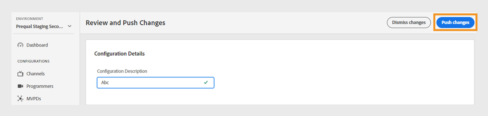

# Granska och skicka ändringar

>[!NOTE]
>
>Innehållet på den här sidan tillhandahålls endast i informationssyfte. Användningen av denna API kräver en aktuell licens från Adobe. Ingen obehörig användning är tillåten.

Med TVE Dashboard kan du granska ändringar i den aktuella konfigurationen och sedan distribuera dem till servern. När du ändrar den aktuella konfigurationen visas ett meddelande på skärmen som uppmanar dig att granska och överföra ändringarna.

Följ de här stegen för att granska och skicka ändringar.

1. Leta upp meddelandet om gransknings- och push-ändringar längst ned på skärmen.

   

   *Granska och skicka meddelanden om ändringar*

1. Välj **Granska ändringar** i meddelanderutan **Granska och skicka ändringar**.

1. Skriv en kort beskrivning av ändringen i **Konfigurationsbeskrivning** för att effektivt spåra och förstå syftet med varje ändring.

   

   *Lägg till en konfigurationsbeskrivning*

1. Navigera till avsnittet **Konfigurationsändringar** för att visa en sammanfattning av ändringarna.

1. Håll muspekaren över ändringen som du vill granska.

1. Välj **Visa** om du vill granska tidigare och nya värden som är associerade med en konfigurationsändring.

   

   *Visa konfigurationsändringar*

1. När du har granskat alla ändringar och allt ser korrekt ut väljer du **Push changes** för att tillämpa den uppdaterade konfigurationen på servern.

   >[!NOTE]
   >
   >Knappen **Push changes** (Skjut in ändringar) aktiveras först när du har lagt till en **Configuration Description**.

   

   *Push-ändringar*

   Du kan också välja **Ignorera ändringar** om du vill återställa alla konfigurationsändringar som visas.
