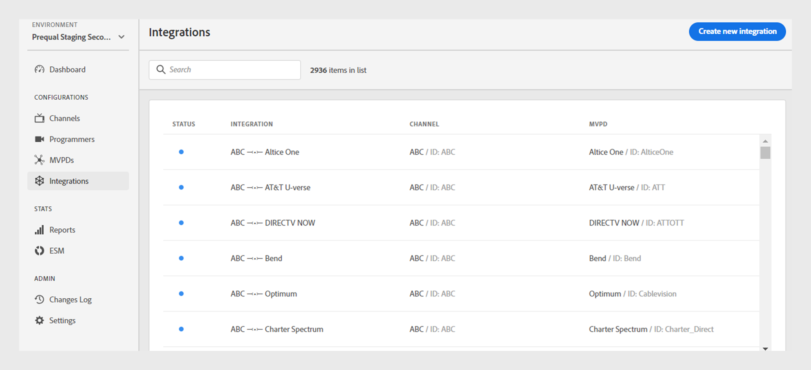
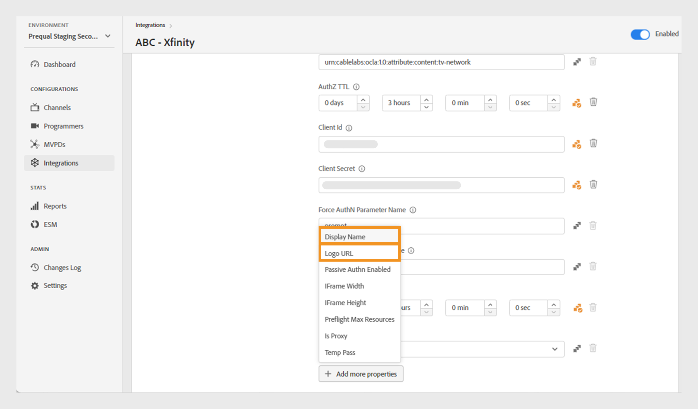
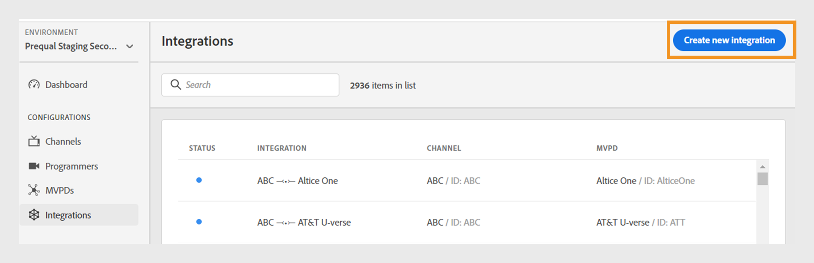

# Integreringar

>[!NOTE]
>
>Innehållet på den här sidan tillhandahålls endast i informationssyfte. Användningen av denna API kräver en aktuell licens från Adobe. Ingen obehörig användning är tillåten.

Med avsnittet **Integrationer** i TVE Dashboard kan du visa och hantera inställningar för integreringar mellan dina kanaler och distributörer av videoprogrammeringstjänster. Du kan också [skapa en ny integrering](#create-new-integration) enligt dina behov.

På fliken **Integrationer** i den vänstra panelen visas en lista med befintliga integreringar med följande information:

* Status som anger om integreringen är aktiv eller inaktiv
* Integrering som länkar specifika kanaler till respektive videoprogrammeringsprogram
* Kanalnamn med kanal-ID
* MVPD-visningsnamn och MVPD ID

*Lista över befintliga integreringar*

Skriv namnet på kanalen eller MVPD i **sökfältet** ovanför listan om du vill veta mer om integreringen.

## Hantera integrationskonfigurationer {#manage-integration-conf}

Följ de här stegen för att hantera en specifik integrering.

1. Välj fliken **Integrationer** i den vänstra panelen.
1. Välj en integrering i listan om du vill visa och redigera olika inställningar i följande avsnitt:

   * [Val av slutpunkt](#endpoint-selection)
   * [Plattformsinställningar](#platform-settings)
   * [Användarmetadata](#user-metadata)

>[!IMPORTANT]
>
> Visa [Granska och skicka ändringar](/help/authentication/user-guide-tve-dashboard/tve-dashboard-review-push-changes.md) om du vill ha mer information om hur du aktiverar konfigurationsändringarna.

### Val av slutpunkt {#endpoint-selection}

I det här avsnittet kan du välja slutpunkter för det MVPD som används för autentiserings-, auktoriserings- och utloggningsflöden från respektive listruta.

*Slutpunkter för autentiserings-, auktoriserings- och utloggningsflöden*

>[!NOTE]
>
>MVPD-program kan tillhandahålla en eller flera slutpunkter för varje flöde. När du integrerar en ny kanal måste MVPD ange vilken slutpunkt de föredrar för varje flöde.

>[!IMPORTANT]
>
>Alla ändringar av slutpunkter påverkar det övergripande beteendet för en integrering. Dessa ändringar ska endast implementeras efter att ha fått bekräftelse från det mobila dokumentationsdokumentet.

### Plattformsinställningar {#platform-settings}

I det här avsnittet kan du visa och redigera integreringsinställningar för alla [plattformar](/help/authentication/user-guide-tve-dashboard/tve-dashboard-reports.md#platforms). Du kan ändra de här inställningarna baserat på enskilda plattformar. Du kan till exempel justera TTL-längden för auktorisering på Android samtidigt som du behåller standardvärdet för en annan plattform.

Varje egenskap i plattformsinställningarna ärver ett standardvärde som angetts av MVPD, men kan justeras om det behövs.

>[!IMPORTANT]
>
>Ett avtal med MVPD krävs för att fastställa de värden som anges för varje egenskap i plattformsinställningarna.

>[!IMPORTANT]
>
> Inställningsarvet följer en kedja som börjar med MVPD-inställningarna (som är de mest allmänna) och sedan MVPD-slutpunkten, integrering, plattformskategori och plattform (som innehåller det mest specifika värdet).

**Plattformsinställningar** används för att åsidosätta inställningar för varje nivå i arvskedjan. De tillgängliga nivåerna i kedjan är grupperade enligt följande:

* **Standard för alla**: Ange värden för egenskaper som ska gälla överallt på alla plattformar om specifika plattformsvärden inte definieras, oavsett programmerarens implementeringar.

* **Skrivbordsenheter**: Ange värden för egenskaper som gäller för alla stationära och bärbara datorer, oavsett programmeringsmetod (JS SDK eller REST API).

* **Mobila enheter**: Ange värden för egenskaper som gäller för alla mobila enheter, inklusive **iOS**, **Android** och andra, oavsett programmeringsmetod (SDK eller REST API).

* **TV-anslutna enheter**: Ange värden för egenskaper som gäller för alla TV-anslutna enheter, inklusive **tvOS**, **Roku**, **FireTV** och andra, oavsett programmeringsmetod (SDK eller REST API).

* **Oidentifierade enheter**: Ange värden för egenskaper som gäller för alla enheter där den aktuella mekanismen inte kan identifiera plattformen korrekt. I sådana fall tillämpar du de mest restriktiva regler som definieras av det enhetliga upphandlingsdokumentet.

  

  *Plattformskategori och enheter*

Välj Ikonen  finns till höger om varje egenskap för att utforska de egenskaper som används för varje arvsnivå som beskrivs ovan.

#### De mest använda affärsflödena {#most-used-flows}

Avsnittet **Plattformsinställningar** innehåller ett antal egenskaper som används i olika affärsflöden. De faktiska egenskaperna kan variera beroende på vilka MVPD-program som har valts i den specifika integreringen. Nedan visas de mest använda flödena:

**AuthN TTL och AuthZ TTL över alla plattformar**

>[!IMPORTANT]
>
>TTL-värden för autentisering (AuthN) och auktorisering (AuthZ) måste vara konsekvent justerade mot MVPD-inställningarna.

Följ de här stegen för att ändra autentiserings- och auktoriserings-TTL på alla plattformar för en viss integrering.

1. Välj fliken **Integrationer** i den vänstra panelen.

1. Välj den integrering som du vill ändra AuthN TTL- och AuthZ TTL-värden för.

1. Navigera till avsnittet **Plattformsinställningar**.

1. Välj **Standard för fliken Alla** under **Plattformsinställningar**.

   >[!NOTE]
   >
   >Om du vill ändra längden på **AuthN TTL** och **AuthZ TTL** för en plattformskategori eller en viss plattform väljer du plattformen i enlighet med detta.

   

   *Ändra AuthN TTL AuthZ TTL-varaktighet på alla plattformar*

   **A.** AuthN TTL-egenskap **B.** AuthZ TTL-egenskap

1. Markera uppåt- och nedåtpilarna för att justera varaktigheten för antalet dagar, timmar, minuter och sekunder i egenskaperna **AuthN TTL** och **AuthZ TTL** .

Varaktigheten för **AuthN TTL** och **AuthZ TTL** på alla plattformar kommer endast att uppdateras efter [gransknings- och push-ändringar](/help/authentication/user-guide-tve-dashboard/tve-dashboard-review-push-changes.md).

**Aktivera enkel inloggning för plattformen**

>[!IMPORTANT]
>
>Egenskapen **Aktivera enkel inloggning** stöds endast på *iOS-, tvOS-, Roku- och FireTV*-plattformar. Det gäller endast för integreringar med MVPD-program som stöder enkel inloggning för dessa plattformar.

Följ de här stegen för att aktivera eller inaktivera enkel inloggning för en specifik integrering och plattform.

1. Välj fliken **Integrationer** i den vänstra panelen.

1. Välj den integrering som du vill aktivera eller inaktivera enkel inloggning för.

1. Navigera till avsnittet **Plattformsinställningar**.

1. Välj en specifik plattform eller plattformskategori som du vill aktivera enkel inloggning för under **Plattformsinställningar**.

   

   *Aktivera enkel inloggning för en viss plattform*

   **A.** Enkel inloggning, egenskap **B.** Använd plattformsbehörigheter, egenskap

1. Välj **Ja** om du vill aktivera eller **Nej** om du vill inaktivera från listrutan **Aktivera enkel inloggning**.

1. Välj **Ja** om du vill aktivera eller **Nej** om du vill inaktivera från listrutan **Använd plattformsbehörighet**.

   Egenskapen **Använd plattformsbehörighet** kontrollerar om användarens beslut att **tillåta** eller **neka** plattformsåtkomst till sin TV-leverantörsprenumeration respekteras.

   Om till exempel både **Aktivera enkel inloggning** och **Använd plattformsbehörighet** är aktiverade och användaren väljer att neka plattformsåtkomst till sin TV-leverantörsprenumeration, kommer respektive program (kanal) inte att kunna använda den Adobe Pass-autentiseringstoken som erhålls av ett annat program (kanal).

Egenskapen **enkel inloggning** för en vald plattform kommer endast att aktiveras eller inaktiveras efter [granskning och push-ändringar](/help/authentication/user-guide-tve-dashboard/tve-dashboard-review-push-changes.md).

**Aktivera hembaserad autentisering**

Följ de här stegen för att aktivera eller inaktivera hembaserad autentisering för OAuth2-baserade MVPD-filer.

1. Välj fliken **Integrationer** i den vänstra panelen.

1. Välj den integrering som du vill aktivera eller inaktivera hembaserad autentisering för.

1. Navigera till avsnittet **Plattformsinställningar**.

1. Välj en specifik plattform eller plattformskategori som du vill aktivera hembaserad autentisering för under **Plattformsinställningar**.

   

   *Aktivera hembaserad autentisering för en viss plattform*

   **A.** Attempt HBA property **B.** HBA AuthN TTL property

1. Välj **Ja** om du vill aktivera och **Nej** om du vill inaktivera från listrutan **Försök med HBA**.

>[!IMPORTANT]
>
>Du bör undvika att ändra längden på **HBA AuthN TTL** -egenskapen. Det kan potentiellt leda till oväntade fel i auktoriseringsprocessen.

Egenskapen **Attempt HBA** för ett specifikt MVPD aktiveras eller inaktiveras först efter [granskning och push-ändringar](/help/authentication/user-guide-tve-dashboard/tve-dashboard-review-push-changes.md).

#### Lägg till fler egenskaper {#add-more-properties}

Med **Lägg till fler egenskaper** kan du med flexibilitet inkludera ytterligare specifika egenskaper för integreringar, särskilt för mindre vanliga flöden.

Du kan lägga till följande egenskaper:

* För alla plattformar väljer du **Standard för alla**-flikar till vänster.
* För en plattformskategori väljer du fliken **Skrivbordsenheter**, **Mobila enheter** eller **TV-anslutna enheter** till vänster.
* För en viss enhet väljer du fliken **iOS**, **Android**, **tvOS**, **Roku** eller **FireTV** till vänster.

Här är några exempel på olika flöden som kan aktiveras genom att du lägger till dessa egenskaper:

**Ändra antalet förauktoriserade resurser**

De flesta MVPD-program har stöd för ett preflight-authZ-anrop med upp till 5 resurs-ID:n som standard.
Om flera PDF-filer accepterar att höja den här gränsen kan du navigera till **Lägg till fler egenskaper** och välja **Max preflight-resurser** på Alternativ-menyn.

**Max resurser för preflight** lägger till ett nytt attribut där den överenskomna gränsen med MVPD kan anges.

*Lägg till egenskapen Max resurser för preflight*

Egenskapen **Max resurser för preflight** läggs bara till efter [granskning och push-ändringar](/help/authentication/user-guide-tve-dashboard/tve-dashboard-review-push-changes.md).

**Ändra MVPD-visningsnamn eller logotyp-URL**

För programmeringsprogram som inte vill bygga sin MVPD-väljare och i stället förlitar sig på de konfigurationer som tillhandahålls, kan du navigera till **Lägg till fler egenskaper** och välja **Visningsnamn** eller **URL för logotyp** för att lägga till det visningsnamn eller de logotyper som krävs för varje MVPD-fil på Alternativ-menyn.

Olika värden för dessa egenskaper kan användas för samma MVPD beroende på enhetsplattform och önskad användarupplevelse.

*Lägg till visningsnamn eller URL-logotyp*

Egenskapen **Visningsnamn** eller **URL för logotyp** läggs bara till efter [gransknings- och push-ändringar](/help/authentication/user-guide-tve-dashboard/tve-dashboard-review-push-changes.md).

**Begär ett nytt autentiseringsflöde vid programväxling (kanal)**

Om du vill framtvinga en ny autentisering när användare växlar mellan appar. I så fall kan du navigera till **Lägg till fler egenskaper** och välja egenskapen **Autentisering per aggregator** .

Om du lägger till **Autentisering per aggregator** bryts enkel inloggning för respektive kanal.

*Lägg till autenticering per aggregator-egenskap*

Egenskapen **Auth per Aggregator** läggs bara till efter [gransknings- och push-ändringar](/help/authentication/user-guide-tve-dashboard/tve-dashboard-review-push-changes.md).

När du har lagt till väljer du **Ja** för att aktivera egenskapen **Autentisering per aggregator** för en vald integrering.

#### Ta bort egenskaper {#delete-properties}

Välj Ikonen  finns till höger om varje egenskap för att ta bort de egenskaper som inte längre behövs.

>[!NOTE]
>
>Vissa egenskaper kan inte tas bort eftersom de är obligatoriska krav för det valda MVPD-programmet.

Egenskapen tas endast bort från avsnittet **Plattformsinställningar** efter [granskning och push-ändringar](/help/authentication/user-guide-tve-dashboard/tve-dashboard-review-push-changes.md).

### Användarmetadata {#user-metadata}

I det här avsnittet kan du uppdatera inställningarna för varje användarmetadataparameter som delas av MVPD.

>[!NOTE]
>
>Varje MVPD kan ha olika parametrar. Mer information om parametrarna som ett visst MVPD kan dela får du av din Adobe-representant.

I avsnittet med användarens metadata visas följande kolumner:

**Nyckel**: Representerar de faktiska parametrarna för användarmetadata som ska användas i API:t för att extrahera värden.

**Beskrivning**: Ger en kort beskrivning av varje metadataparameter för användare.

**Krypterad**: Med den här kolumnen kan du aktivera eller inaktivera parametrar i API:t genom att välja **Ja** respektive **Nej** i listrutan. Om du väljer **Ja** anges att parametervärdet kommer att krypteras i API:t. Krypteringen utförs med ett certifikat som definieras av ett **användarmetadataområde** .

>[!TIP]
>
>
> Kontrollera alltid att parametern **ZIP** är krypterad.

Läs mer om tillgängliga certifikat i avsnitten [Programmerare](/help/authentication/user-guide-tve-dashboard/tve-dashboard-programmers.md#available-certificates) och [Kanaler](/help/authentication/user-guide-tve-dashboard/tve-dashboard-channels.md#available-certificates).

**Aktiverad**: Med den här kolumnen kan du aktivera eller inaktivera parametrar i API:t genom att välja **Ja** respektive **Nej** i listrutan.

*Parametrar tillgängliga för användarmetadata*

## Skapa ny integrering {#create-new-integration}

Så här skapar du en ny integrering med ett nytt MVPD-program i den aktuella konfigurationen:

1. Välj fliken **Integrationer** i den vänstra panelen.

1. Välj **Skapa ny integrering** längst upp till höger i avsnittet **Integrationer**.

   

   *Skapa en ny integrering*

   Följande avsnitt visas:

   **Välj kanal och MVPD**

   Välj en **kanal** i listrutan **Välj kanal** om du vill lägga till en ny integrering. När du har markerat kanalen väljer du önskad **MVPD** i listrutan **Välj MVPD** som ska integreras med den valda kanalen.

   

   *Välj kanal och MVPD*

   **Markera slutpunkter**

   När du har valt det obligatoriska MVPD-värdet fylls avsnittet **Markera slutpunkt** i automatiskt med standardslutpunkterna som är konfigurerade för det aktuella MVPD-värdet.

   >[!IMPORTANT]
   >
   >Ändra inte standardslutpunkterna i något flöde om det inte uttryckligen anges av MVPD.

   

   *Markera slutpunkter*

   **Ytterligare information**

   Det här avsnittet innehåller olika egenskaper som måste konfigureras för det valda MVPD-programmet i avsnittet **Välj kanal och MVPD**.

   >[!NOTE]
   >
   > De faktiska egenskaperna kan variera beroende på vilka MVPD-program som har valts i avsnittet **Välj kanal och MVPD**.

   Du kan till exempel redigera **AuthN TTL** eller **partner-ID** (Channel ID) för sammärkning på MVPD-inloggningssidan i följande bild.

   

   *Redigera ytterligare information*

   Välj **Spara integrering** längst upp till höger i avsnittet **Skapa ny integrering**.

En ny integrering skapas först efter [granskning och push-ändringar](/help/authentication/user-guide-tve-dashboard/tve-dashboard-review-push-changes.md).

## Inaktivera integrering {#disable-integration}

Så här inaktiverar du en integrering:

1. Välj fliken **Integrationer** i den vänstra panelen.

1. Välj den integrering som du vill inaktivera.

1. Inaktivera alternativet längst upp till höger i den valda integreringen.

   

   *Inaktivera integrering*

Integreringen inaktiveras först efter [gransknings- och push-ändringar](/help/authentication/user-guide-tve-dashboard/tve-dashboard-review-push-changes.md).

När integreringen har inaktiverats förlorar slutanvändarna möjligheten att autentisera eller auktorisera med det specifika MVPD-programmet.
