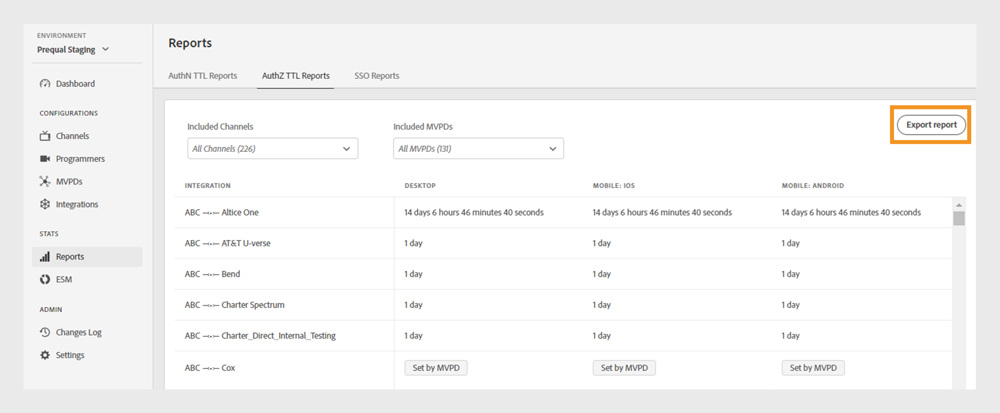

# Rapporter {#Reports}

>[!NOTE]
>
>Innehållet på den här sidan tillhandahålls endast i informationssyfte. Användningen av denna API kräver en aktuell licens från Adobe. Ingen obehörig användning är tillåten.

Avsnittet **Rapporter** i TVE Dashboard ger åtkomst till aggregerade data för AuthN TTL-, AuthZ TTL- och SSO-rapporter. Dessa rapporter innehåller kanalintegreringar med olika MVPD-program på alla [plattformar](#platforms).

Med rapporter kan du filtrera data och samla in insikter över [specifika kanaler eller MVPD](#selecting-specific-channels-mvpds). Du kan också exportera rapporter i en CSV-fil för ytterligare analys.

## Visa rapporter {#view-reports}

Följ de här stegen för att visa en specifik rapport.

1. Välj fliken **Rapporter** i den vänstra panelen.
1. Välj någon av följande flikar för att visa och exportera aggregerade data för de inkluderade kanalerna och videoprogrammeringsgränssnitten:
   * [AuthN TTL-rapporter](#authn-ttl-reports)
   * [AuthZ TTL-rapporter](#authz-ttl-reports)
   * [SSO-rapporter](#sso-reports)

   

   *Typ av rapporter*

### AuthN TTL-rapporter {#authn-ttl-reports}

I AuthN TTL-rapporterna, som även kallas TTL (Authentication Time-To-Live), visas hur länge autentiseringstoken konfigureras för kanalintegreringar med olika MVPD:er på alla [plattformar](#platforms). Med hjälp av dessa rapporter kan du kontrollera hur länge en användare är autentiserad för en viss MVPD och plattform. Varaktighetsvärdena visas i användarvänliga format som **dagar**, **timmar**, **minuter** och **sekunder**. Tabellen AuthN TTL Reports innehåller vågrät och lodrät rullning för att passa olika skärmstorlekar.

Du kan också visa och hämta data för [specifika kanaler eller MVPD-program](#selecting-specific-channels-mvpds).

*Exportera AuthN TTL-rapporter*

>[!IMPORTANT]
>
> Platshållaren **Set by MVPD** används när MVPD tvingar AuthN TTL-värdet i stället för Adobe Pass Authentication-konfigurationen.

Välj **Exportera rapporter** om du vill spara data som en CSV-fil på den lokala datorn.

### AuthZ TTL-rapporter {#authz-ttl-reports}

I AuthZ TTL-rapporterna, som även kallas TTL (Authorization Time-To-Live), visas varaktigheten för den auktoriseringstoken som konfigurerats för kanalintegreringar med olika MVPD:er på alla [plattformar](#platforms). Med hjälp av dessa rapporter kan du kontrollera hur lång tid en användare har på sig att bevaka innehåll för en viss MVPD och plattform. Varaktighetsvärdena visas i användarvänliga format som **dagar**, **timmar**, **minuter** och **sekunder**. Tabellen AuthZ TTL Reports innehåller vågrät och lodrät rullning för olika skärmstorlekar.

Du kan också visa och hämta data för [specifika kanaler eller MVPD](#selecting-specific-channels-mvpds).

*Exportera AuthZ TTL-rapporter*

>[!IMPORTANT]
>
> Platshållaren **Set by MVPD** används när MVPD tvingar AuthZ TTL-värdet i stället för Adobe Pass Authentication-konfigurationen.

Välj **Exportera rapporter** om du vill spara data som en CSV-fil på den lokala datorn.

### SSO-rapporter {#sso-reports}

SSO-rapporterna, som även kallas enkel inloggning, visar den status för enkel inloggning som konfigurerats för kanalintegreringar med olika MVPD:er på alla [plattformar](#platforms). Med hjälp av dessa rapporter kan du inspektera den förväntade användarautentiseringen för enkel inloggning för en specifik MVPD och plattform. Värdena visas i användarvänliga format som **SSO inaktiverat**, **SSO aktiverat** och **SSO osäkert**. Tabellen SSO-rapporter innehåller vågrät och lodrät rullning för olika skärmstorlekar.

Du kan också visa och hämta data för [specifika kanaler eller MVPD-program](#selecting-specific-channels-mvpds).

*Exportera SSO-rapporter*

>[!IMPORTANT]
>
> Platshållaren **Osäker enkel inloggning** anger att enkel inloggning (SSO) är aktiverad och kan vara i drift. Inställningarna nedan kan dock hämma SSO-autentisering, vilket förklaras i följande exempel:
>
> * Inställningar för användarplattform: Alternativet att blockera cookies från tredje part.
> * Användarbeslut: Användarna nekar plattformsåtkomst till sin TV-leverantörsprenumeration.
> * MVPD-inställningar: MVPD begär autentisering för varje kanal.

Välj **Exportera rapporter** om du vill spara data som en CSV-fil på den lokala datorn.

## Plattformar {#platforms}

[AuthN TTL-rapporter](#authn-ttl-reports), [AuthZ TTL-rapporter](#authz-ttl-reports) och [SSO-rapporter](#sso-reports) visar data på olika plattformar, till exempel:

* **Skrivbord**: Visar värden som används för programmeringsimplementeringar via Adobe Pass Authentication JavaScript SDK.

* **Mobil**

  **iOS**: Visar värden som används med Adobe Pass Authentication iOS SDK.

  **Android**: Visar värden som används via Adobe Pass Authentication Android SDK.

  **Övriga**: Visar värden som används med hjälp av REST-API:t för Adobe Pass-autentisering som utvecklats för mobila enheter.

* **TVCD**

  **Roku**: Visar värden som används via Adobe Pass Authentication REST API och identifierar Roku som en enhetstyp.

  **FireTV**: Visar värden som används via Adobe Pass Authentication FireTV SDK.

  **AppleTV**: Visar värden som används via Adobe Pass Authentication TVOS SDK.

  **Övriga**: Visar värden som används med Adobe Pass Authentication REST API för tv-anslutna enheter.

* **Oidentifierad plattform**: Visar värden som används för programmeringsimplementeringar när Adobe Pass Authentication Services identifierar en okänd enhetstyp.

Om du vill veta mer om hur du delar önskad enhetstyp, till exempel **Roku** med Adobe Pass Authentication REST API:er eller SDK:er, kan du visa mekanismen för att [skicka klientinformation](/help/authentication/integration-guide-programmers/legacy/client-information/passing-client-information-device-connection-and-application.md).

>[!IMPORTANT]
>
> De aggregerade uppgifterna baseras på den specifika konfigurationen för varje Adobe Pass-autentiseringsmiljö. När du växlar mellan olika TVE Dashboard-miljöer kan du förvänta dig variationer i data mellan olika rapporter. Mer information finns i [Adobe Pass-autentiseringsmiljöerna](/help/authentication/user-guide-tve-dashboard/tve-dashboard-environments.md).

## Välja ut specifika kanaler och videoprogrammeringsfönster {#selecting-specific-channels-mvpds}

[AuthN TTL-rapporter](#authn-ttl-reports), [AuthZ TTL-rapporter](#authz-ttl-reports) och [SSO-rapporter](#sso-reports) innehåller data för **alla kanaler**-integreringar med **Alla MVPD-filer** som standard.

>[!NOTE]
>
> Om du avmarkerar **Alla kanaler** eller **Alla PDF-filer** i respektive listruta visas ett meddelande som gör en markering för att visa meningsfulla rapporter.

Så här skapar du en rapport för specifika kanaler:

1. Välj listrutan **Inkluderade kanaler** längst upp i den markerade rapporten.

   

   *Listrutan Inkluderade kanaler*

1. Avmarkera **Alla kanaler**.

1. Välj de kanaler som krävs på den nedrullningsbara menyn **Inkluderade kanaler** som du vill generera data för.

>[!NOTE]
>
> Om du vill ha alternativ tillgängliga i listrutan **Inkluderade MVPD** måste du markera minst en kanal i listrutan **Inkluderade kanaler**.

Så här skapar du en rapport för specifika programmeringsdokumentskydd:

1. Välj listrutan **Inkluderade PDF-filer** högst upp i den markerade rapporten.

   

   *Listrutan MVPD ingår*

1. Avmarkera **Alla PDF-filer**.

1. Välj obligatoriska MVPD:er i listrutan **Inkluderade MVPD:er** som du vill generera data för.
