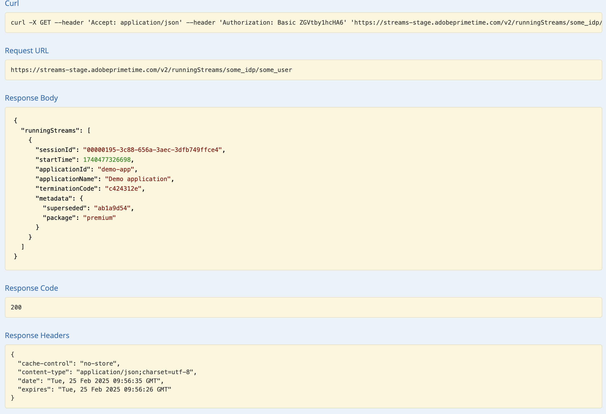

# API-översikt {#api-overview}

Mer information finns i [online-API-dokumentationen](http://docs.adobeptime.io/cm-api-v2/).

## Syfte och krav {#purpose-prerequisites}

Det här dokumentet hjälper programutvecklare att använda specifikationen för Swagger API när de implementerar en integrering med Concurrency Monitoring. Vi rekommenderar starkt att läsaren har en tidigare förståelse för de begrepp som definieras av tjänsten innan han/hon följer denna riktlinje. För att förstå detta måste du ha en översikt över [produktdokumentationen](/help/concurrency-monitoring/cm-home.md) och [API-specifikationen för ](http://docs.adobeptime.io/cm-api-v2/) Swagger.


## Introduktion {#api-overview-intro}

Under utvecklingsprocessen utgör den offentliga dokumentationen för Swagger referensriktlinjerna för att förstå och testa API-flödena. Det här är en bra startpunkt för att ha en praktisk strategi och bekanta dig med hur verkliga program fungerar i olika scenarier för användarinteraktion.

Skicka en biljett i [Zendesk](mailto:tve-support@adobe.com) för att registrera ditt företag och dina program i Concurrency Monitoring. Adobe tilldelar varje enhet ett program-ID. I den här guiden använder vi två referensprogram med ID:n **demo-app** och **demo-app-2** som kommer att finnas under klientens Adobe.


## Användningsexempel {#api-use-case}

Det första steget i att testa ett flöde med Swagger är att ange program-ID:t i sidans övre högra hörn så här:


Därefter trycker vi på **Utforska** för att ange det ID som ska användas i auktoriseringshuvudet för alla anrop till REST API.  Alla API-anrop förväntar sig att program-ID:t skickas via grundläggande HTTP-autentisering. Användarnamnet är program-ID:t och lösenordet är tomt.


### Första programmet {#first-app-use-cases}

Program med ID **demo-app** har av Adobe-teamet tilldelats en princip med en regel som begränsar antalet samtidiga strömmar till 3. En profil tilldelas till ett specifikt program baserat på den begäran som skickas in i Zendesk.


#### Hämtar metadata {#retrieve-metadata-use-case}

Det första anropet vi gör är att Metadata-resursen ska hämta listan över metadataattribut som behövs för att skickas som formulärdata under sessionsinitieringen. Dessa metadata kommer att användas för att utvärdera de principer som tilldelats för det här programmet.


När du har tryckt på Testa det för programmet med ID **demo-app** får du följande resultat:


Listan med metadataattribut är tom, vilket vi kan se i svarsfältet. Det innebär att de attribut som krävs för design är tillräckliga för att utvärdera den 3-strömningsprincip som tilldelats det här programmet. Se även [dokumentationen för standardmetadatafält](/help/concurrency-monitoring/standard-metadata-attributes.md). Efter det här samtalet kan vi fortsätta och skapa en ny session för REST-resursen för sessioner.


#### Initiering av session {#session-initial}

Initieringsanropet för sessionen utförs av ett program efter att all nödvändig information som krävs för att det ska kunna utföras har hämtats.


Ingen avslutningskod behöver anges för det första samtalet eftersom vi inte har några andra aktiva strömmar. Och inget metadataattribut eftersom inget returnerades från anropet Hämta metadata.

Parametrarna **subject** och **idp** är obligatoriska. De anges som URI-sökvägsvariabler. Du kan hämta parametrarna **subject** och **idp** genom att anropa metadatafälten **mvpd** och **upstreamUserID** från Adobe Pass Authentication. Se även [översikten över metadata-API:er](https://experienceleague.adobe.com/docs/primetime/authentication/auth-features/user-metadat/user-metadata-feature.html?lang=sv-SE#). I det här exemplet anger vi värdet&quot;12345&quot; som ämne och&quot;adobe&quot; som idp.


Anropa sessionsinitieringen. Du får följande svar:


Alla data vi behöver finns i svarsrubrikerna. Rubriken **Plats** representerar ID:t för den nya skapade sessionen och rubrikerna **Datum** och **Förfaller** representerar de värden som används för att schemalägga programmet så att nästa pulsslag kan hållas vid liv.

Med varje anrop får du skicka alla metadata du behöver, inte bara de metadata som är obligatoriska för ditt program. Du kan skicka metadata på två sätt:
* med **query** **parameters**:

  ```sh
  curl -i -XPOST -u "user:pass" "https://streams-stage.adobeprimetime.com/v2/sessions/some_idp/some_user?metadata1=value1&metadata2=value2"
  ```

* med **request** **body**:

  ```sh
  curl -i -XPOST -u "user:pass" https://streams-stage.adobeprimetime.com/v2/sessions/some_idp/some_user -d "metadata1=value1" -d "metadata2=value2" -H "Content-Type=application/x-www-form-urlencoded"
  ```

#### Hjärtslag {#heartbeat}

Ring ett hjärtslag. Ange det **sessions-ID** som hämtats i sessionens initieringsanrop, tillsammans med parametrarna **subject** och **idp** som används.


För hjärtslagsanrop får du skicka metadata på samma sätt som du gör för sessionsinitiering. Du kan när som helst lägga till nya metadata och uppdatera tidigare skickade värden med några **undantag**. Följande värden kan inte ändras när de väl har angetts: **package**, **channel**, **platform**, **assetId**, **idp**, **mvpd**, **hba_status**, **hba**
**mobileDevice**

Om sessionen fortfarande är giltig (den har inte gått ut eller tagits bort manuellt) får du ett resultat:


Som i det första fallet använder vi rubrikerna **Date** och **Expires** för att schemalägga ett annat pulsslag för den här sessionen. Om sessionen inte längre är giltig misslyckas anropet med en 410 GONE HTTP-statuskod.

Du kan använda alternativet &quot;Håll strömmen vid liv&quot; som är tillgängligt i användargränssnittet för Swagger för att köra automatiska pulsslag på en viss session. Det kan hjälpa dig att testa en regel utan att behöva bekymra dig om den standardplatta som behövs för att göra sessionshjärtslag i rätt tid. Den här knappen placeras bredvid knappen&quot;Prova ut&quot; på fliken Svag pulsslag. Om du vill ställa in en automatisk pulsslag för alla sessioner som skapas måste du ha dem schemalagda var och en i ett separat Swagger-gränssnitt som öppnas på en webbläsarflik.


#### Sessionsavslut {#session-termination}

Företagets affärsplan kan kräva Concurrency Monitoring för att avsluta en viss session, t.ex. när en användare slutar titta på en video. Detta kan du göra genom att ringa ett DELETE-anrop till Sessions-resursen.


Använd samma parametrar för anropet som för sessionens pulsslag. HTTP-svarskoderna är:

* 202 ACCEPTERAT för ett lyckat svar
* 410 GONE om sessionen redan hade stoppats.

#### Hämta alla strömmar som körs {#get-all-running-streams}

Den här slutpunkten innehåller alla sessioner som för närvarande körs för en specifik klient i alla dess program. Använd parametrarna **subject** och **idp** för anropet:


När du ringer får du följande svar:


För varje session hämtas **terminateCode** och fullständiga metadata.

Observera rubriken **Förfaller**. Det är den tidpunkt då den första sessionen ska förfalla om inte ett pulsslag skickas.
Metadatafältet fylls i med alla metadata som skickades när sessionen startades. Vi filtrerar inte den, du får allt som du har skickat.
Svaret inkluderar alla strömmar som körs på andra innehavares appar så länge apparna delar samma policy.
Om det inte finns några sessioner som körs för en viss användare när du ringer får du det här svaret:


Observera också att i det här fallet är rubriken **Expires** inte tillgänglig.

Om en session skapades och en annan session togs bort, med rubriken **X-Terminate**, hittar du fältet **ersatt** under metadata. Värdet är en indikator på den session som avbrutits för att ge plats åt den aktuella sessionen.



#### Bryter principen {#breaking-policy-app-first}


För att simulera beteendet hos programmet när den 3-strömningspolicy som är tilldelad till den bryts, måste vi göra tre anrop för sessionsinitiering. För att principen ska börja gälla måste anropen göras innan en session förfaller på grund av brist på hjärtslag. Vi kommer att se att alla dessa samtal lyckas, men om vi gör en fjärde misslyckas de med följande fel:


Vi får ett 409 CONFLICT-svar tillsammans med ett utvärderingsresultatobjekt i nyttolasten. Detta anger att serversidans principer inte tillåter att den här sessionen skapas eller fortsätter. Svarstexten innehåller ett EvaluationResult-objekt med en AssociatedAdvice som inte är tom, vilket är en lista med Advice-objekt som innehåller förklaringar för varje regelöverträdelse.

Programmet ska uppmana användaren med felmeddelanden som medföljer varje Advice-instans. Alla råd indikerar också regeldetaljer som attribut, tröskelvärde, regel- och principnamn. Dessutom kommer de värden som står i konflikt att tas med i listan över aktiva sessioner för varje värde.

Den här informationen är avsedd för avancerad felmeddelandeformatering och för att användaren ska kunna vidta åtgärder för sessionerna som står i konflikt.

Varje session som står i konflikt har en **terminateCode** som kan användas för att **döda** den strömmen. På så sätt kan programmet tillåta användaren att välja vilka sessioner som ska avslutas för att försöka få åtkomst till den aktuella sessionen.

Programmet kan använda informationen från utvärderingsresultatet för att visa ett visst meddelande för användaren när videon stoppas och vidta ytterligare åtgärder om det behövs. Ett exempel kan vara att stoppa andra befintliga strömmar för att starta en ny. Detta görs genom att använda värdet **terminateCode** som finns i fältet **Confacts** för ett specifikt attribut i konflikt. Värdet anges som X-Terminate HTTP-huvud i anropet till en ny sessionsinitiering.


När du anger en eller flera avslutningskoder vid sessionsinitieringen lyckas anropet och en ny session genereras. Om vi sedan försöker skapa ett pulsslag med en av sessionerna som har fjärrstoppats får vi tillbaka ett 410 GONE-svar med en nyttolast som beskriver att sessionen har fjärravslutats, som i exemplet:


410 kan returneras med eller utan en brödtext, baserat på vad som orsakade att den aktuella sessionen avslutades.

När svaret inte har något innehåll innebär 410 att ett hjärtslag (eller avslutande)-anrop görs för en session som inte längre är aktiv (på grund av timeout eller en tidigare konflikt eller något annat). Det enda sättet att återskapa från det här läget är att programmet initierar en ny session. Eftersom det inte finns något innehåll ska programmet hantera det här felet utan att användaren vet om det.

När en svarstext tillhandahålls måste programmet däremot söka i attributet **associatedAdvice** för att hitta en **fjärrtermineringsrådgivning** som anger fjärrsessionen som startades med en explicit avsikt att **döda** den aktuella. Detta bör resultera i ett felmeddelande som&quot;Din session har sparats ut av enhet/program&quot;.

### Svarstext {#response-body}

För alla API-anrop för sessionens livscykel är svarstexten (om sådan finns) ett JSON-objekt som innehåller följande fält:


**Råd**
**EvaluationResult** innehåller en array med Advice-objekt under **associatedAdvice** . Enheterna är avsedda för programmet att visa ett omfattande felmeddelande för användaren och (eventuellt) tillåta användaren att vidta åtgärder.

Det finns för närvarande två typer av enheter (anges av deras **type** -attributvärde): **rule-violett** och **remote-terminate**. Den första innehåller information om en regel som har brutits och sessionerna som är i konflikt med den aktuella regeln (inklusive attributet terminate som kan användas för att fjärravsluta den sessionen). Det andra är bara att det står att den aktuella sessionen avslutades avsiktligt av en fjärranvändare, så att användarna vet vem som sparkade ut dem när gränserna nåddes. Om **ersatt** inkluderas i metadata skapades sessionen i fråga med rubriken **X-Terminate**.


**Skyldighet**
Utvärderingen kan också innehålla en eller flera fördefinierade åtgärder som måste utlösas av programmet till följd av utvärderingen.


### Andra programmet {#second-application}

Det andra exempelprogrammet som vi kommer att använda är det med ID **demo-app-2**. Den här har tilldelats en princip med en regel som begränsar antalet tillgängliga strömmar för en kanal till maximalt 2.   Du måste ange kanalvariabeln för att kunna utvärdera den här principen.

#### Hämtar metadata {#retrieving-metadata}

Ange det nya program-ID:t i det övre högra hörnet på sidan och anropa metadataresursen. Du får följande svar:


Den här gången är svarstexten inte längre en tom lista, som i exemplet med det första programmet. Nu anger Concurrency Monitoring Service i svarsbrödtexten att metadata för **kanal** krävs vid sessionsinitieringen för att principen ska kunna utvärderas.

Om du ringer ett samtal utan att ange ett värde för parametern **channel** får du:

* Svarskod - 400 FELAKTIG BEGÄRAN
* Svarstext - en nyttolast för utvärderingsresultat som i fältet **requirements** beskriver vad som förväntas i begäran om sessionsinitiering för att åtgärden ska lyckas.


#### Initiering av session {#session-init}

Tilldela ett värde för den metadatanyckel som krävs och ange det som en formulärparameter i sessionsinitieringsbegäran, vilket visas nedan:


Nu kommer samtalet att lyckas och en ny session kommer att skapas.


#### Bryter principen {#breaking-policy-second-app}

För att bryta regeln som vi har i den policy som tilldelats det här programmet måste vi ringa 2 samtal med samma kanalvärde. Precis som i det första exemplet måste det andra anropet göras medan den första sessionen som skapas fortfarande är giltig.


Om vi använder olika värden för kanalmetadata varje gång vi skapar en ny session lyckas alla anrop eftersom tröskelvärdet 2 omfattar varje värde för sig.

Som i det första exemplet kan vi använda avslutningskoden för att fjärrstoppa strömmar som är i konflikt eller vänta på att en av strömmarna ska förfalla, förutsatt att ingen pulsslag kommer att användas på dem.
