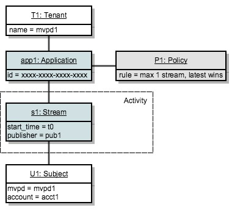

# Policybeslutspunkt {#policy-desc-pt}

## Domänmodell {#domain-model}

Den här sidan är avsedd att fungera som referens för olika användningar och implementeringar av policyer. Vi rekommenderar att du också läser delen [Ordlista](/help/concurrency-monitoring/cm-glossary.md) i dokumentationen för att få information om termdefinitioner.

En **klientorganisation** äger **program** som den vill tillämpa **profiler** för. **Klientprogram** måste konfigureras med program-ID:t **&#x200B;**&#x200B;(tillhandahålls av Adobe).

Klienten associerar sedan varje program med en eller flera profiler, antingen skapade av honom eller skapade och delade av andra. Profiler kan länkas mellan flera innehavare.

**Ämnesaktiviteten** består av alla strömmar (oavsett program) som rapporteras till övervakning av samtidig användning för ett visst ämne.

När en ström ska auktoriseras för ett visst ämne, kontrollerar systemet först alla principer som definierats för programmet som skapade strömmen.

För var och en av de tillämpliga profilerna måste vi sedan samla in alla **relevanta aktiviteter** som ska skickas till regeln. Den **relevanta aktiviteten** för en princip-P kommer endast att innehålla strömmen S om den uppfyller följande villkor:

**Strömmen S startas av ett program som innehåller principen P bland sina principer.**

## Användningsexempel för torr körning {#dry-run-use-cases}

Genomgången nedan avser att validera modellen mot vissa användningsfall. Vi gör det gradvis genom att börja med en grundläggande konfiguration och lägga till komplexitet på olika sätt.

### &#x200B;1. En klient. Ett program. En policy. En ström {#onetenant-oneapp-onepolicy-onestream}

Vi börjar med en enda klient, med ett enda program och en enda policy. Låt oss anta att principen anger att det kan finnas högst en aktiv ström för alla användare (den senaste strömmen får spelas upp).

När en direktuppspelning har startats består aktiviteten endast av den strömmen och den får spelas upp.

### &#x200B;2. En klient. Ett program. En policy. Två strömmar. {#onetenant-oneapp-onepolicy-twostreams}

När en andra ström har startats (av samma ämne med samma program) kommer aktiviteten som används för valideringen att bestå av både **s1** och **s2**.

Gränsen har överskridits eftersom principen anger att endast en ström får spelas upp, så vi tillåter endast att den senaste strömmen (**s2**) spelas upp.

>[!NOTE]
>
>Diagrammen representerar systemvyn för användaraktiviteten. Vid försök till initiering av strömmar inkluderas åtkomstbeslutet i svaret. För aktiva strömmar kommer beslutet att returneras vid pulsslagssvar.

### &#x200B;3. Två hyresgäster. Två program. En policy. Två strömmar. {#twotenant-twoapp-onepolicy-twostreams}

Låt oss nu anta att en ny hyresgäst vill tillämpa samma policy i sina program:

På grund av att de två klienterna är kopplade enligt samma princip gäller den situation som beskrivs i avsnitt 2 här och **s3** kan spelas upp som den senaste strömmen.

### &#x200B;4. Två hyresgäster. Tre program. Två policyer. Två strömmar. {#twotenants-threeapps-twopolicies-twostreams}

Låt oss nu anta att den andra klienten distribuerar ett nytt program och vill definiera en ny princip som ska delas mellan **app2** och **app3**.

För tillfället är både de aktiva strömmarna **s3** och **s4** tillåtna. När principen **P1** utvärderas för **s3** räknas endast **s3** som **relevant aktivitet** (**s4** är inte på något sätt relaterat till principen **P1**), vilket innebär att det inte finns några överträdelser.

Principen **P2** tillämpas på båda strömmarna och inkluderar både **s3** och **s4** som relevant aktivitet. Eftersom den här aktiviteten ligger inom gränserna för två strömmar tillåts båda strömmarna.

### &#x200B;5. Två hyresgäster. Tre program. Två policyer. Tre strömmar. {#twotenants-threeapps-twopolicies-threestreams}

Anta nu att ett nytt försök att initiera strömmen utförs med **app2**:

**s5** tillåts starta av **P1** (som tillåter att nyare strömmar tar över), men det nekas av **P2** så att det inte startar.

Samma sak händer om en direktuppspelningsinit görs med app3: samma P2-princip nekar åtkomst för den.

Nu ska vi se vad som händer om användaren försöker skapa en ny ström med app1:

Programprogrammet app1 är inte på något sätt relaterat till principen **P2**, så den tillämpar bara principen **P1**: som gör att den nya strömmen kan starta och nekar den äldre (**s3** i det här fallet).
