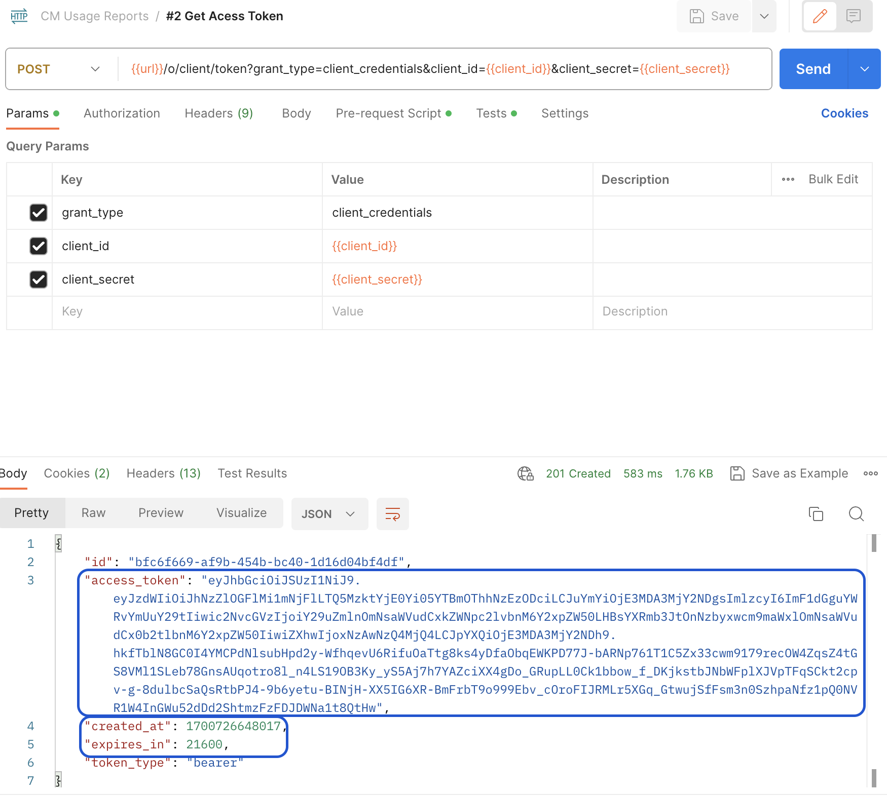

# API-åtkomst för samtidighetsövervakning av användning {#cmu-api-usage-access}

>[!NOTE]
>
>Innehållet på den här sidan tillhandahålls endast i informationssyfte. Användning av denna API kräver en aktuell licens från Adobe. Ingen obehörig användning är tillåten. Kontakta Adobe om du har frågor om tillgänglighet.

## Översikt över åtkomstproceduren {#api-access-procedure-overview}

Vi har uppdaterat åtkomsten till CMU-rapporter så att de är kompatibla med OAuth 2.0 Dynamic Client Registration Protocol. En anpassad OAuth 2.0-auktoriseringsserver distribueras för att tillgodose behoven i programmet för övervakning av samtidig användning. \
För att klientprogrammen ska kunna utnyttja OAuth 2.0-auktoriseringen måste servern registrera sig dynamiskt för att få specifik information (klientautentiseringsuppgifter) för att kunna interagera med den. Som en del av registreringsprocessen måste klienten presentera en uppsättning inbyggda metadata för klientregistreringens slutpunkt.
Dessa metadata kommuniceras som en programsats, som innehåller ett &quot;software_id&quot; som gör att vår autentiseringsserver kan korrelera olika instanser av ett program med samma programsats.
En programsats är en JSON Web Token (JWT) som bekräftar metadatavärden om klientprogramvaran som ett paket. När programsatsen skickas till auktoriseringsservern som en del av en klientregistreringsbegäran måste den signeras digitalt eller MACed med JSON Web Signature (JWS). \
Du hittar en mer detaljerad förklaring om vilka programsatser som är och hur de fungerar i den officiella dokumentationen <a href="https://datatracker.ietf.org/doc/html/rfc7591" target="_blank">[RFC7591]</a>.
Följ stegen nedan för att få åtkomst.

## Åtkomstprocedursteg {#access-procedure-steps}

1. Ha ett registrerat program i Adobe Pass DCR-servern. Kontakta vårt [supportteam](mailto:tve-support@adobe.com) för det här steget.

2. Hämta programsatsen
   1. Gå till [Adobe Pass TVE Dashboard](https://experience.adobe.com/#/pass/authentication)
   2. Välj programmerare
   3. Gå till fliken *Registrerade program*
   4. Välj program
   5. Klicka på Hämta på den registrerade programraden som du vill hämta en programsats för och spara den som en fil på den lokala datorn
      <figure>
          
      </figure>

      <figure>
          
      </figure>

3. Hämta åtkomsttoken
   1. Hämta klientens inloggningsuppgifter med programsatsen ovan och utför anropet nedan. På så sätt hämtas ett client_id - client_secrets-par som kan användas för att hämta åtkomsttoken.
      *Det här steget ska inte utföras varje gång. Det bör bara göras igen när autentiseringsuppgifterna upphör att gälla.*
      <figure>
          
       </figure>

   2. Få åtkomsttoken genom att använda anropet nedan. Använd den här åtkomsttoken för att anropa ett CMU-API tills token upphör att gälla.
      *Det här steget bör endast utföras om den senast genererade token har gått ut.*
      <figure>
          
       </figure>

4. Anropa CMU API - se relaterad information nedan.
   <figure>
          
       </figure>

## Relaterad information {#related-information}

* [CMU-översikt](/help/concurrency-monitoring/reports/cm-usage-reports.md)
* [CMU API](/help/concurrency-monitoring/reports/cmu-api.md)
